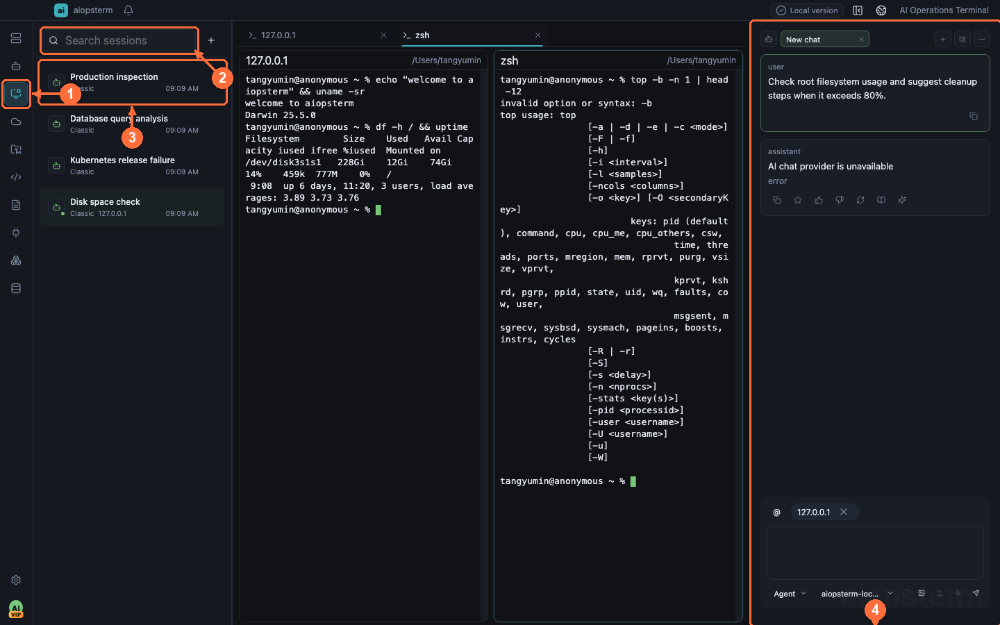
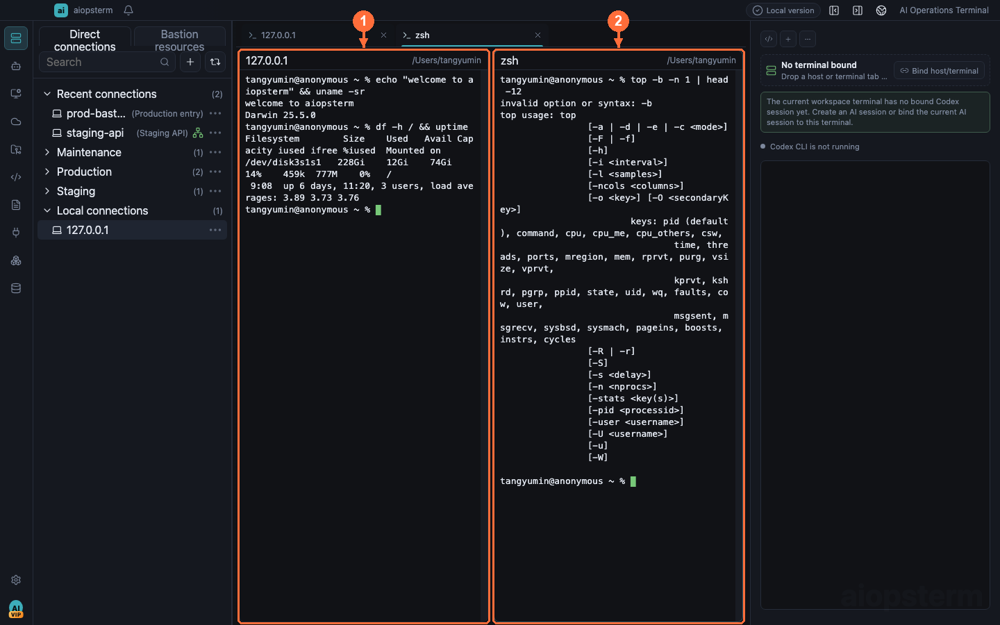
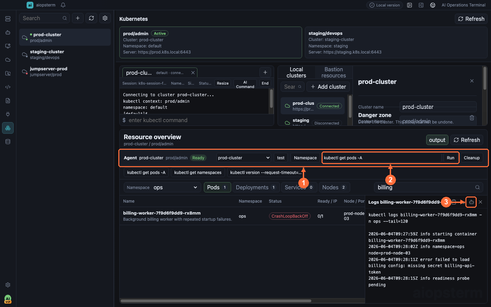

# aiopsterm

[中文](README.md) | English

**An operations terminal built for humans and AI**: terminals, SSH and bastion hosts, host agents, AI sessions, files, assets, MCP, database AI, and Kubernetes in one desktop workspace.

[Website](https://aiopsterm.com) · [Download](https://aiopsterm.com/download) · [Docs](https://aiopsterm.com/docs) · [GitHub Releases](https://github.com/TangGee/aiopsterm/releases)

[](https://github.com/TangGee/aiopsterm/releases)
[](LICENSE)
[](https://github.com/TangGee/aiopsterm/actions/workflows/ci.yml)
[](https://aiopsterm.com/download)
[](https://discord.gg/jbWEjKCm8w)



## Features

- **Multi-tab terminal workspace** — local and remote terminals share tabs, right/down splits, drag-to-merge, search, and multi-terminal broadcast, with built-in control commands such as `aio` and `aiossh`.
- **SSH and bastion hosts** — key and SSH Agent authentication, standard jump hosts and relay-shell, plus JumpServer bastion asset sync; double-click a host to connect.
- **Host Agent** — embedded Codex CLI and Classic assistant run commands and read files through the bound terminal; no agent needs to be installed on remote hosts, even behind proxies or jump hosts.
- **AI session management** — brings external coding-agent sessions from Codex, Claude Code, OpenCode, Kimi Code, and more into one inbox with live status and desktop notifications; browse, search, and revise full transcripts and review project file changes.
- **Two-way MCP integration** — consume third-party MCP servers, and export host SSH, managed AI sessions, and read-only database capabilities to external agents over MCP.
- **Kubernetes operations** — kubeconfig import, resource overview, logs and describe, isolated kubectl terminals, and a cluster agent command bar.
- **Database and DB AI** — connection management and SQL consoles for MySQL, PostgreSQL, Oracle, SQL Server, SQLite, and more; DB AI generates SQL from natural language and explains, optimizes, and diagnoses SQL.
- **Security and privacy** — every installer is signed and published with a SHA-256 checksum, and macOS builds are signed and notarized by Apple; telemetry is anonymous, can be disabled, and never collects terminal content, SSH credentials, or AI conversations.

## Screenshots

**Split terminals and host resources**



**Kubernetes resources with AI commands**



**Database workspace with DB AI**


## Download

- Website download page: [aiopsterm.com/download](https://aiopsterm.com/download) (macOS / Windows / Linux)
- GitHub Releases: [github.com/TangGee/aiopsterm/releases](https://github.com/TangGee/aiopsterm/releases)

Every stable installer is signed and published with a SHA-256 checksum so you can verify downloads. macOS packages (DMG/ZIP) are signed and notarized by Apple and pass Gatekeeper checks directly.

## Documentation

The complete documentation ships with every desktop package and can also be read from the [website documentation index](https://aiopsterm.com/docs) or directly on GitHub:

- [Usage documentation index](docs/usage/index.md)
- [Installation and runtime dependencies](docs/usage/installation.md)
- [Bilingual task-oriented guide](docs/usage/best-practices/index.md)
- [Product tour and getting started](docs/usage/best-practices/en-US/01-getting-started.md)
- [Terminal and main workspace](docs/usage/best-practices/en-US/02-terminal-workspace.md)
- [Host Agent](docs/usage/best-practices/en-US/03-host-agent.md)
- [Agents product sessions](docs/usage/best-practices/en-US/04-agents-product-sessions.md)
- [AI session management](docs/usage/best-practices/en-US/05-ai-sessions.md)
- [Quick Commands and macros](docs/usage/best-practices/en-US/06-quick-commands.md)
- [Keyboard shortcuts and built-in commands](docs/usage/best-practices/en-US/07-shortcuts.md)
- [Kubernetes](docs/usage/best-practices/en-US/14-kubernetes.md)
- [Database and DB AI](docs/usage/best-practices/en-US/15-database.md)
- [Troubleshooting](docs/usage/best-practices/en-US/17-troubleshooting.md)

## Building From Source

```bash
npm ci
npm run dev
npm run typecheck
npm test
```

Platform builds and release audits are documented in [development commands](docs/usage/development-commands.md) and [technical development notes](docs/technical/development.md). Please read [CONTRIBUTING.md](CONTRIBUTING.md) before contributing.

## Privacy

Anonymous telemetry is enabled by default and can be disabled in Settings. Telemetry is limited to version, platform, architecture, launch, and feature-usage statistics. It does not include terminal content, commands, paths, logs, SSH credentials, or AI conversation content.

## Community And Support

- Report issues at [GitHub Issues](https://github.com/TangGee/aiopsterm/issues).
- Email support: support@aiopsterm.com.
- Report security vulnerabilities through the process in [SECURITY.md](SECURITY.md).

## License

aiopsterm-owned code is licensed under the [Apache License 2.0](LICENSE). Third-party attributions are listed in [NOTICE](NOTICE), and dependency licenses in [THIRD-PARTY-NOTICES.txt](THIRD-PARTY-NOTICES.txt).
