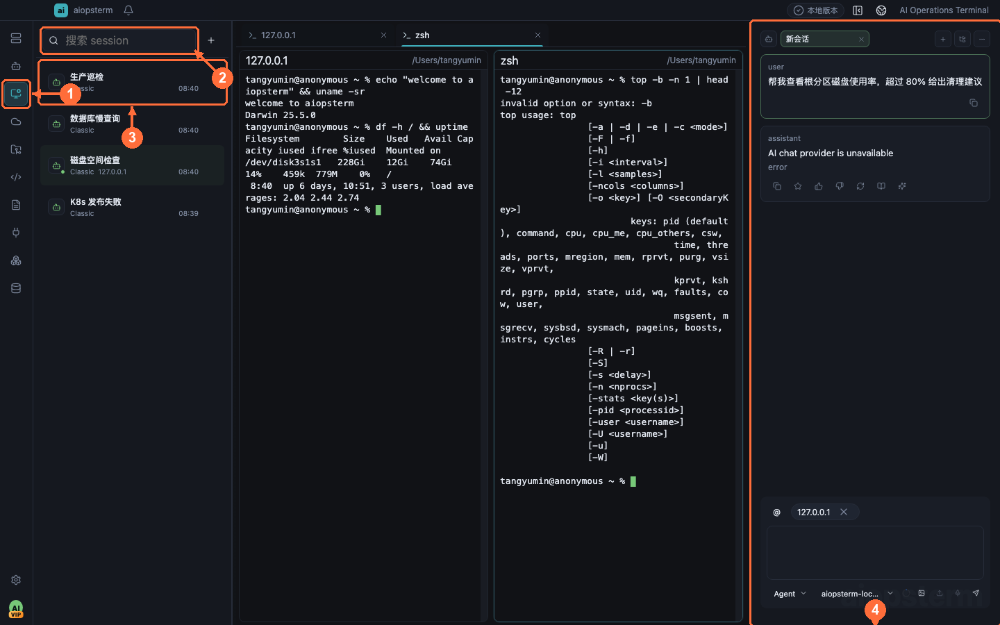
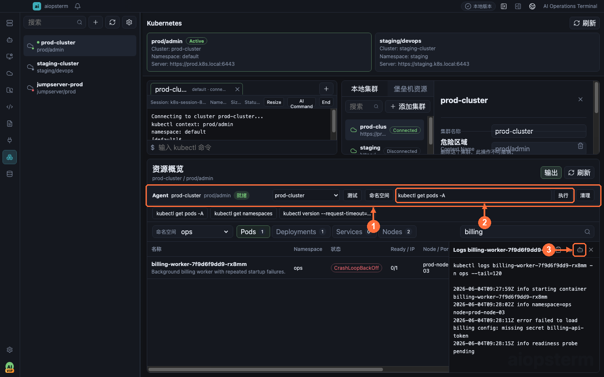
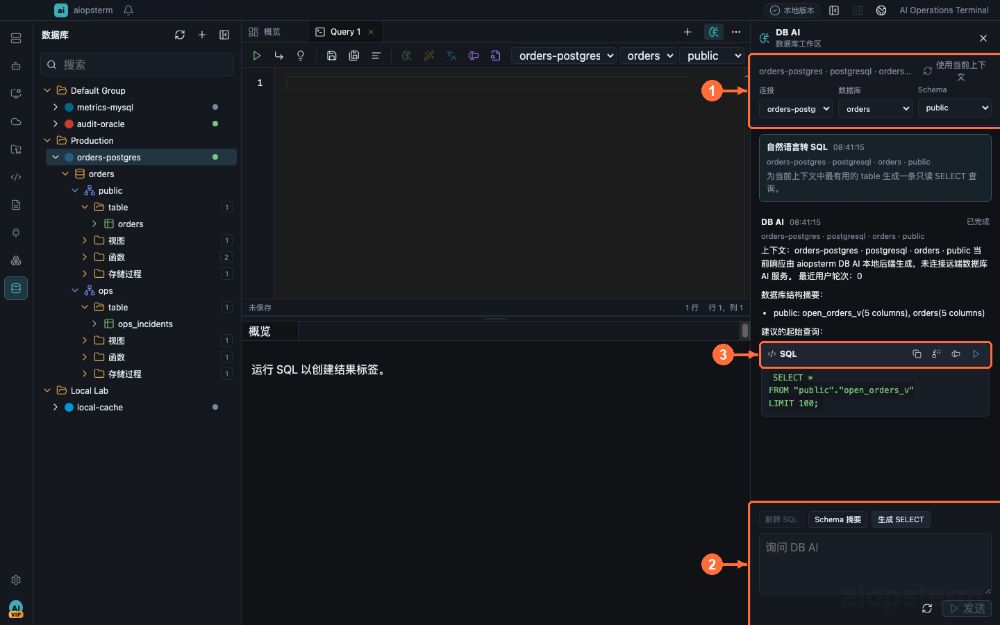

# aiopsterm

中文 | [English](README.en.md)

**为人和 AI 打造的运维终端**：把终端、SSH 与堡垒机、主机 Agent、AI 会话、文件、资产、MCP、数据库 AI 和 Kubernetes 收进同一个桌面工作区。

[官网](https://aiopsterm.com/zh-cn/) · [下载](https://aiopsterm.com/zh-cn/download/) · [文档](https://aiopsterm.com/zh-cn/docs) · [GitHub Releases](https://github.com/TangGee/aiopsterm/releases)

[](https://github.com/TangGee/aiopsterm/releases)
[](LICENSE)
[](https://github.com/TangGee/aiopsterm/actions/workflows/ci.yml)
[](https://aiopsterm.com/zh-cn/download/)
[](https://discord.gg/jbWEjKCm8w)



## 功能特性

- **多标签终端工作区** — 本地与远程终端共享标签、左右/上下分屏、拖拽合并、搜索与多终端广播，内置 `aio`、`aiossh` 等控制命令。
- **SSH 与堡垒机** — 密钥与 SSH Agent 认证、标准跳板与 relay-shell，支持 JumpServer 堡垒机资产同步，双击主机即可连接。
- **主机 Agent** — 内嵌 Codex CLI 与 Classic 助手，AI 通过绑定终端执行命令、读写文件；远程主机无需安装 Agent，经代理或跳板的主机同样可管理。
- **AI 会话管理** — 集中接入 Codex、Claude Code、OpenCode、Kimi Code 等外部 AI 编程会话，实时状态与桌面通知，可查看、搜索并修订完整 transcript，审查项目文件变更。
- **MCP 双向集成** — 既能接入第三方 MCP Server 扩展工具，也能把主机 SSH、托管 AI 会话和数据库只读能力通过 MCP 导出给外部 Agent。
- **Kubernetes 运维** — kubeconfig 导入、资源概览、日志与 Describe、隔离的 kubectl 终端，以及集群 Agent 命令栏。
- **数据库与 DB AI** — MySQL、PostgreSQL、Oracle、SQL Server、SQLite 等连接管理与 SQL 控制台，DB AI 支持自然语言转 SQL、解释、优化与诊断。
- **安全与隐私** — 全平台安装包签名发布并附带 SHA-256 校验和，macOS 经 Apple 签名与公证；遥测匿名且可关闭，不采集终端内容、SSH 凭据或 AI 对话。

## 界面预览

**终端分屏与主机资源**


**Kubernetes 资源与 AI 命令**



**数据库工作区与 DB AI**



## 下载

- 官网下载页：[aiopsterm.com/zh-cn/download](https://aiopsterm.com/zh-cn/download/)（macOS / Windows / Linux）
- GitHub Releases：[github.com/TangGee/aiopsterm/releases](https://github.com/TangGee/aiopsterm/releases)

每个正式安装包均签名发布并附带 SHA-256 校验和，下载后可比对校验；macOS 安装包（DMG/ZIP）经 Apple 签名与公证，可直接通过 Gatekeeper 检查。

## 文档

完整文档随桌面安装包一起提供，也可以从[官网文档索引](https://aiopsterm.com/zh-cn/docs)或 GitHub 阅读：

- [使用文档索引](docs/usage/index.md)
- [安装与运行时依赖说明](docs/usage/installation.md)
- [双语场景化使用指南](docs/usage/best-practices/index.md)
- [产品总览与快速上手](docs/usage/best-practices/zh-CN/01-getting-started.md)
- [终端与主工作区](docs/usage/best-practices/zh-CN/02-terminal-workspace.md)
- [主机 Agent](docs/usage/best-practices/zh-CN/03-host-agent.md)
- [Agents 产品会话](docs/usage/best-practices/zh-CN/04-agents-product-sessions.md)
- [AI 会话管理](docs/usage/best-practices/zh-CN/05-ai-sessions.md)
- [快捷命令与宏](docs/usage/best-practices/zh-CN/06-quick-commands.md)
- [快捷键与内置命令参考](docs/usage/best-practices/zh-CN/07-shortcuts.md)
- [Kubernetes](docs/usage/best-practices/zh-CN/14-kubernetes.md)
- [数据库与 DB AI](docs/usage/best-practices/zh-CN/15-database.md)
- [故障排查](docs/usage/best-practices/zh-CN/17-troubleshooting.md)

## 从源码构建

```bash
npm ci
npm run dev
npm run typecheck
npm test
```

平台构建和发布审计见[开发命令](docs/usage/development-commands.md)与[技术开发说明](docs/technical/development.md)，参与贡献请先阅读 [CONTRIBUTING.md](CONTRIBUTING.md)。

## 隐私

匿名遥测默认开启，可在设置中关闭。遥测仅用于版本、平台、架构、启动和功能使用统计；不包含终端内容、命令、路径、日志、SSH 凭据或 AI 对话内容。

## 社区与支持

- 普通问题请提交 [GitHub Issues](https://github.com/TangGee/aiopsterm/issues)。
- 邮件支持：support@aiopsterm.com。
- 安全漏洞请按 [SECURITY.md](SECURITY.md) 中的流程报告。

## License

aiopsterm 自有代码采用 [Apache License 2.0](LICENSE)；第三方归因见 [NOTICE](NOTICE)，第三方依赖许可见 [THIRD-PARTY-NOTICES.txt](THIRD-PARTY-NOTICES.txt)。
