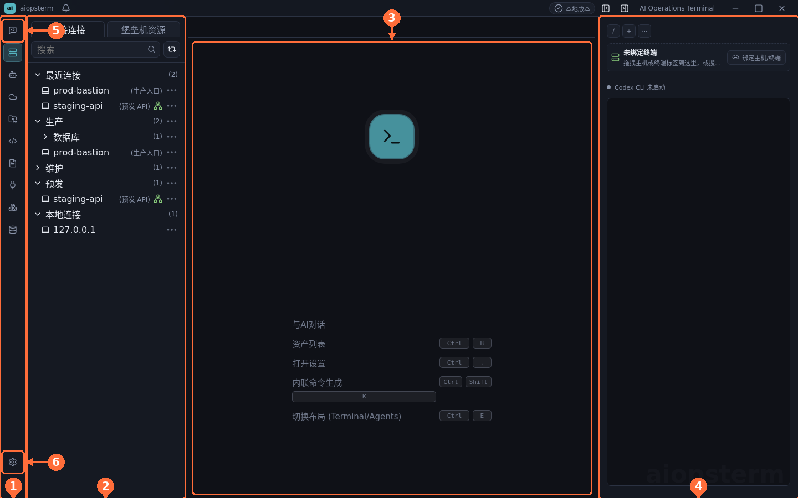
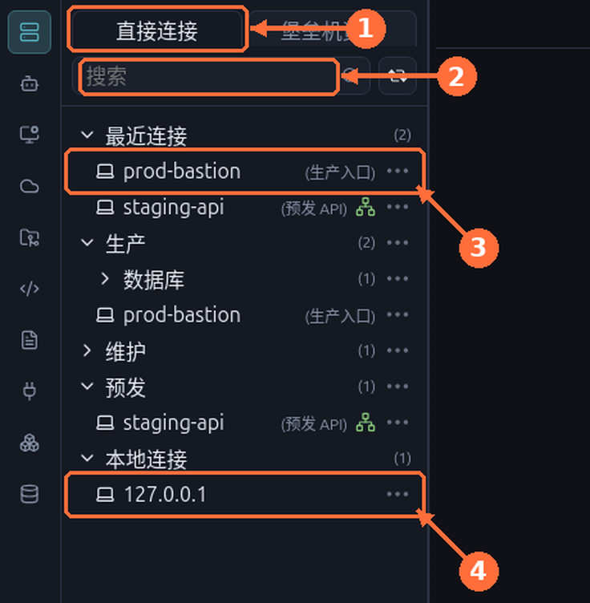

# Getting Started

This guide gets you from install to your first connection in about ten minutes and introduces the four main regions of the UI. Screenshots show the Chinese UI; English label translations are given inline.

## Install And Launch

The aiopsterm desktop package bundles the Electron runtime, the native terminal module, and the built-in Codex runtime. **No user-installed Node.js or npm is required.** Install and launch directly.

Local terminals created by aiopsterm expose `aio`, `aictl`, `aiopsterm-control`, and `aiossh` on PATH. Prefer the short `aio` command day to day; `aiossh <saved-host>` connects straight to a host already saved in aiopsterm.

## The Main Window

| # | Region | Description |
| --- | --- | --- |
| ① | SideRail (module navigation) | Icon-only rail on the far left; switches Workspace, Assets, Files, Quick Commands, Knowledge, Database, and more |
| ② | Module panel | Left functional panel of the active module; shows the host resource tree in Workspace |
| ③ | Main workspace | Where terminals, files, database and knowledge documents live |
| ④ | AI panel | Right-side AI assistant; supports Codex CLI and Classic conversations |
| ⑤ | Agents entry | Enters Agents mode, the catalog of all AI Product Sessions |
| ⑥ | Settings button | Opens the settings workspace (`Ctrl+,`) |

The welcome dashboard lists the everyday shortcuts: assets list `Ctrl+B`, settings `Ctrl+,`, inline AI command `Ctrl+Shift+K`, and recent panels `Ctrl+Tab`.

## Your First Connection

1. Switch between the **① 直接连接 (Direct connections) / 堡垒机资源 (Bastion resources)** trees at the top of the resource panel.
2. Use the **② search box** to filter hosts by name.
3. **③ Double-click a host row** (for example `prod-bastion`) to open an SSH session; the row's `⋯` menu offers edit, clone, and more.
4. **④ 本地连接 (Local connections)** contains `127.0.0.1`; double-click for a local shell — a safe place to explore first.

> Best practice: save your jump hosts and production entry points as grouped assets (production / staging / maintenance). "Recent connections" keeps the last 10 successful connections, so frequent hosts never need tree digging.

Connection behavior worth knowing:

- Password-auth hosts without a saved password open the global authentication dialog; with `记住密码并更新该主机` (remember password) checked, the password is stored only after the SSH connection actually reaches ready.
- Bastions that request an OTP / dynamic password use the same global dialog; clicking the backdrop does not dismiss it.
- SSH sessions send keepalives by default, reducing idle disconnects caused by NAT, firewalls, or bastion cleanup.

## Managing Assets Centrally

The **Assets** module opens as a full workspace with four top tabs: **① 主机管理 (Hosts), ② 堡垒机管理 (Bastions), ③ 密钥管理 (Keys), ④ 代理管理 (Proxies)**. Double-clicking a **⑤ host row** creates a real SSH terminal and returns you to the terminal workspace.

Recommendations:

- Create folders and hosts from context menus: right-click blank tree space for a top-level directory, right-click a group for child directories or hosts — new hosts inherit the clicked group.
- Keep private keys in Key management (KeyChain); the host form no longer accepts pasted private-key text, and one key can serve many hosts.
- The host form supports SSH proxies (HTTP/SOCKS/raw TCP) and jump hosts, and can create keys/proxies/jump hosts in place — successful creation returns and preselects the new resource.
- Use connection tests to validate configuration: password-disabled servers, wrong passwords, rejected keys, missing auth methods, and network failures each return a distinct actionable message.

## Next Steps

- Splits, broadcast, and search: [Terminal Workspace Best Practices](02-terminal-workspace.md).
- Let AI generate and run commands: [AI Assistant And Sessions](03-ai-assistant.md).
