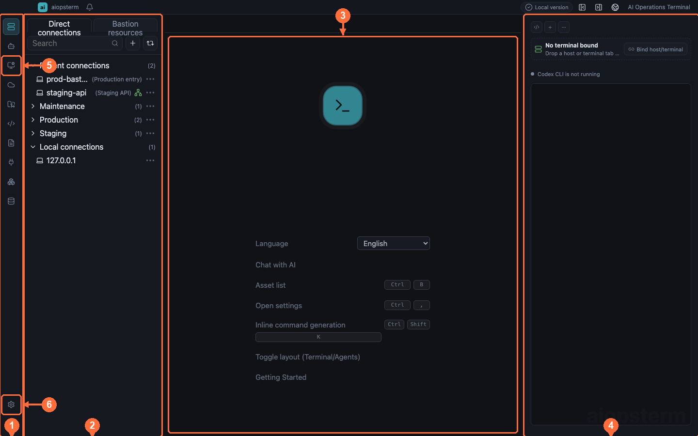
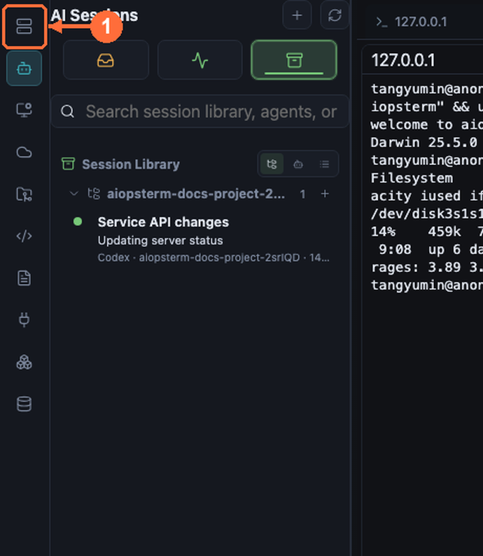
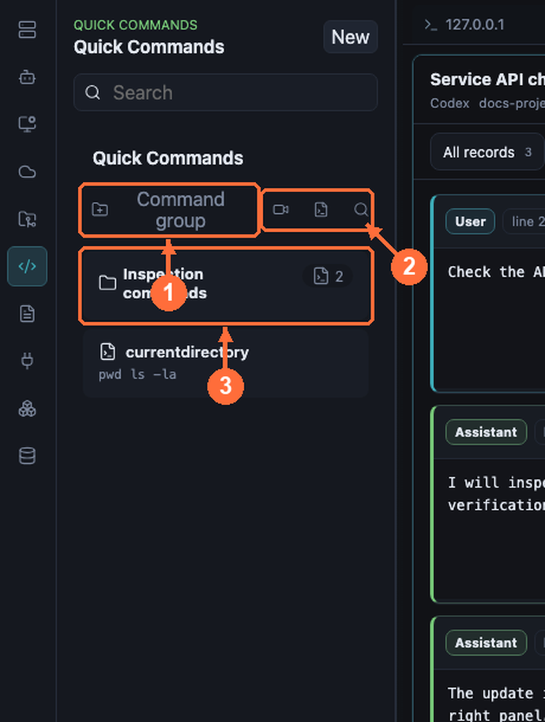
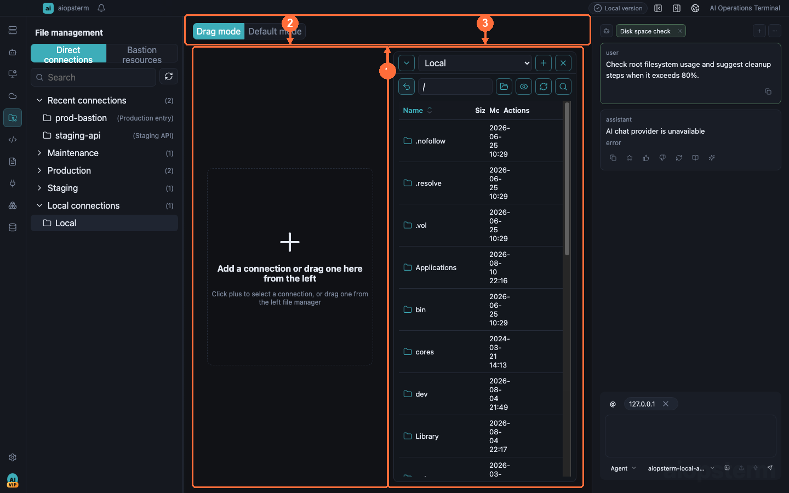
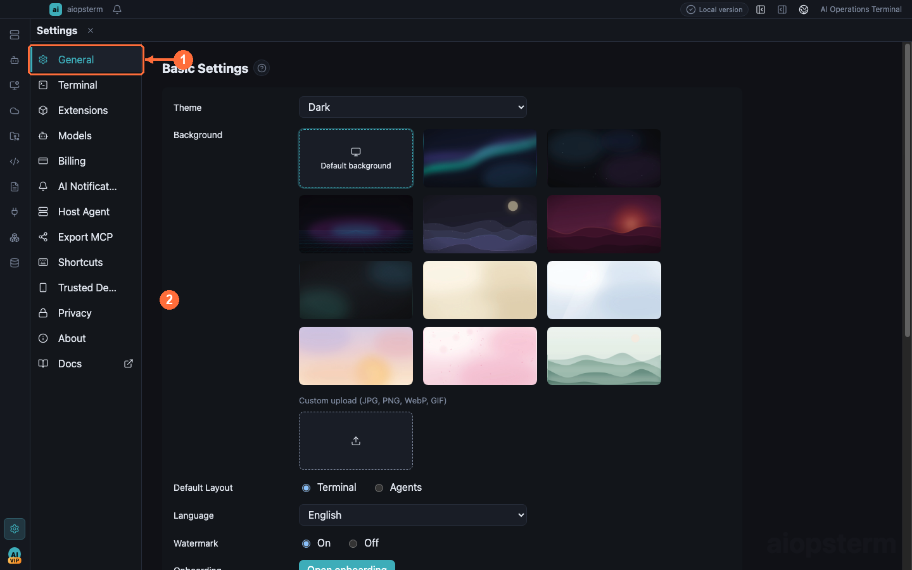

# Product Tour And Getting Started

aiopsterm combines local terminals, SSH assets, AI operations, external AI-session observation, files, knowledge, Kubernetes, and databases in one desktop workspace. This page identifies every entry button before linking to the complete workflow.

## Start With The Main Window

| # | Region | Purpose |
| --- | --- | --- |
| ① | Module rail | Workspace, Assets, Files, Quick Commands, Knowledge, Plugins, Kubernetes, and Database |
| ② | Source panel | Hosts, sessions, files, or documents for the selected module |
| ③ | Main workspace | Shared tabs for terminals, knowledge documents, AI-session content, and project files |
| ④ | AI panel | Embedded Codex or Classic, bindable to the active terminal |
| ⑤ | Agents | aiopsterm-owned Codex, Classic, and DB AI product sessions |
| ⑥ | Settings | Models, terminal, notifications, MCP, shortcuts, themes, and policy |

The welcome page lets users select a language. **Getting Started** opens the bilingual guide index first, where users can choose the corresponding language. Source and center are normally independent; double-clicking an Assets host is the exception and switches both to Workspace before SSH starts.

## 1. Terminal And SSH

**Entry:** click **Workspace**, then double-click `127.0.0.1` for a local shell or a saved host for SSH. Right-click a terminal for command input, AI Command, split, search, file management, and global execution.

Tabs, splits, proxies, keys, SSH Agent, standard jumps, relay-shell, `aio`, and `aiossh` are covered in [Terminal And Main Workspace](02-terminal-workspace.md).

## 2. Host Agent

**Entry:** open a terminal, use the mode control at the top of the right AI panel, and select **Codex CLI** or **Classic**. Configure a provider first under **Settings -> Models**.

Embedded Codex uses terminal-bound remote tools. Classic offers Chat, Command, and Agent permission levels. The remote host needs no installed agent, including proxy and jump-host targets. See [Host Agent](03-host-agent.md).

## 3. Agents Product Sessions

**Entry:** click **Agents** at the top of the module rail. Use `+` to create Classic, Codex, or DB AI sessions, and select history to restore and continue.

Agents stores conversations created by aiopsterm with their terminal, project, or database bindings. See [Agents Product Sessions](04-agents-product-sessions.md).

## 4. AI Session Management

**Entry:** click **AI Sessions** on the rail. Use **Settings -> AI Notifications** to install hooks and configure desktop and sound alerts.

Track pending, running, and historical external-agent sessions. Right-click **Open Session Content** to inspect the complete conversation, switch source/rendered views, and revise its transcript; use **Project Files** for recent changes and the real project tree. Live state and notifications require the matching trusted Agent Hook. See [AI Session Management](05-ai-sessions.md).

## 5. Quick Commands And Macros

**Entry:** click **Quick Commands** and use its toolbar add button. Terminal context actions send input or execute globally.

Store operational commands, record macros, broadcast safely, and reference commands with `/` in AI. See [Quick Commands](06-quick-commands.md).

## 6. Keyboard Shortcuts

**Entry:** open **Settings -> Shortcuts** and click the key field beside an action.

Bindings preserve plain shell control keys and can be remapped per OS. See [Keyboard Shortcuts](07-shortcuts.md).

## 7. Export MCP

**Entry:** open **Settings -> Export MCP**, then install each capability card independently for Codex or Claude Code.

The three servers expose hosts/SSH, managed AI sessions, and authorized read-only databases to external Agents. See [Export MCP](08-export-mcp.md).

## 8. Third-party MCP Servers

**Entry:** open **Settings -> Host Agent -> MCP**, use **Add Server** for a stdio or HTTP Server, then inspect connection state and tool approval.

This imports third-party tools into embedded Classic, the opposite direction from Export MCP. See [Third-party MCP Servers](09-third-party-mcp.md).

## 9. File Management

**Entry:** click **Files**, or right-click an SSH terminal and choose **File Management**.

Browse local and remote SFTP sides, transfer with progress, edit, rename, and manage permissions. See [File Management](10-files.md).

## 10. Asset Management

**Entry:** click **Assets**, then use the top tabs for hosts, bastions, keys, and proxies.

Save connection settings, credential references, proxies, standard SSH jump hosts, and JumpServer sources. See [Assets](11-assets.md).

## 11. Knowledge Base

**Entry:** click **Knowledge**. Search and add controls are at the top of its source panel; selecting a file opens the source/preview editor in the center.

Markdown, images, search, Mermaid, internal links, and AI context are covered in [Knowledge Base](12-knowledge-base.md).

## 12. Plugins And Extensions

**Entry:** click **Plugins**, select a card, then install, enable, or disable it from details.

Plugins contribute pages, tools, and aliases after manifest validation and trust. See [Plugins And Extensions](13-extensions.md).

## 13. Kubernetes

**Entry:** click **Kubernetes**, use the add control in the cluster area to import kubeconfig, then connect.

Resources, logs, Describe, isolated kubectl terminals, the cluster Agent command bar, and sending output to AI are covered in [Kubernetes](14-kubernetes.md).

## 14. Database And DB AI

**Entry:** click **Database**, use the add control in the connection sidebar, choose an engine, and test the connection.

Catalog browsing, SQL, result editing, and DB AI generation, explanation, optimization, conversion, and diagnosis are covered in [Database And DB AI](15-database.md).

## 15. Themes And Terminal Appearance

**Entry:** use **Settings -> General** for theme/background and **Settings -> Terminal** for font, line height, cursor, and terminal options.

System/light/dark themes, bundled and custom backgrounds, and cross-platform typography are covered in [Themes](16-themes.md).

## Recommended First Run

1. Configure an AI provider under **Settings -> Models** if needed.
2. Save a test host under **Assets -> Host Management** and run Connection Test.
3. Double-click it in **Workspace**, then try search, split, and file management.
4. Bind the right AI panel and begin with a read-only diagnostic task.
5. If you use an external coding agent, install its hook under **Settings -> AI Notifications**.

Next: [Terminal And Main Workspace](02-terminal-workspace.md) · [Back to index](../index.md)
