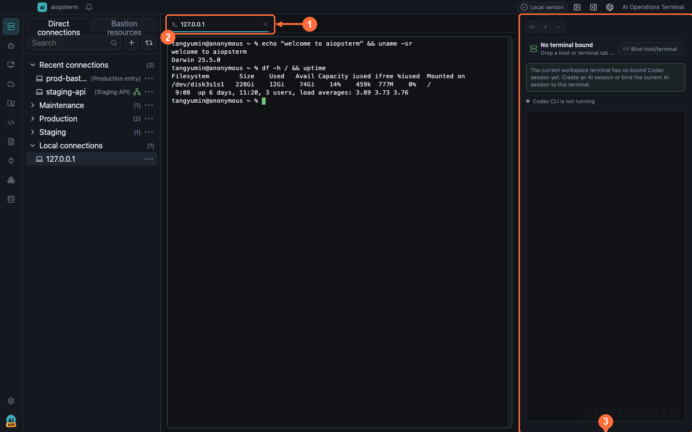
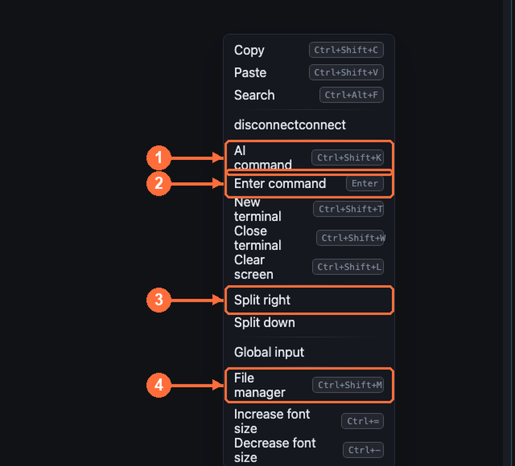
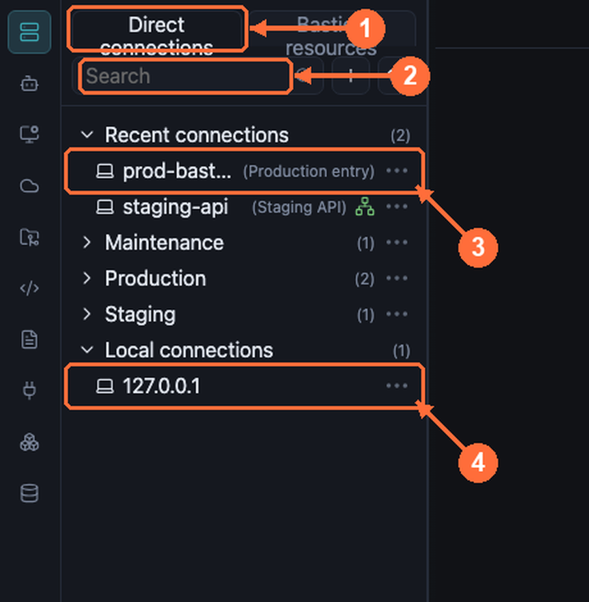

# Terminal Workspace Best Practices

The terminal is the heart of aiopsterm. This guide covers session tabs, the context menu, split panes, and the keyboard shortcuts worth memorizing.

## Where To Open It

Click **Workspace** at the top of the module rail. Double-click **Local Connections -> 127.0.0.1** for a local shell, or a host under Direct/Bastion Resources for SSH. Terminal actions are not a permanent toolbar: right-click terminal content or its tab to reveal split, command input, AI Command, file management, global execution, and search.

## Session Tabs



- **① Session tab**: a single compact row; long titles ellipsize. Hover to see the full type, state, host, cwd, and backend session id. Only exceptional connection states show indicators — routine `running/ready` text stays out of the label.
- **② Terminal pane**: the selected pane is the target for split, reconnect, search, and font-zoom actions.
- **③ AI panel**: can be bound to the current terminal so AI-generated commands execute in this exact session.

Terminal programs may retitle tabs via the standard xterm title protocol (`OSC 0`/`OSC 2`) and report progress via `OSC 9;4`; manual renames always win.

> Note: there is no toolbar `+` button. New sessions come from resource-tree double-clicks, `Ctrl+Shift+T` (new local shell), or the tab/pane context menu.

## The Context Menu



Right-click a terminal pane or tab:

| # | Item | Purpose |
| --- | --- | --- |
| ① | AI 命令 (AI command, `Ctrl+Shift+K`) | Inline AI command generation for this terminal |
| ② | 输入命令 (Command input) | Floating input near the cursor; stays open for rejected commands, closes after a successful write |
| ③ | 向右拆分 / 向下拆分 (Split right / down) | Splits the **selected pane region**, not the whole workspace |
| ④ | 文件管理 (File manager, `Ctrl+Shift+M`) | SFTP file management for this host |

Also present: copy/paste (`Ctrl+Shift+C/V`), search (`Ctrl+Alt+F`), new/close terminal, clear screen, global execute (broadcast a command to multiple terminals), font zoom.

## Splitting And Merging Panes


- `向右拆分` / `向下拆分` places the new pane right of / below the selected region (① original pane, ② new pane).
- `取消拆分` (unsplit) restores a pane to its own tab, with automatic refit.
- **Drag attach**: drop a terminal/knowledge tab onto another tab or pane to attach it as a right-side split.
- **Drag detach**: drop a split tab onto empty tab-bar space to restore it as a standalone tab.
- Dropping local files onto a terminal inserts shell-quoted paths — spaces and metacharacters survive.

> Best practice: for single-host debugging, split down — logs on top (`tail -f`), commands below. For cross-host comparison, split right and use global execute to broadcast the same diagnostic command.

## Shortcuts Worth Memorizing

With a terminal focused, plain `Ctrl+letter` goes to the shell (readline/TUI keys like `Ctrl+a/c/d/e/k/l` keep their meaning). App actions use `Ctrl+Shift+…`:

| Shortcut | Action |
| --- | --- |
| `Ctrl+Shift+C` / `Ctrl+Shift+V` | Copy / paste |
| `Ctrl+Alt+F` / `G` / `H` / `J` | Search / next / previous / clear highlight |
| `Ctrl+Shift+K` | AI command |
| `Ctrl+Shift+T` / `W` | New terminal / close current panel |
| `Ctrl+Shift+Y` | Fork the current SSH channel (incl. jump/relay sessions) |
| `Ctrl+Shift+L` | Clear terminal |
| `Ctrl+=` / `Ctrl+-` / `Ctrl+0` | Font zoom in / out / reset (selected pane only) |
| `Alt+1..9`, `Ctrl+PageUp/PageDown` | Tab navigation |
| `Shift+PageUp/PageDown` | Scrollback |
| `F11` | Full screen |

`Ctrl+Shift+T` from a connected local terminal inherits its cwd; from SSH it does not clone the remote connection implicitly.

### Main Workspace Navigation

| Action | macOS | Windows / Linux |
| --- | --- | --- |
| Open recent panels | `Ctrl+Tab` | `Ctrl+Tab` |
| Back / forward through activation history | `Cmd+[` / `Cmd+]` | `Ctrl+Left` / `Ctrl+Right` |
| Switch left / right by tab-bar order | `Ctrl+Shift+Left` / `Ctrl+Shift+Right` | `Ctrl+Shift+Left` / `Ctrl+Shift+Right` |

Activation history covers main-workspace panels such as terminals, knowledge documents, AI session content, and project files. Ordered navigation wraps at both ends of the tab bar and does not reset activation history.

## Jump Hosts And Files



SSH settings are configured before a terminal opens. To create the first host:

1. Open **Assets -> Host Management**, right-click empty tree space or a target folder, and choose **New Host**.
2. Enter display name, Host/IP, port, and username.
3. Choose password, private key, or SSH Agent. Save private keys under **Key Management** first, then reference them from the host.
4. For a proxy, save HTTP, SOCKS, or raw TCP under **Proxy Management**, then select it from the host.
5. For a standard SSH jump, save the jump host first and select it from the target host. Run Connection Test before saving.
6. Double-click the saved host under **Workspace -> Direct/Bastion Resources** or Assets. In the figure, **①** selects the resource group, **②** searches, **③** opens saved SSH, and **④** opens a local shell.

A **standard jump host** is one hop in a target host connection. **Bastion Management** can also configure a JumpServer URL, Private Token, and organization sync; these are different configuration types. See [Asset Management](11-assets.md). Standard jump paths prefer TCP forwarding and fall back to relay-shell only when forwarding is rejected.

- Direct and standard jump-host (TCP-forward) paths support SFTP file management.
- Hosts reached through relay-shell (restricted bastions) do not expose SFTP yet — the Files workspace states this explicitly; use `scp`/`rsync` in the terminal instead.
- When a bastion rejects TCP forwarding, aiopsterm falls back to relay-shell mode automatically: local OpenSSH logs into the bastion, then the nested `ssh <target>` is written after the relay prompt appears. Auth prompts stay in the terminal stream.

## CLI Control And Idle Cleanup

aiopsterm-created **local terminals** add these commands to PATH on Windows, macOS, and Linux. Remote SSH shells do not receive them automatically.

| Command | Purpose | Example |
| --- | --- | --- |
| `aio` | Query/control workspaces, terminals, sessions, settings, and notifications | `aio terminal list` |
| `aiopen` | Open local text files in the main workspace | `aiopen ./README.md` |
| `aiossh` | Connect or reuse a saved host | `aiossh prod-bastion` |
| `aioic` | Close panels confirmed idle by the configured policy | `aioic` |
| `aiobc` | Immediately close background panels and keep the current panel | `aiobc` |

```sh
aio host list --names
aio host add prod-api --host 10.0.0.8 --user ops --port 22 --group production
aiossh prod-api
aio terminal list
aio terminal send --panel <panel-id> --text $'uptime\n'
```

`aiossh` connects managed assets; create one with `aio host add`. For an ad-hoc workspace remote use `aio workspace remote configure user@host --connect`. Automation should query panel/session ids before writes, focus, or close operations. Run `aio help` or `aio recipes terminal` for the installed command set.

Idle cleanup checks the PTY foreground process group before closing anything. A terminal is eligible only when it has returned to its original shell. Sessions running `ssh`, `top`, Codex, or another foreground program are marked busy and skipped; unknown foreground state is also skipped conservatively.

## Performance Notes

- The threaded terminal renderer (workers + OffscreenCanvas) is on by default and falls back to plain xterm when unsupported.
- Hidden tabs and background panes keep receiving output without painting; they sync once when visible again — long-running log jobs in the background will not drag the foreground.
- Both main process and renderer coalesce output under load (backpressure, no data loss). If things feel slow, see [Troubleshooting](17-troubleshooting.md).

Previous: [Product Tour](01-getting-started.md) · Next: [Host Agent](03-host-agent.md) · [Back to index](../index.md)
