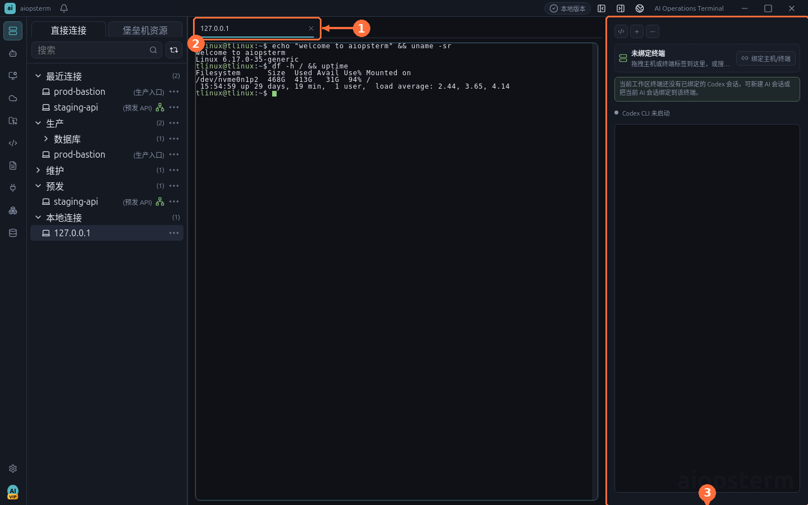
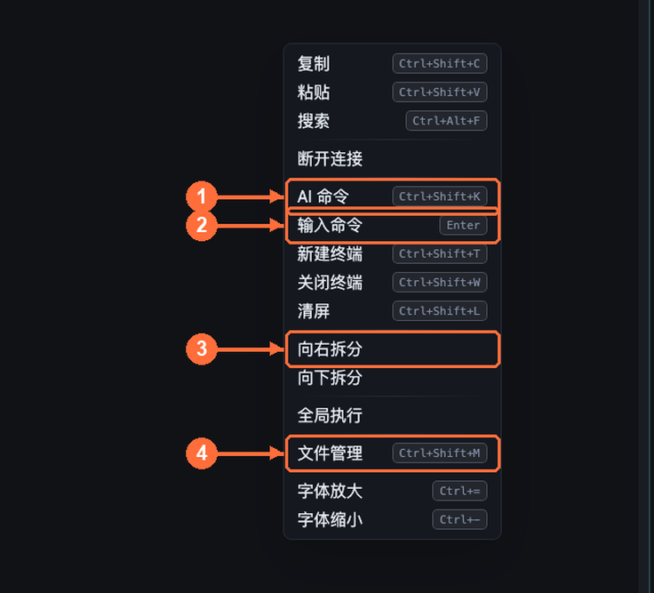
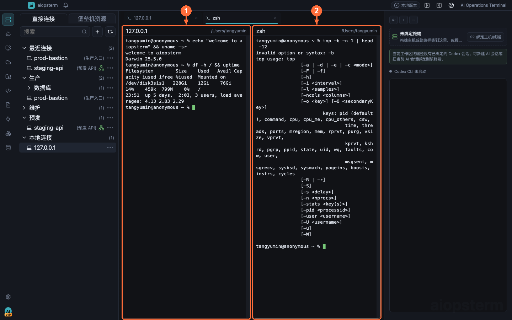

# Terminal Workspace Best Practices

The terminal is the heart of aiopsterm. This guide covers session tabs, the context menu, split panes, and the keyboard shortcuts worth memorizing.

## Session Tabs

- **① Session tab**: a single compact row; long titles ellipsize. Hover to see the full type, state, host, cwd, and backend session id. Only exceptional connection states show indicators — routine `running/ready` text stays out of the label.
- **② Terminal pane**: the selected pane is the target for split, reconnect, search, and font-zoom actions.
- **③ AI panel**: can be bound to the current terminal so AI-generated commands execute in this exact session.

Terminal programs may retitle tabs via the standard xterm title protocol (`OSC 0`/`OSC 2`) and report progress via `OSC 9;4`; manual renames always win.

> Note: there is no toolbar `+` button. New sessions come from resource-tree double-clicks, `Ctrl+Shift+T` (new local shell), or the tab/pane context menu.

## The Context Menu

Right-click a terminal pane or tab:

| # | Item | Purpose |
| --- | --- | --- |
| ① | AI 命令 (AI command, `Ctrl+Shift+K`) | Inline AI command generation for this terminal |
| ② | 输入命令 (Command input) | Floating input near the cursor; stays open for rejected commands, closes after a successful write |
| ③ | 向右拆分 / 向下拆分 (Split right / down) | Splits the **selected pane region**, not the whole workspace |
| ④ | 文件管理 (File manager, `Ctrl+Shift+M`) | SFTP file management for this host |

Also present: copy/paste (`Ctrl+Shift+C/V`), search (`Ctrl+Alt+F`), new/close terminal, clear screen, global execute (broadcast a command to multiple terminals), font zoom.

## Splitting And Merging Panes

- `向右拆分` / `向下拆分` places the new pane right of / below the selected region (① original pane, ② new pane).
- `取消拆分` (unsplit) restores a pane to its own tab, with automatic refit.
- **Drag attach**: drop a terminal/knowledge tab onto another tab or pane to attach it as a right-side split.
- **Drag detach**: drop a split tab onto empty tab-bar space to restore it as a standalone tab.
- Dropping local files onto a terminal inserts shell-quoted paths — spaces and metacharacters survive.

> Best practice: for single-host debugging, split down — logs on top (`tail -f`), commands below. For cross-host comparison, split right and use global execute to broadcast the same diagnostic command.

## Shortcuts Worth Memorizing

With a terminal focused, plain `Ctrl+letter` goes to the shell (readline/TUI keys like `Ctrl+a/c/d/e/k/l` keep their meaning). App actions use `Ctrl+Shift+…`:

| Shortcut | Action |
| --- | --- |
| `Ctrl+Shift+C` / `Ctrl+Shift+V` | Copy / paste |
| `Ctrl+Alt+F` / `G` / `H` / `J` | Search / next / previous / clear highlight |
| `Ctrl+Shift+K` | AI command |
| `Ctrl+Shift+T` / `W` | New terminal / close current panel |
| `Ctrl+Tab` | Open recent panels |
| `Ctrl+Shift+Y` | Fork the current SSH channel (incl. jump/relay sessions) |
| `Ctrl+Shift+L` | Clear terminal |
| `Ctrl+=` / `Ctrl+-` / `Ctrl+0` | Font zoom in / out / reset (selected pane only) |
| `Alt+1..9`, `Ctrl+PageUp/PageDown` | Tab navigation |
| `Shift+PageUp/PageDown` | Scrollback |
| `Ctrl+Shift+Left/Right` | Jump to previous/next known command segment |
| `F11` | Full screen |

`Ctrl+Shift+T` from a connected local terminal inherits its cwd; from SSH it does not clone the remote connection implicitly.

## Jump Hosts And Files

- Direct and standard jump-host (TCP-forward) paths support SFTP file management.
- Hosts reached through relay-shell (restricted bastions) do not expose SFTP yet — the Files workspace states this explicitly; use `scp`/`rsync` in the terminal instead.
- When a bastion rejects TCP forwarding, aiopsterm falls back to relay-shell mode automatically: local OpenSSH logs into the bastion, then the nested `ssh <target>` is written after the relay prompt appears. Auth prompts stay in the terminal stream.

## Performance Notes

- The threaded terminal renderer (workers + OffscreenCanvas) is on by default and falls back to plain xterm when unsupported.
- Hidden tabs and background panes keep receiving output without painting; they sync once when visible again — long-running log jobs in the background will not drag the foreground.
- Both main process and renderer coalesce output under load (backpressure, no data loss). If things feel slow, see [Troubleshooting](08-troubleshooting.md) for the exact log fields to read.
