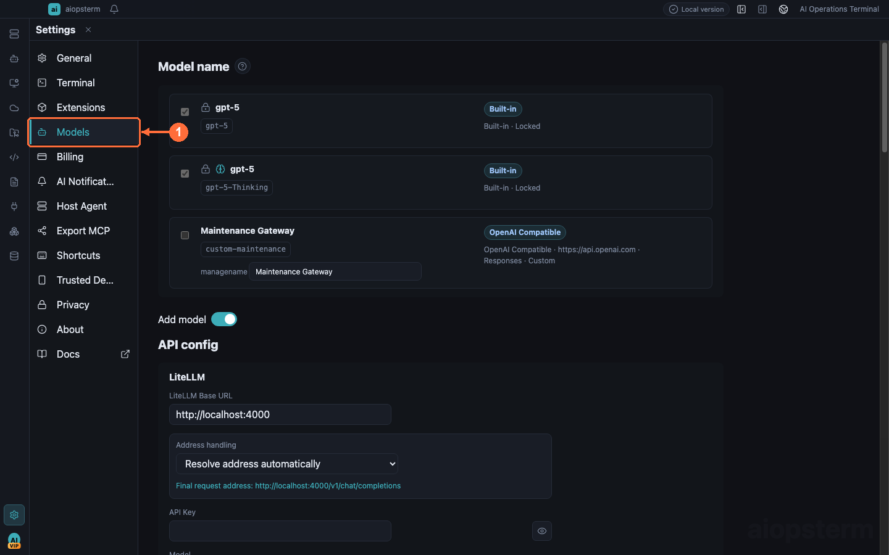
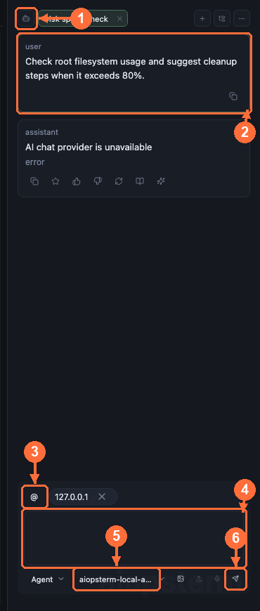

# Host Agent: Operate Local And Remote Hosts With AI

Use this guide when a host is already saved and connected in aiopsterm and you want AI-assisted diagnostics or controlled operations without losing target identity and approval boundaries.

## Where To Open It And Required Setup

A Host Agent requires a working model. An SSH connection alone cannot send AI requests.



1. Open **Settings -> Models -> Add Model**.
2. For embedded Codex, select **OpenAI Compatible**, enter Base URL, API Key, and Model, and set **API Format** to **Responses**. Codex does not use Chat Completions from this Provider.
3. Click **Check** against the Responses endpoint, then **Save**, and confirm the model appears. Ollama, LM Studio with OpenAI Compatible Server enabled, and explicitly supported Bedrock OpenAI models use dedicated adapters.
4. Classic may use its supported Chat Completions, Responses, Anthropic, and other Providers; Check and Save first.
5. Open **Workspace**, double-click a local or SSH host, and wait for readiness.
6. Select **Codex CLI** or **Classic** at the top of the right AI panel. Restore the panel through the layout control if hidden.
7. Bind Codex to the current terminal, or add a host through Classic's `@` control.

The remote host does not need Codex or Classic installed. The local agent operates through the connected terminal and its proxy/jump path.



Use **①** to choose Codex CLI or Classic, review output at **②**, add host context explicitly at **③**, enter the task at **④**, verify the model at **⑤**, and send or stop at **⑥**.

## Scenario 1: Diagnose a Host With Embedded Codex

Open the `prod-api-01` terminal, switch the right AI panel to Codex CLI, bind the terminal, and ask:

```text
Check load, memory, root disk usage, and recent nginx errors on this host. Diagnose only and do not change configuration.
```

Embedded Codex does not run shell commands in a local project directory. It obtains the selected terminal context through `aiopsterm_remote`, then uses remote command, file-read, and search tools. Without a valid bound terminal it stays in analysis mode and does not fabricate execution.

Recommended flow:

1. Connect the target host in the workspace.
2. Select or bind that terminal in a Codex tab.
3. Verify the target label and working directory.
4. Start with read-only diagnostics.
5. Review every approval that restarts services, writes files, or installs software.

With workspace linking enabled, selecting a terminal chooses an existing Codex conversation bound to it. aiopsterm never creates a new conversation silently when no binding exists.

## Scenario 2: Run a Multi-Step Classic Agent Investigation

Classic offers three permission levels:

| Mode | Intended work | Command execution |
| --- | --- | --- |
| Chat | Explanations and plans | Never |
| Command | One editable command proposal | Only after user execution |
| Agent | Multi-step diagnosis and controlled operations | Through tools and approval |

Add `prod-api-01` through `@ Add context`, then ask:

```text
Find the fastest-growing disk directories, determine whether logs are responsible, and propose safe cleanup steps.
```

Host context starts empty. The model can operate only on hosts explicitly selected for the conversation. Every command card retains its target identity and requires the corresponding backend terminal.

## Approval And Automatic Execution

Configure `Settings -> Host Agent -> Conversation & Hosts`:

- Automatically run read-only commands.
- Auto Approval for low-risk actions.
- Shell Integration Timeout.
- Security Configuration for allow, block, and approval policy.

The model's `requiresApproval: false` declaration is not final authority. Main-process terminal security can require approval or reject the command. Pending Agent commands are not editable, keeping the approved text identical to the executed text.

## Choosing Codex Or Classic

- Use embedded Codex for a terminal-style coding agent, remote file reads, and persistent sessions.
- Use Classic for structured command cards, explicit Chat/Command/Agent modes, and multi-host context.
- Use Classic Command or the terminal AI Command action for one command.
- Restore long-lived Codex or Classic work from [Agents Product Sessions](04-agents-product-sessions.md).

## Add Third-party Tools To Classic

For CMDB, monitoring, or internal-platform tools, open **Settings -> Host Agent -> MCP** and add a third-party MCP Server. This imports tools into embedded Classic; it does not export aiopsterm to external Codex. See [Third-party MCP Servers](09-third-party-mcp.md).

## Common Failures

- Host tools are missing: bind a live terminal.
- A command card cannot execute: its original terminal may be closed.
- A read-only command still asks: Main security overrode the model declaration.
- Codex only advises: the target may be unbound, disconnected, or restoring.
- A long command times out: adjust Shell Integration Timeout or use a long-running execution mode.

Previous: [Terminal And Main Workspace](02-terminal-workspace.md) · Next: [Agents Product Sessions](04-agents-product-sessions.md) · [Back to index](../index.md)
