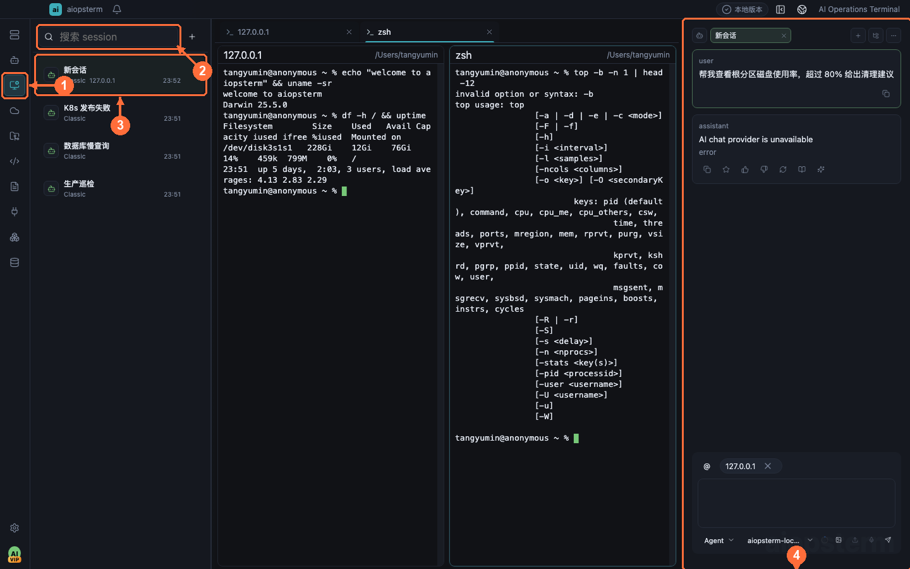
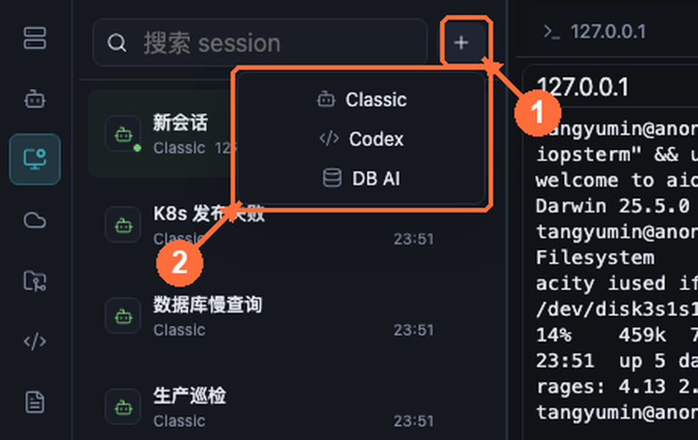
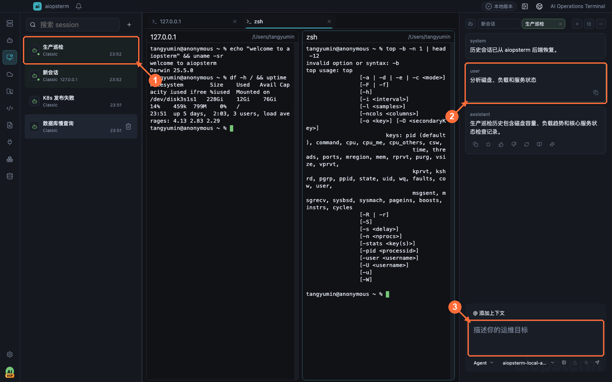

# Agents Product Sessions: Create, Restore, And Continue

Agents is the directory for AI product sessions created and stored by aiopsterm. It manages right-side Classic, embedded Codex, and Database DB AI sessions. It is not the notification inbox for external Codex, Claude Code, or OpenCode processes.

## Where To Open It

Click **Agents** at the top of the module rail. The left pane contains search, the session list, and the `+` button; selecting a session restores it into the right AI pane or Database workspace. Before creating one, configure and check its Provider under **Settings -> Models**; see [Host Agent](03-host-agent.md).

**①** opens Agents, **②** searches titles, carriers, bindings, and projects, **③** selects a saved session, and **④** is the restored conversation.

## Create The Three Product Session Types

Click **① `+`** to open **② the menu**:

- **Classic** creates a Chat, Command, or Agent host-operations conversation. Host context starts empty and must be selected with `@`.
- **Codex** creates an embedded Codex session bound to a terminal and optional project cwd. Codex uses a Responses Provider and terminal switching does not silently create sessions.
- **DB AI** opens Database and creates a database-scoped session. A valid connection, database, and schema are required before sending.

Use durable task names such as “Production inspection”, “Payments slow SQL”, or “K8s release check” instead of mixing unrelated work.

## Restore, Page, And Continue

Click **① a session row** to restore messages in **②** and continue from **③**. Restore starts at the newest message; scrolling upward pages older messages without adding those UI pages to the next model request twice.

- Codex restores its terminal binding and reconnects or asks for a new binding when needed.
- Classic restores host context and mode, but commands still require the original target.
- DB AI restores its original database scope and opens read-only when that connection or schema is unavailable.

## Close, Delete, And Restart

- **Close** stops the current UI/runtime but keeps the session restorable.
- **Delete** permanently removes the product session.
- App startup does not automatically restore every session, avoiding a burst of background models and terminals.

## How This Differs From AI Sessions

| Agents product sessions | AI Sessions module |
| --- | --- |
| Created by aiopsterm | Discovered through external Agent Hooks or local history |
| Codex, Classic, and DB AI | External Codex, Claude Code, OpenCode, and similar processes |
| Restored to continue a conversation | Used for alerts, focus, transcript revision, and project files |
| Does not require notification Hooks | Live state and notifications require the matching Hook |

Previous: [Host Agent](03-host-agent.md) · Next: [AI Session Management](05-ai-sessions.md) · [Back to index](../index.md)
