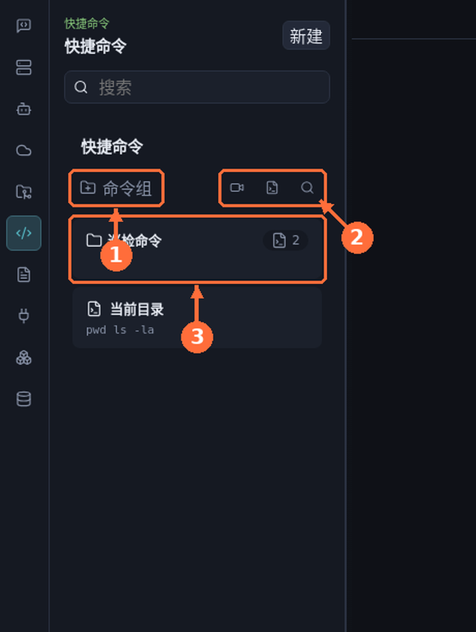

# Quick Commands And Macro Recording

Quick Commands keep named command scripts in the main-process backend, runnable from anywhere. Macro recording turns a real terminal interaction into a replayable quick command.

## Panel Overview

- **① 命令/分组 (Commands / Groups)** — flat list or grouped browsing.
- **② Toolbar buttons** — new command, record macro, search.
- **③ Command item** — hover for Run, Paste, and edit actions.

## Writing Reliable Quick Commands

- Create/edit completes through the backend before the catalog changes; Run plans the script by **snippet ID**, so it always executes the latest saved content — never a stale renderer draft.
- `Run` submits all command segments; `Paste` leaves the final command unsubmitted, ideal when you need to tweak parameters before pressing Enter.
- Use `sleep==milliseconds` between segments to wait for the previous step to take effect (e.g. service restart, then status check).
- A failed terminal write stops all remaining segments — half a script never lands in the wrong session.

Organization tips:

- Group by scenario: inspection, release, database, incident.
- Name as verb + object: "restart nginx and verify", "capture JVM thread dump".
- Do not make destructive one-click Run commands; use Paste mode so a human presses Enter.

## Macro Recording

1. Start recording from the Quick Commands panel; the recorder binds to the active terminal pane (never a Knowledge or chat panel).
2. Work in the terminal as usual. Only input confirmed by the terminal backend (exact session and byte count) enters the macro; rejected or malformed writes are excluded.
3. Return commits the current line; supported control keys can be captured when enabled.
4. Stop saves a timestamped backend-owned quick command; cancel discards it.

> Note: captured input feeds the macro state machine directly and is not appended to the terminal's visible history — the PTY echo remains the only echo you see.

## Referencing In AI Chat

Type `/` in the AI composer to insert a quick command as a mention, letting the AI explain or adapt your existing scripts.
