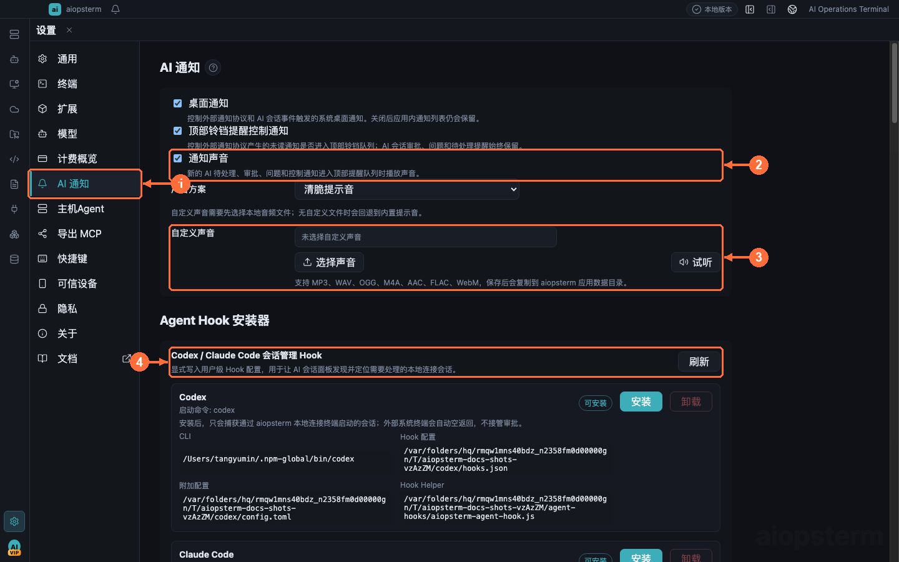
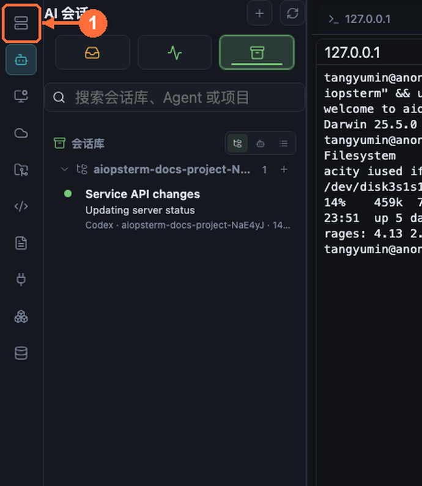
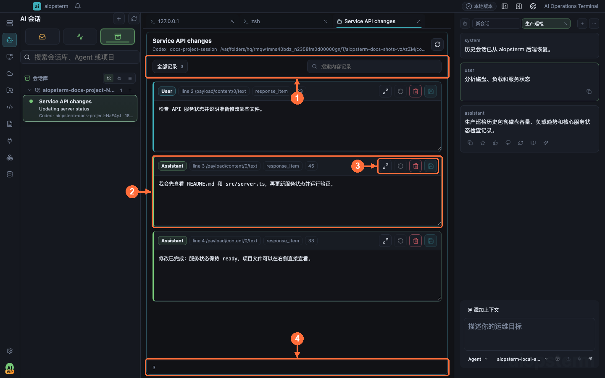
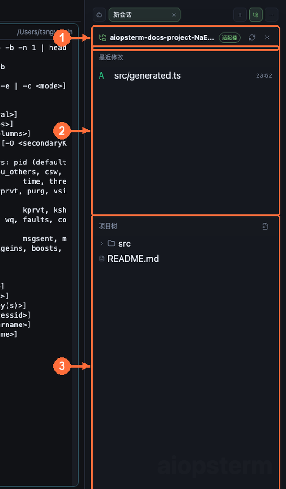

# AI Session Management: Observe External Coding Agents

AI Sessions observes external Codex, Claude Code, OpenCode, and similar coding Agents: live state and alerts, terminal focus, complete transcript inspection/revision, and project-file review. It does not own right-side embedded Codex/Classic or DB AI; see [Host Agent](03-host-agent.md) and [Agents Product Sessions](04-agents-product-sessions.md).

## Where To Open It And Required Setup

Click **AI Sessions** on the module rail. Install the matching Agent Hook before expecting live management:

1. Open **Settings -> AI Notifications** and find the Agent card you actually use.
2. Confirm its CLI is detected and click **Install Hook**. The installer adds only aiopsterm-marked entries and preserves other Hooks.
3. Codex also requires Hooks enabled and the installed configuration in `trusted` state. The installer writes the current trust hash; reinstall after Codex/plugin changes if status is no longer installed/trusted.
4. Launch the Agent from an aiopsterm-created local terminal. Live events report only from the managed terminal environment; ordinary system terminals are not taken over.
5. Run a short turn and verify it appears under **Running**, then becomes attention-worthy and notifies when the turn stops.

> Local history import and live Hooks are separate. History may appear in the Library without a Hook, but live running, approval, question, completion, and reliable recent-file events require the Hook.

**①** opens AI Notifications, **②** controls sound, **③** imports/previews audio, and **④** installs and checks Agent Hooks.

## The Three Inbox Views

- **Pending** contains approval, answer, or confirmation requests; the top bell cycles these sessions.
- **Running** contains active sessions, grouped by project by default.
- **Library** contains imported and ended history, organized by project, Agent, or time.

Double-click a session to focus its aiopsterm terminal. Restorable idle records open a local terminal at the saved cwd and write that Agent's resume command. Native Codex permission prompts remain in Codex's terminal; aiopsterm records, alerts, and focuses them without impersonating Codex approval.

## Inspect The Complete AI Conversation

1. Right-click a session row and choose **Open Session Content**.
2. A named content tab opens in the main workspace. **①** is the message timeline, **②** switches source/rendered or content views, and **③** contains save state/actions.
3. Use rendered view for user messages, assistant replies, tools, and errors; switch to source for original fields.
4. This is the Agent's real transcript, not a summary regenerated by the right AI pane.

If the action is unavailable, verify that the Agent exposes a readable transcript and its stored path still exists. A notification-only Agent may appear without conversation text.

## Revise AI Conversation Content

Revision can remove a bad context fragment, sensitive text, or malformed local record:

1. Stop/exit the running Agent so it no longer uses in-memory old context.
2. Open session content, switch to editable source, and revise it.
3. Save. aiopsterm validates the revision and backs up the original under `agent-sessions/content-backups/`; unsupported structures are not blindly overwritten.
4. Close the original process and resume the session. A running process does not reload its transcript from disk automatically.

Editing history does not undo commands or file changes already performed by the Agent. Restore from the backup instead of hand-splicing incomplete JSON/JSONL.

## Inspect And Edit AI Project Files

Open a session and click **Project Files** on its toolbar:

- **①** identifies project, Agent, and capability level.
- **② Recent Changes** separates created, modified, deleted, and renamed files.
- **③ Project Tree** reads the real disk lazily and opens files in Monaco.
- Edits save after about one second of inactivity or blur. Concurrent Agent edits require Reload or Overwrite.

Recent changes come from native Hook events, recognized file tools, or explicit reports. Arbitrary shell side effects are not guessed, and paths cannot escape the bound project root.

## Notifications, Sound, And Hibernation

Use **Settings -> AI Notifications** for desktop alerts, custom sound, and Agent Hibernation:

- Approval, questions, and turn completion are appropriate for desktop alerts and short sounds.
- Imported MP3, WAV, OGG, M4A, AAC, FLAC, or WebM files are copied into app data.
- Hibernation skips visible sessions, pending-input sessions, and sessions without resume commands.
- `aio notify` creates a generic control notification; it does not create an AI session or replace an Agent Hook.

## When Events Do Not Arrive

1. Check CLI detection and installed status under **Settings -> AI Notifications**.
2. Verify Codex Hooks are enabled and trusted; reinstall after configuration changes to refresh trust hashes.
3. Verify the Agent started inside an aiopsterm local-connection terminal, not macOS Terminal, iTerm2, Windows Terminal, or an external Linux shell.
4. History visible but no live state usually means importer works while the Hook does not.
5. For silent alerts, preview sound first, then inspect OS notification permission and the app sound toggle.

Previous: [Agents Product Sessions](04-agents-product-sessions.md) · Next: [Quick Commands And Macros](06-quick-commands.md) · [Back to index](../index.md)
