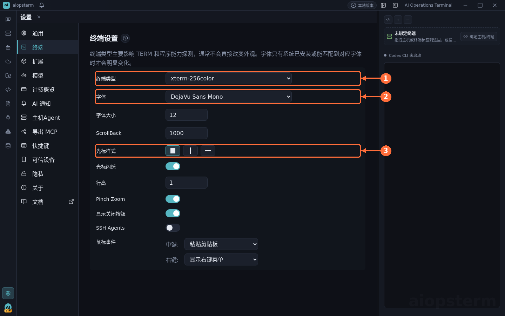
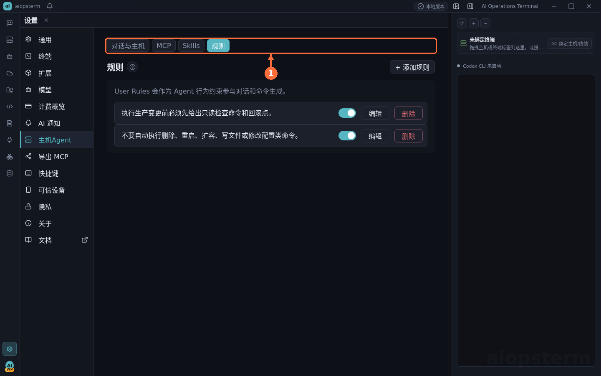

# Settings That Matter

There are many settings pages; this guide walks the ones with the biggest day-to-day impact, in recommended order. `Ctrl+,` opens Settings.

## General: Theme And Background

The **① 通用 (General)** page sets the theme (Dark/Light) and the app background (**②** presets or a custom JPG/PNG/WebP/GIF). With a background active, panels, tab strips, and menus switch to translucent surfaces while terminal text areas stay readable; picking a preset applies sensible default opacity/brightness.

## Terminal: Font, Cursor, Terminal Type

- **① 终端类型 (Terminal type)** — applied to xterm `termName` and passed as `TERM` to new local pty, SSH, and relay-shell sessions; invalid values fall back to `xterm-256color`. Check here first when remote TUI programs render oddly.
- **② 字体 (Font)** — family, size, and line height apply live to all open panes and the embedded Codex panel; a pane-local `Ctrl+=` zoom overrides the global size until that pane closes.
- **③ 光标 (Cursor)** — style and blink.
- Also useful: scrollback length, Pinch Zoom (gates Ctrl/Meta+wheel font zoom), tab close-button visibility, paste protection.

## Models: Your Inference Endpoints

The **① 模型 (Models)** page manages built-in and custom models (OpenAI Compatible / OpenAI Responses providers). Base URLs that already include `/v1` or `/v3` are preserved; append `#` to prevent the automatic `/v1` suffix (the marker is stripped before use). Use `Check` to verify connectivity before `Save`.

## Shortcuts: Remap To Taste

The **① 快捷键 (Shortcuts)** page remaps app actions such as new terminal, switch-to-tab, and AI panel visibility. Note: an app shortcut configured as plain `Ctrl+letter` is **not** captured inside terminal panes — shell readline keys keep priority. `重置全部` resets everything.

## Host Agent: The AI Security Hub

The `对话与主机` (Conversation & Hosts) sub-tab **②** concentrates AI execution policy:

- `自动执行只读命令` (auto-run read-only commands) — lets model-declared non-destructive diagnostics run automatically; main-process policy can still force approval.
- `安全配置` (Security configuration) — command block/confirm policy; commands blocked by policy stay blocked for AI too.
- `AI 会话自动命名` (auto-name AI sessions, off by default) — summarizes completed turns into titles with your configured model; manual names are preserved.
- The MCP / Skills / Rules sub-tabs are covered in [MCP Integration](06-mcp.md) and [AI Assistant](03-ai-assistant.md).

## Rules: House Rules For AI

The **①** `规则` (Rules) sub-tab maintains User Rules injected into every Classic conversation — company terminology, reply language, or workflow conventions like "always give a dry-run variant for production commands". Rules shape style and workflow but never bypass security policy.

## About: Version And Diagnostics

Besides the version and update check, the **① 关于 (About)** page has two troubleshooting entries: `Open Log Dir` opens the runtime log directory, and `Feedback` prepares a local diagnostics report — start here when filing issues.
