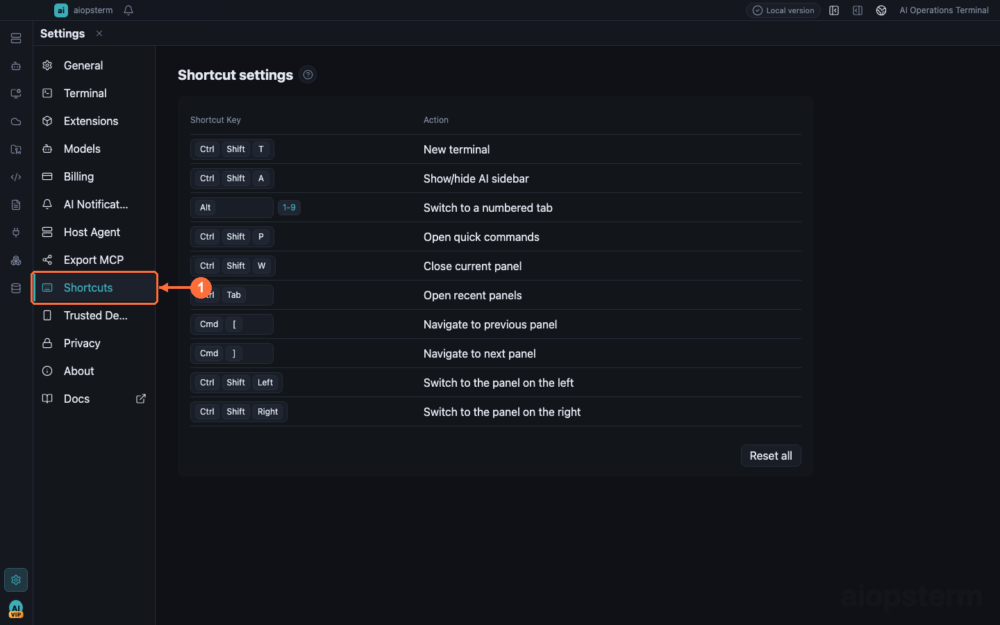

# Keyboard Shortcuts

This guide explains how to operate terminals, tabs, search, AI, and layout from the keyboard without stealing control keys from the shell.

## Where To Open It

Click the **Settings gear** at the lower-left corner, then select **Shortcuts** in the Settings navigation. Click the key field beside an action and press the new combination. Conflicts appear immediately. Use the row reset control for one action or the page reset control for all defaults.



## Most-used Shortcuts

| Shortcut | Action | Notes |
| --- | --- | --- |
| `Ctrl+Shift+T` | New local terminal | Configurable; inherits the current cwd when opened from a local terminal |
| `Ctrl+Shift+Y` | Fork the current SSH channel | Available only when the current terminal is a forkable SSH channel |
| `Ctrl+Shift+W` | Close the current panel | Configurable |
| `Ctrl+Tab` | Open Recent Panels | Searches terminals, knowledge documents, AI sessions, and project files |
| `Ctrl+Shift+A` | Show or hide the AI sidebar | Configurable |
| `Ctrl+Shift+P` | Open Quick Commands | Opens user-configured commands and macros |
| `Ctrl+Shift+K` | Open inline AI Command | Generates a command for the current terminal |
| `Ctrl+Shift+M` | Open file management | Opens the file workspace for the current SSH host |

`Ctrl+T` by itself is not aiopsterm's New Terminal shortcut. Plain `Ctrl+letter` combinations go to the shell while a terminal has focus; the default for New Terminal is `Ctrl+Shift+T`. If an app action is remapped to `Ctrl+T`, it works outside terminal areas, while terminal panes still send it to the shell first.

## Why Terminal Shortcuts Use Modifiers

While a terminal is focused, `Ctrl+A/C/D/E/K/L` must reach readline, vim, tmux, and remote TUIs. aiopsterm therefore places copy, paste, new-terminal, and similar app actions under `Ctrl+Shift` or `Ctrl+Alt`. macOS labels follow the configured binding; operating-system key-repeat behavior is separate from application shortcuts.

## Configurable Workspace Shortcuts

The actions below can be remapped under **Settings -> Shortcuts**. The Settings page shows the active value; this table lists defaults for a new installation.

| Action | Windows / Linux | macOS |
| --- | --- | --- |
| New local terminal | `Ctrl+Shift+T` | `Ctrl+Shift+T` |
| Show or hide the AI sidebar | `Ctrl+Shift+A` | `Ctrl+Shift+A` |
| Switch to tab 1 through 9 | `Alt+1..9` | `Alt+1..9` |
| Open Quick Commands | `Ctrl+Shift+P` | `Ctrl+Shift+P` |
| Close the current panel | `Ctrl+Shift+W` | `Ctrl+Shift+W` |
| Open Recent Panels | `Ctrl+Tab` | `Ctrl+Tab` |
| Go back through activation history | `Ctrl+Left` | `Cmd+[` |
| Go forward through activation history | `Ctrl+Right` | `Cmd+]` |
| Switch to the panel on the left by tab order | `Ctrl+Shift+Left` | `Ctrl+Shift+Left` |
| Switch to the panel on the right by tab order | `Ctrl+Shift+Right` | `Ctrl+Shift+Right` |

## Terminal Shortcuts

The bindings below apply to terminal surfaces and currently cannot be remapped on the Shortcuts page. `Option` is the macOS label for `Alt`; fixed terminal shortcuts on macOS also accept their corresponding `Ctrl` combinations.

| Action | Windows / Linux | macOS |
| --- | --- | --- |
| Copy / paste | `Ctrl+Shift+C` / `Ctrl+Shift+V` | `Cmd+C` / `Cmd+V` |
| Open search | `Ctrl+Alt+F` | `Cmd+Option+F` |
| Next / previous search result | `Ctrl+Alt+G` / `Ctrl+Alt+H` | `Cmd+Option+G` / `Cmd+Option+H` |
| Clear search highlights | `Ctrl+Alt+J` | `Cmd+Option+J` |
| New / close window | `Ctrl+Shift+N` / `Ctrl+Shift+Q` | `Cmd+Shift+N` / `Cmd+Shift+Q` |
| Fork the current SSH channel | `Ctrl+Shift+Y` | `Cmd+Shift+Y` |
| Open inline AI Command | `Ctrl+Shift+K` | `Cmd+Shift+K` |
| Clear the terminal | `Ctrl+Shift+L` | `Cmd+Shift+L` |
| Open file management for the current host | `Ctrl+Shift+M` | `Cmd+Shift+M` |
| Increase / decrease / reset font size | `Ctrl+=` / `Ctrl+-` / `Ctrl+0` | `Cmd+=` / `Cmd+-` / `Cmd+0` |
| Switch to the previous / next terminal tab | `Ctrl+PageUp` / `Ctrl+PageDown` | `Cmd+PageUp` / `Cmd+PageDown` |
| Move the current tab left / right | `Ctrl+Shift+PageUp` / `Ctrl+Shift+PageDown` | `Cmd+Shift+PageUp` / `Cmd+Shift+PageDown` |
| Scroll up / down one line | `Ctrl+Shift+Up` / `Ctrl+Shift+Down` | `Cmd+Shift+Up` / `Cmd+Shift+Down` |
| Scroll up / down one page | `Shift+PageUp` / `Shift+PageDown` | `Shift+PageUp` / `Shift+PageDown` |
| Scroll to the top / bottom | `Shift+Home` / `Shift+End` | `Shift+Home` / `Shift+End` |
| Toggle full screen | `F11` | `F11` |
| Reconnect a closed or failed terminal | `Enter` | `Enter` |

`Ctrl+Shift+T` and `Ctrl+Shift+W` also follow the configurable shortcut settings. Once either action is remapped, its old default no longer triggers it.

## Common Editor Shortcuts

| Surface | Action | Windows / Linux | macOS |
| --- | --- | --- | --- |
| Files, Knowledge, session-content, and JSON editors | Save | `Ctrl+S` | `Cmd+S` |
| Text editors | Undo / redo | `Ctrl+Z` / `Ctrl+Y` | `Cmd+Z` / `Cmd+Shift+Z` |
| Text editors | Cut / copy / paste | `Ctrl+X` / `Ctrl+C` / `Ctrl+V` | `Cmd+X` / `Cmd+C` / `Cmd+V` |
| Text editors | Select all | `Ctrl+A` | `Cmd+A` |
| Text editors | Find / replace | `Ctrl+F` / `Ctrl+H` | `Cmd+F` / `Option+Cmd+F` |
| SQL editor | Run statement | `Ctrl+Enter` | `Cmd+Enter` |
| SQL editor | Save | `Ctrl+S` | `Cmd+S` |

## AI Input And Search

| Surface | Key | Action |
| --- | --- | --- |
| Classic AI or DB AI composer | `Enter` | Send the message |
| Classic AI or DB AI composer | `Shift+Enter` | Insert a new line |
| Classic AI composer | `Ctrl+Enter` / `Cmd+Enter` | Send the message |
| Classic AI composer | `@` | Open the context picker |
| Classic AI composer | `/` | Open the command picker |
| Classic AI conversation | `Ctrl+F` / `Cmd+F` | Search the current conversation |
| Conversation search field | `Enter` / `Shift+Enter` | Next / previous match |
| Popup, menu, or edit state | `Escape` | Close, go back, or cancel the current operation |

## Built-in Terminal Helper Commands

Local terminals created by aiopsterm automatically add the following commands to `PATH`. These are command-line shortcuts, not keyboard combinations. They are not installed in remote SSH shells.

| Command | Purpose | Example |
| --- | --- | --- |
| `aio` | Preferred workspace control command | `aio terminal list` |
| `aictl` | Compatibility alias for `aio` | `aictl context` |
| `aiopsterm-control` | Full-name compatibility entry for `aio` | `aiopsterm-control help` |
| `aiopen` | Open one or more local text files in the main workspace | `aiopen README.md src/main.ts` |
| `aiossh` | Connect to or locate a managed host | `aiossh prod-api` |
| `aiswitch` | Switch to a managed host, equivalent to `aio host switch` | `aiswitch prod-api` |
| `aioic` | Close panels confirmed idle under the configured timeout | `aioic` |
| `aiobc` | Immediately close background panels and keep the current panel | `aiobc` |

The correct command names are `aiopen` and `aiossh`; there is no `aioopen` or `aiopssh` command. Run `aio help` for the complete command tree and `aio recipes` for copyable examples. The detailed [Control CLI Tutorial](../../control-cli-tutorial.md) covers parameters and workflows.

Common examples:

```bash
aiopen ./README.md
aiossh prod-api
aio terminal read-screen --lines 80
aio settings open --target shortcuts
aioic
aiobc
```

Treat the current Settings page and the current version's interface hints as authoritative. Configurable bindings may have been changed, and the operating system or desktop environment may reserve some combinations.

## Customization Steps

1. Search for the action under **Settings -> Shortcuts**.
2. Click its key field and confirm recording state.
3. Press the complete combination.
4. Resolve any reported conflict before leaving the page.
5. Verify it in a real terminal: normal shell controls must still pass through and the app action must fire once.

## Best Practices And Troubleshooting

- Keep plain `Ctrl+letter` combinations available to terminal programs.
- Avoid combinations reserved by macOS Mission Control, Windows input methods, or the Linux desktop.
- If a binding does nothing, focus the intended surface first and check for conflicts.
- If vim or tmux loses a control key, restore the related app action and choose a modifier-heavy binding.

Previous: [Quick Commands](06-quick-commands.md) · Next: [Export MCP](08-export-mcp.md) · [Back to index](../index.md)
