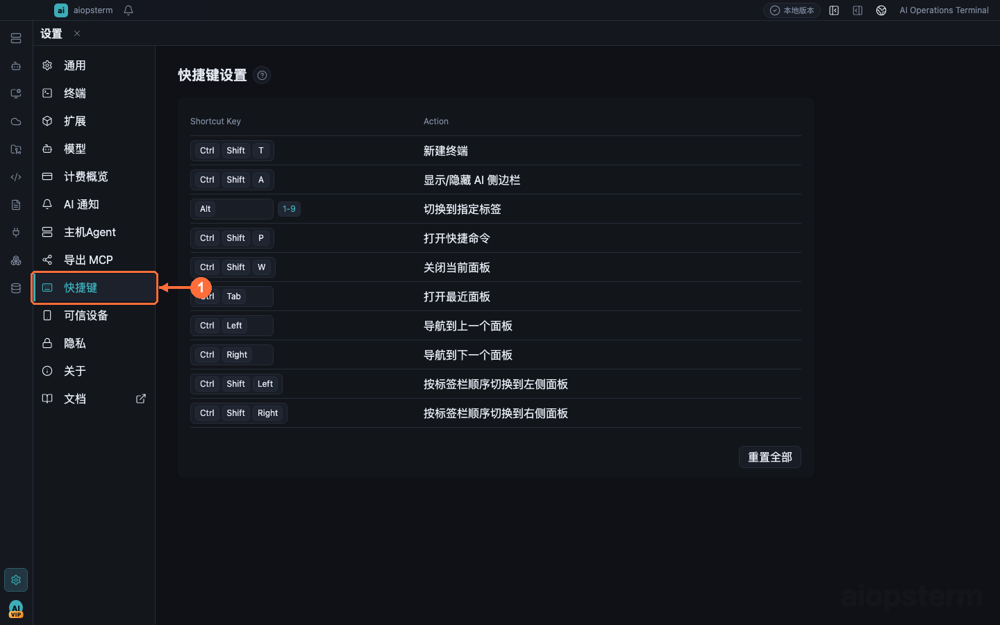

# Keyboard Shortcuts

This guide explains how to operate terminals, tabs, search, AI, and layout from the keyboard without stealing control keys from the shell.

## Where To Open It

Click the **Settings gear** at the lower-left corner, then select **Shortcuts** in the Settings navigation. Click the key field beside an action and press the new combination. Conflicts appear immediately. Use the row reset control for one action or the page reset control for all defaults.

## Why Terminal Shortcuts Use Modifiers

While a terminal is focused, `Ctrl+A/C/D/E/K/L` must reach readline, vim, tmux, and remote TUIs. aiopsterm therefore places copy, paste, new-terminal, and similar app actions under `Ctrl+Shift` or `Ctrl+Alt`. macOS labels follow the configured binding; operating-system key-repeat behavior is separate from application shortcuts.

## Recommended Categories

| Category | Typical actions |
| --- | --- |
| Sessions | New local terminal, close panel, recent panels, previous/next tab |
| Terminal | Copy, paste, clear, fork SSH, font zoom |
| Search | Open, previous, next, clear highlights |
| AI | Inline AI command, show or hide AI panel |
| Files | Open file management for the selected SSH host |
| App | Settings, Assets, full screen, layout switch |

Treat the current Settings page as authoritative because bindings are editable and OS-reserved combinations differ between Windows, Linux, and macOS.

## Customization Steps

1. Search for the action under **Settings -> Shortcuts**.
2. Click its key field and confirm recording state.
3. Press the complete combination.
4. Resolve any reported conflict before leaving the page.
5. Verify it in a real terminal: normal shell controls must still pass through and the app action must fire once.

## Best Practices And Troubleshooting

- Keep plain `Ctrl+letter` combinations available to terminal programs.
- Avoid combinations reserved by macOS Mission Control, Windows input methods, or the Linux desktop.
- If a binding does nothing, focus the intended surface first and check for conflicts.
- If vim or tmux loses a control key, restore the related app action and choose a modifier-heavy binding.

Previous: [Quick Commands](06-quick-commands.md) · Next: [Export MCP](08-export-mcp.md) · [Back to index](../index.md)
