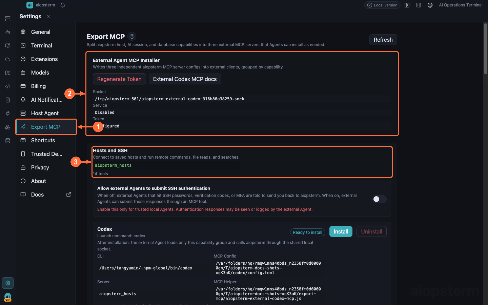

# Export MCP To External Agents

This guide focuses on exporting aiopsterm capabilities to external coding agents. Consuming third-party MCP inside the embedded Agent is a separate path.

## Where To Open It

Click the lower-left **Settings gear -> Export MCP**. The header manages gateway and Token; three cards below represent Hosts, AI Sessions, and Databases. Install Codex or Claude Code from the individual card—there is no bulk install button. Third-party MCP for the embedded Agent lives under **Settings -> Host Agent -> MCP**.

## The Three Independent Exports

Open **① Export MCP**, manage the local gateway and token at **②**, and install the first independent capability card at **③**. The other two server cards follow on the same page.

**Settings -> 导出 MCP (Export MCP)** splits aiopsterm capabilities into three independent MCP servers for hosts and SSH, managed AI sessions, and read-only database access, so external Codex, Claude Code, and similar agents can install only what they need:

| Server | Typical scenario | Capability boundary |
| --- | --- | --- |
| `aiopsterm_hosts` | Reuse saved hosts from an external agent, open headless SSH connections, and inspect remote files | Host listing, connect/disconnect, authentication requests, bounded commands, file reads, glob, and grep; never returns passwords, private keys, or tokens |
| `aiopsterm_ai_sessions` | See where another coding agent is blocked and return the operator to its terminal | Sessions, approvals/questions/plans, events and notifications, polling-free completion waits, focus, mark, and clear; blocking Claude hooks can receive replies, while native Codex prompts must be completed in the Codex terminal |
| `aiopsterm_databases` | Let a trusted external agent inspect saved schemas and bounded data samples | Redacted connections, catalog search, table metadata/DDL, structured filters and paging; no arbitrary SQL, and external database reads are off by default |

Installation flow:

1. Confirm that the local gateway is enabled and generate a token for the target agent.
2. Install only the capability cards required for the task. An uninstalled server contributes no tool schemas.
3. For database work, also enable **Allow external Agents to read databases**; non-SQLite connections normally need to be open in Database Workspace.
4. Reload the external agent's MCP list and verify it with one read-only call.

Do not ask an external agent to call `list_ai_sessions` every few seconds while monitoring another agent. Resolve the target `source` and `sessionId`, then call `wait_ai_session_completion` once. It returns as soon as a later `stop`, `session_end`, or ended lifecycle event arrives and waits for at most 120 seconds by default. Only when it returns `timedOut: true` should the caller continue with the returned `nextSeq` as the next `afterSeq`. After a completion event, the external agent can inspect the working tree, diff, and test results.

The three servers share the local socket, bundled runtime, and current token, while publishing fully disjoint tool lists:

- **Regenerate Token** immediately invalidates the old token, so running external agents must reload their configuration.
- Helper scripts run through aiopsterm's bundled runtime (`ELECTRON_RUN_AS_NODE=1 <aiopsterm-executable> <helper.js>`) — **no system Node.js needed**.
- Database tools go through the separate Export MCP gateway, resolving process-scoped random handles to saved connections inside the main process — external agents never see a second DSN or password.
- Database handles change after an app restart. External agents must list connections again instead of persisting a handle.

> Best practice: give the token only to a trusted local agent and regenerate it on any suspicion of leakage. Host commands remain bounded by connection and authentication rules; database access stays read-only; AI-session tools do not close the owning terminal or kill the agent process.

Third-party MCP Servers use a different direction and entry. Follow [Third-party MCP Servers](09-third-party-mcp.md), and do not place their JSON in Export MCP.

Previous: [Keyboard Shortcuts](07-shortcuts.md) · Next: [Third-party MCP Servers](09-third-party-mcp.md) · [Back to index](../index.md)
