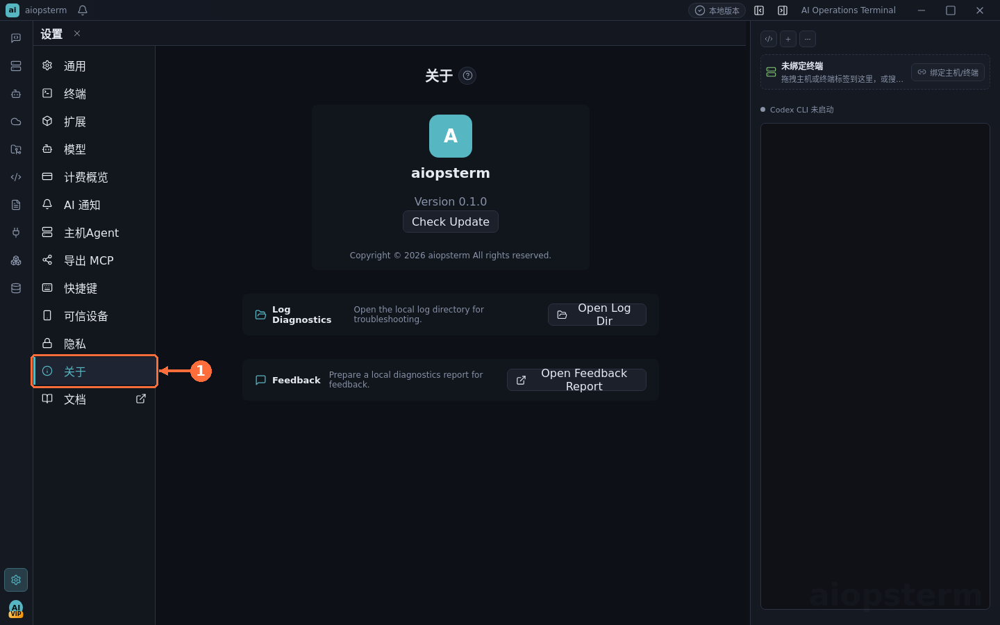

# Troubleshooting Quick Reference

Grab the logs first, then match your symptom. This is the field-guide version of the [full troubleshooting doc](../../troubleshooting.md).

## Step One: Find The Logs

Runtime diagnostics live at:

```text
<userData>/logs/aiopsterm-runtime.log
```

On Linux `<userData>` is usually `~/.config/aiopsterm`. The fastest route is **Settings -> About -> Open Log Dir** (see [Settings](07-settings.md)).



Terminal write logs record byte counts and session metadata only — **no command text, no secrets** — so they are safe to attach to reports.

## Symptom Table

| Symptom | Look at |
| --- | --- |
| Terminal input unresponsive | Recent `terminal.*` and `renderer.terminal-*` entries |
| Lag while running TUI programs (codex, top, …) | `terminal.data.summary`, `renderer.terminal-output.slow-write` (`writeMs/queueMs/maxPendingBytes`) |
| AI Sessions module slow to open | `ai-agent.managed-event` entries like `managed_ai.sessions.imported`, cross-checked with `agent-sessions/managed-ai-sessions.audit.jsonl` |
| Slow jump from session row to terminal | The five `renderer.managed-ai-session.terminal-switch.*` phases (requested → target-resolved → panel-activated → ui-frame-ready → terminal-frame-ready) |
| Slow "open session content" | Backend `managed_ai.content.list.durationMs` low but renderer `renderSettleMs` high → bottleneck is card rendering, not disk IO |
| SSH will not connect | Jump-host diagnostics below |
| Right-side Codex reports `ETIMEDOUT` | Health-check timeout: raise `AIOPSTERM_CODEX_HEALTH_CHECK_TIMEOUT_MS=60000`, then run the binary from the error message with `--version` |

Rules of thumb for output problems: high `terminal.data.summary` with low renderer timings → the program simply prints a lot. Frequent `terminal.data.coalesced` → the backend is reducing IPC pressure as designed. High `writeMs/queueMs` in `slow-write` → xterm rendering throughput is the bottleneck. Coalescing is backpressure, not data loss, subject to scrollback limits.

## SSH And Jump-Host Diagnostics

SSH lifecycle logs carry structured, secret-free metadata:

- `authScope`: `jump` (bastion side) vs `target` (final host) — establish which hop failed first.
- `sshTransport`: `direct` / `proxy` / `jump` / `relay-shell`.
- `connectionReuse`: `created` vs `reused`.
- `remoteHop` + `endpointConfidence`: in relay-shell mode, whether you are on the bastion or the target.

Read a jump-host failure in order: ① `terminal.keyboard-interactive.request` with `authScope:"jump"` (bastion asks for a dynamic code) → ② `stage:"proxy-opening"` (tunnel parameters) → ③ `Opening SSH jump tunnel ...` (bastion authenticated, opening forwardOut) → ④ `authScope:"target"` (target handshake). If it stops at ③, TCP forwarding is rejected and aiopsterm falls back to relay-shell mode — auth prompts then appear in the terminal stream, not the global dialog.

Also worth knowing:

- No pre-emptive password dialog on first connect: the dialog appears only after the real server rejects authentication (and the asset supports password auth).
- The SSH ready timeout defaults to 120 seconds to fit interactive bastion / OTP flows.
- Relay/jump hosts without SFTP are an explicit unsupported state in Files — use `scp`/`rsync`.

## Crashes And Safe Mode

With crash diagnostics enabled (`npm run build:start` sets `AIOPSTERM_CRASH_DIAGNOSTICS=1`; packaged builds keep it off):

- Crash dumps are stored locally under `<userData>/crashes/` and never uploaded.
- Watch for `electron.render-process-gone`, `electron.child-process-gone`, `process.uncaught-exception`, `crash-diagnostics.ready`.
- After an abnormal exit, the next launch enters **crash safe mode** once: threaded terminal rendering disabled, worker 2D forced, hardware acceleration off. A clean exit clears it. `AIOPSTERM_CRASH_SAFE_MODE=0` disables the mechanism.

## Renderer Backend Checks

- If threaded terminals are unavailable, the log shows `renderer.threaded-terminal.unavailable` and aiopsterm falls back to plain xterm; force the fallback with `AIOPSTERM_THREADED_TERMINAL=0` for comparison.
- Verify WebGL2 really runs on hardware: `npm run build && npm run probe:terminal-gpu`, then check `terminalBackend` and `hardwareLikely`.
- If freezes line up with `control.notification.*` / `native-notification.*` entries, temporarily disable desktop notifications in Settings -> AI Notifications to isolate the notification path.

## Filing A Good Report

Include: reproduction steps, the relevant time window from `aiopsterm-runtime.log` (with the entries named above), the version from Settings -> About, and the report generated by `Feedback`.
