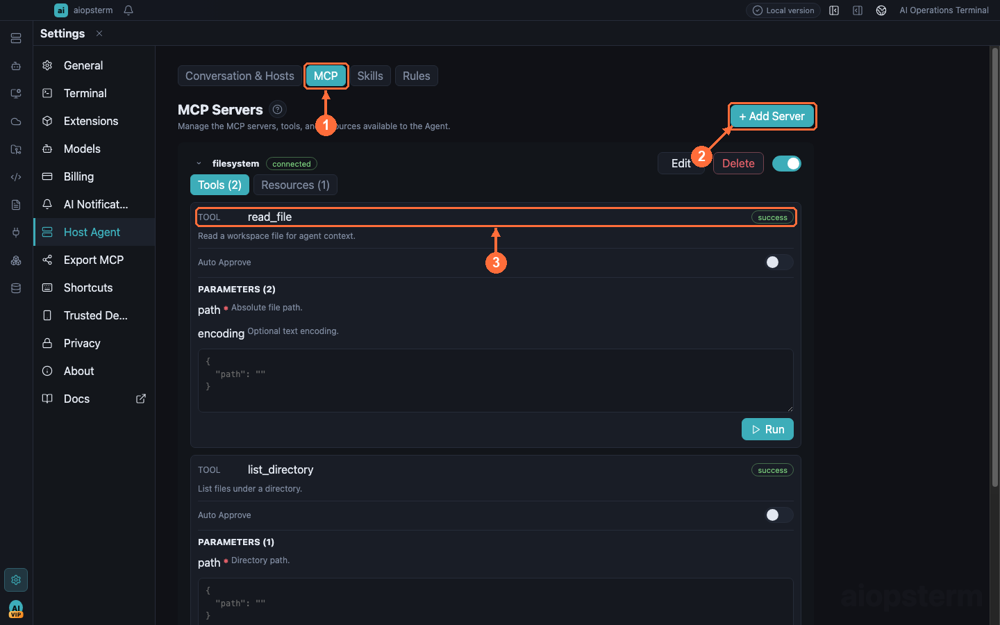

# Configure Third-party MCP Servers For Host Agent

This guide connects third-party MCP tools and resources to aiopsterm's Classic Host Agent. It is the opposite direction from exporting aiopsterm to an external Agent and uses separate settings, processes, and permissions.

## Where To Open It

Open **Settings -> Host Agent -> MCP**. Click **Add Server** to edit JSON, save, then inspect connection state, Tools, and Resources. This page does not install `aiopsterm_hosts`, `aiopsterm_ai_sessions`, or `aiopsterm_databases`; those belong to [Export MCP](08-export-mcp.md).



**①** selects MCP, **②** opens Server configuration, and **③** displays discovered tools and resources.

## Add A stdio Server

```json
{
  "mcpServers": {
    "local-tools": {
      "type": "stdio",
      "command": "node",
      "args": ["/absolute/path/to/server.js"],
      "env": { "SERVICE_TOKEN": "..." },
      "timeout": 10
    }
  }
}
```

The command must be executable in the aiopsterm main-process environment and script paths should be absolute. Credentials launch the Server but are not added to model context.

## Add A Remote Server

```json
{
  "mcpServers": {
    "remote-tools": {
      "type": "streamableHttp",
      "url": "https://mcp.example.com/mcp",
      "headers": { "Authorization": "Bearer ${TOKEN}" }
    }
  }
}
```

`streamableHttp` and compatible `sse` configurations are supported. An omitted type is inferred as HTTP only when `url` exists without `command`; specify a type when both are present.

## Verify And Authorize Tools

1. Save and wait for status refresh.
2. Only `connected` means initialization and discovery completed.
3. Expand the Server and verify Tools and Resources.
4. Enable Auto Approve only for trusted read-only tools; keep write, execution, and network tools manual.
5. Run a read-only Classic task and confirm its tool card shows the expected Server and arguments.

The Agent can read only explicitly listed resource URIs. Resource reads still require approval, and transport commands, environment variables, HTTP headers, and credentials are not exposed to the model.

## Common Problems

- `ENOENT`: the command or script path does not exist.
- `disconnected`: inspect process startup, URL, authentication headers, and timeout.
- No Tools: the Server may expose only Resources or return an invalid `tools/list` response.
- Tool does not auto-run: inspect that tool's Auto Approve setting.
- External Codex cannot see it: this page serves embedded Classic; install external capabilities under **Settings -> Export MCP**.

Previous: [Export MCP](08-export-mcp.md) · Next: [File Management](10-files.md) · [Back to index](../index.md)
