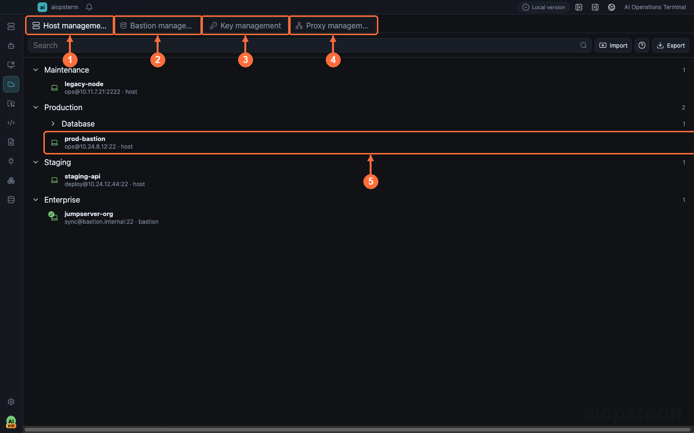

# Assets: Hosts, Jump Hosts, Keys, Proxies, And JumpServer

This guide starts with a common goal: save a production entry once, reconnect by name, route through proxies or jump hosts when required, and synchronize JumpServer organization assets into one resource tree.

## Where To Open It

Click **Assets** on the module rail. The top Host, Bastion, Key, and Proxy tabs are separate surfaces. Creation lives in tree context menus or empty states: right-click blank host-tree space for a top-level folder/host, or a folder for a child folder/host. Edit, clone, test, and delete are in the host row's more menu. Double-click a host to connect and switch to Workspace.

Use **① Host Management**, **② Bastion Management**, **③ Key Management**, and **④ Proxy Management** for separate resource types; **⑤** is a connectable host asset.

## Scenario 1: Save Credentials And Reconnect

Right-click empty tree space or a folder under **Host Management** and choose **New Host**:

1. **Basics**: Name is used by the resource tree and `aiossh`; Host/IP is the real target, port defaults to 22, and username is required.
2. **Authentication**: a password may be saved; private keys should reference a record created under **Key Management**, including a passphrase when needed; SSH Agent uses locally loaded identities.
3. **Network path**: optionally select a saved proxy and a standard SSH jump host. A proxy transports the first hop; a jump host performs the second SSH connection.
4. **Organization**: choose folders, groups, and tags for workspace search and CLI completion.
5. Run **Connection Test**. Success verifies configuration but does not open a terminal; save and double-click to connect.

The saved asset can then be opened from the Workspace tree, Assets, `aiossh <host-name>`, or the exported `aiopsterm_hosts` MCP server.

When no password is stored, a global authentication dialog appears. `Remember password and update this host` writes the password only after SSH reaches ready state.

## Scenario 2: Route SSH Through A Proxy

Host forms support saved HTTP/HTTPS CONNECT, SOCKS4/SOCKS5, and raw TCP proxy configurations. Raw TCP is intended for an endpoint that already forwards bytes to the target SSH service; it sends no target metadata and implements no proxy credential protocol.

Proxy settings and credentials stay in Main and are not exposed through ordinary asset snapshots or AI context.

## Scenario 3: Use A Jump Host

Save a standard SSH jump host as a host asset first, then select it from the target. aiopsterm prefers standard SSH TCP forwarding. Jump and target retain separate addresses, users, and authentication; password, OTP, and keyboard-interactive requests identify `jump` versus `target` so credentials are not entered for the wrong hop.

If the jump host rejects TCP forwarding, the visible terminal may fall back to relay-shell:

1. Local OpenSSH logs into the relay.
2. aiopsterm waits for an interactive prompt.
3. It writes a nested `ssh <target>` into that terminal stream.

Relay-shell remains interactive but is not a structured SSH channel, so SFTP is unavailable. Use a TCP-forward-capable jump host or run `scp` or `rsync` in the terminal.

## Scenario 4: Synchronize JumpServer Assets

Create a JumpServer data source under Bastion Management:

1. Enter the JumpServer root URL.
2. Enter a Private Token.
3. Optionally enter an organization id.
4. Save the bastion's own SSH endpoint and authentication.
5. Run Refresh Organization Assets.

The backend creates and updates stable synchronized assets. It removes only stale rows previously marked as synchronized for that organization and preserves manually managed assets. A failed refresh leaves the previous validated snapshot intact.

The Private Token is stored through the credential boundary. Normal snapshots and exports expose only a presence flag.

> Naming boundary: a standard SSH jump host is a host asset used for TCP forwarding or relay-shell. JumpServer under **Bastion Management** is an API/Token/organization-sync data source. Both can feed Bastion Resources, but they are created differently and provide different capabilities.

## JumpServer And Kubernetes

The Kubernetes workspace can map synchronized JumpServer assets into its catalog, but JumpServer command streaming is not implemented. Connect, resource refresh, and Kubernetes terminal actions fail closed for those entries. Import a local kubeconfig for real Kubernetes operations.

## Troubleshooting Order

1. Run the host or bastion connection test.
2. Distinguish network, password, key, disabled-password, and missing-auth failures.
3. For JumpServer refresh failures, verify URL, token, organization id, and pagination.
4. For nested SSH failures, verify TCP forwarding.
5. For SFTP failures, check whether the connection is using relay-shell.

Previous: [File Management](10-files.md) · Next: [Knowledge Base](12-knowledge-base.md) · [Back to index](../index.md)
