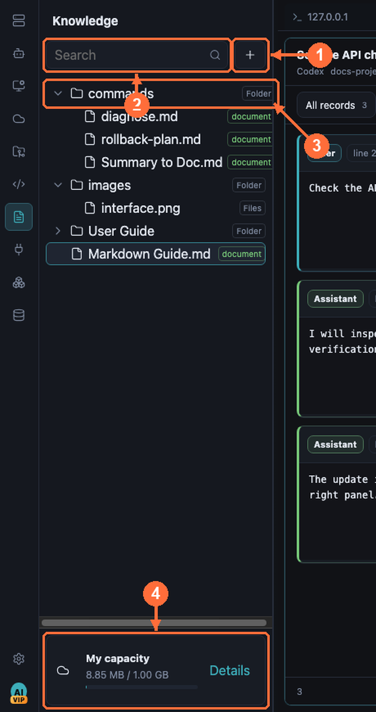
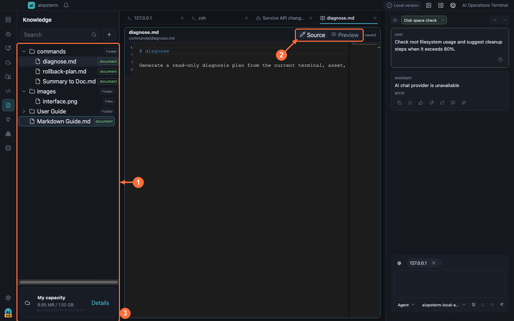

# Knowledge Base Best Practices

The Knowledge Base keeps runbooks, playbooks, and command references inside aiopsterm — documents behave like first-class workspace tabs next to terminals, and double as AI context evidence.

## Where To Open It

Click **Knowledge** on the module rail. Search and the `+` add button are at the top of the source panel; click `+` to reveal document, folder, upload-file, and upload-folder actions. Select Markdown to open it in the center and use the upper-right **Source/Preview** control. Rename, move, delete, and Add to Chat live in the document context menu.

## The Tree Panel

- **① Add button** — `新建文档` (New document) creates a Markdown document that opens immediately and enters inline rename; folders and file/directory uploads are here too.
- **② Search box** — filter tree nodes by name.
- **③ Tree node** — rows show a compact type label: `文件夹` (folder) / `文档` (document) / `文件` (file).
- **④ Capacity bar** — storage usage at a glance.

Organizing:

- Drag files/folders onto a folder to move them; drop on blank space to move to root. Moving into itself or a descendant is blocked up front.
- Folder context menus include upload, so imports land directly in that folder.

## Editing Documents

- Double-click a document in the **① tree** to open the **③ editor** in the main workspace.
- **② `源码` / `渲染` (Source / Preview)** toggles raw Markdown and rendered view — tables, code highlighting, Mermaid diagrams, knowledge-local images, and sanitized HTML all render. Your choice is remembered: later Markdown documents open in the last-selected mode (jumping to a specific line from search still opens the source editor).
- In Render mode, click a relative Markdown link to open that Knowledge document in the shared workspace. A `#heading` fragment scrolls to the matching heading. External `http/https` links go to the system browser, while relative paths that escape the Knowledge root are rejected.
- Content **auto-saves** through the knowledge backend; there is no save button. Backend failures keep the editor dirty and show the error.

> Best practice: embed Mermaid flowcharts and language-tagged code blocks in your runbooks. During incidents, split the document next to a terminal (drag the doc tab onto the terminal pane): plan on the left, execution on the right.

## Working With Terminals And AI

- Knowledge tabs are first-class workspace tabs: split via context menu, drag-attach onto panes, drag back to the tab bar to restore.
- Use `@` in the AI composer to attach knowledge documents as context; automatic knowledge search sends only the bounded matched line ranges, not whole documents.
- Agent mode's `search_knowledge_base` tool returns at most ten bounded snippets — structured documents (small headings, short paragraphs) retrieve best.
- Knowledge images can be attached as Classic image input (counted against the five-images-per-message limit).

Previous: [Asset Management](11-assets.md) · Next: [Plugins And Extensions](13-extensions.md) · [Back to index](../index.md)
