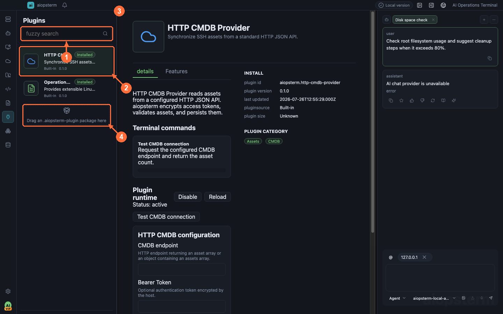

# Plugins And Extensions

Plugins add pages, tools, or integrations to aiopsterm. Verify provenance and permissions before installation; a failing plugin can be disabled independently of the core terminal.

## Where To Open It

Click **Extensions** on the module rail to reveal the plugin list. Click a plugin card before expecting the middle workspace to show its details, then use **Install/Update/Uninstall** there. For a local package, drag a supported package onto the dashed drop target at the bottom of the left list and wait for validation and confirmation.

## Browse And Manage

- Search by name or description and filter built-in, installed, and available entries.
- Details show version, author, description, features, installation state, and contributed entry points.
- Install and update tasks expose progress and can be cancelled while still downloading or validating.
- Disable keeps configuration while hiding functionality. Uninstall behavior for user data is stated by its confirmation dialog.

## Trust And Permissions

An external plugin is enabled only after manifest validation and user trust. Do not install unknown packages. Contributed pages and tools still pass through aiopsterm preload, IPC, and backend boundaries; renderer code is not a credential store.

## Aliases And Entry Points

For plugins that support aliases, open the plugin card and switch to the **Alias** tab to create, edit, enable, and order aliases. Contributed pages appear in details or their declared module entry; consult the feature list rather than searching for an unlabelled global button.

## Best Practices And Troubleshooting

- Record the current version and validate updates on a test machine first.
- Disable and restart after a plugin error, then inspect manifest compatibility and logs.
- If drag/drop does nothing, verify package format, manifest location, and window focus.
- Do not bypass validation after incompatibility, signature, checksum, or entry-point failures.

Previous: [Knowledge Base](12-knowledge-base.md) · Next: [Kubernetes](14-kubernetes.md) · [Back to index](../index.md)
