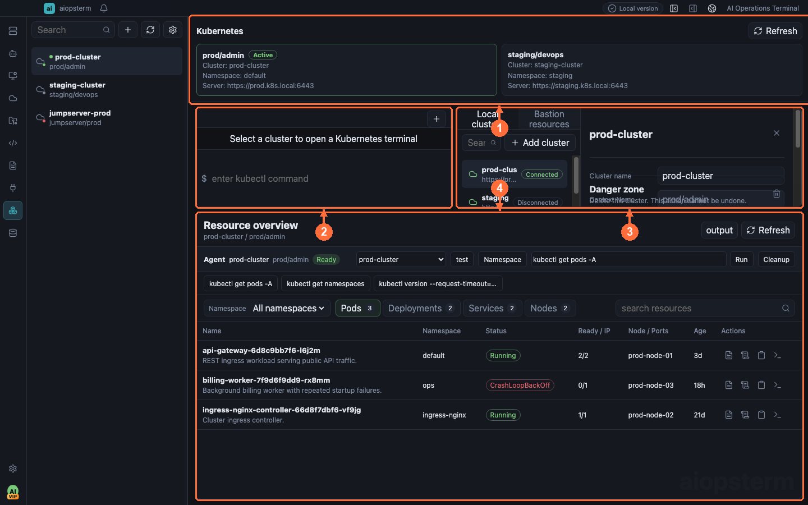

# Everyday Kubernetes Operations

This guide starts with a common task: import a kubeconfig, inspect workloads in one namespace, read Pod logs, and open a real kubectl terminal when needed.

## Where To Open It

Click **Kubernetes** on the module rail. With no cluster, use the add control, import kubeconfig or configure manually, and run Connection Test before saving. After connecting, open Describe/Logs from resource rows, a terminal from cluster actions, and scoped commands from the resource workspace **Agent** bar. **Send Output To AI** passes real output to the right AI conversation; configure a model under **Settings -> Models** first.

Use **①** to switch context, **②** for the kubectl terminal, **③** for cluster configuration, and **④** to browse and operate resources.

## Scenario 1: Import A Kubeconfig

Choose Import Kubeconfig:

1. Select a kubectl or client-go style kubeconfig.
2. Choose one discovered context.
3. Verify the cluster name, server, context, and default namespace.
4. Run Test Connection.
5. Save and connect.

Manual configuration accepts pasted kubeconfig content. Empty and historical placeholder configurations are rejected. Updating a saved path or content after credential rotation resets the connection so the next Connect uses the new credentials.

## Scenario 2: Inspect Resources And Logs

After connecting, choose a namespace and resource kind:

1. Inspect Deployment, StatefulSet, and Pod status.
2. Run Describe on abnormal resources.
3. Read Pod Logs.
4. Open a Kubernetes Terminal for `kubectl logs -f`.

The backend builds real kubectl operations from the selected cluster, context, and namespace. A failed probe never becomes a locally fabricated connected state.

## Scenario 3: Use An Isolated kubectl Terminal

Each Kubernetes terminal receives a private session kubeconfig with current-context pinned to the selected cluster. Running `kubectl config use-context` in that shell does not modify the user's original file.

Streaming logs and `kubectl exec` work. Full-screen TUI programs are not supported by the plain terminal view. kubectl output is capped at 10 MiB and terminal session state retains the newest 1 MiB.

## Scenario 4: Cluster Agent Command Workflow

The Agent bar is always bound to an explicit cluster/context:

1. Verify **① cluster/context selection**.
2. Run Connection Test and use **Namespaces** to fetch available namespaces.
3. Enter `kubectl get deployments -A` in **② the command bar**. Command, target, and result enter Agent history.
4. Review **③ history/output**. Switching clusters changes scope and never presents old output as a new-cluster result.
5. **Cleanup** clears Agent state without deleting cluster configuration.

This Agent is a scoped kubectl command surface with history; it does not invoke an LLM by itself or escape the selected cluster/context. **Agent Proxy** in cluster settings is a kubectl network proxy, not an AI Agent switch.

## Scenario 5: Send Kubernetes Evidence To AI

- Run Describe or Logs, expand output, and click **Send Output To AI**. aiopsterm includes cluster, namespace, resource identity, and real output in a user message to right-side Classic/Codex.
- After a Kubernetes terminal command, click **Collect Command Output To AI**. Collection starts only when a current command exists, preventing accidental upload of unrelated history.

Prefer “collect evidence, then analyze”: Describe, Events, and Logs first, then ask AI for a root-cause summary and the next read-only command. Sending context does not execute model suggestions; review them in the terminal or Agent command bar.

## JumpServer-Sourced Clusters

JumpServer organization assets can appear in the Kubernetes catalog, but JumpServer command streaming is not implemented. Connect, refresh, terminal, and resource actions fail closed. Import a directly usable kubeconfig for real kubectl work.

## Security And Troubleshooting

- Kubeconfig content and session copies use current-user-only file permissions.
- Test and Connect require kubectl or `AIOPSTERM_KUBECTL_PATH`.
- Test Connection times out after 15 seconds; ordinary refresh uses 30 seconds by default.
- Missing resources usually indicate context, namespace, or RBAC issues.
- Update and reconnect after server, certificate, or token rotation.
- Narrow namespace, resource, or label filters when output is truncated.

Previous: [Plugins And Extensions](13-extensions.md) · Next: [Database And DB AI](15-database.md) · [Back to index](../index.md)
