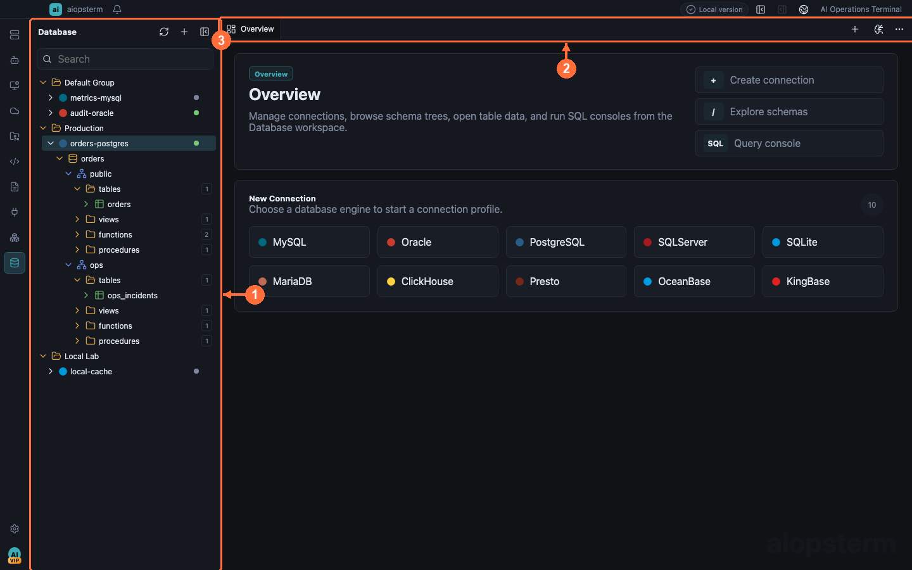
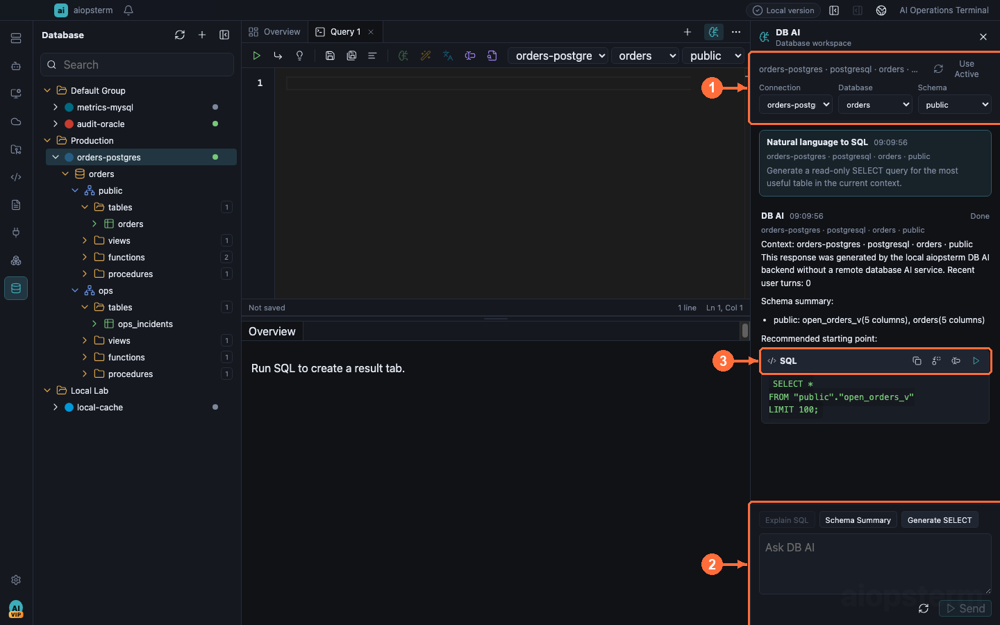

# Databases, SQL, And DB AI

Use this guide to save database connections, browse objects, execute SQL, and ask AI for help within a fixed database scope.

## Where To Open It

Click **Database** on the module rail. Add and test a connection, then open SQL from a table menu or the main `+` control. Click **Toggle DB AI Pane** on the Database workspace to bind the active connection. Before DB AI, configure, Check, and Save a working Provider under **Settings -> Models**.



**①** is the connection and object tree, **②** manages SQL, data, and result tabs, and **③** is the current database workspace.

## Scenario 1: Connect And Browse

Create a connection in the Database workspace, test it, save it, and connect. Expand database, schema, and table nodes. A normal single-catalog SQLite connection hides the internal `main` level and shows tables directly.

Double-click a table for paged data. Pin result tabs that must remain available for comparison; completed unpinned slots are reused to prevent unbounded tab growth.

## Scenario 2: Execute SQL

Create a New SQL tab:

```sql
select status, count(*) as total
from orders
group by status
order by total desc;
```

Run all recognizes common statement boundaries. Semicolons inside strings, comments, quoted identifiers, and PostgreSQL dollar-quoted bodies do not split a statement. One failed statement does not prevent later statements from producing their own result tabs.

Generated SQL can run directly only when it is read-only and the active tab still matches the captured connection, database, and schema.

## Scenario 3: Generate SQL From Natural Language



1. Open a connection and select database/schema, then click **Toggle DB AI Pane**.
2. Confirm connection, database, and schema in **① context**; sending is disabled without context.
3. Click **Generate SELECT** or describe a query in **② the composer**, such as “count each order status over the last 24 hours”.
4. DB AI returns target-dialect SQL. Use **③ actions** to copy, replace the current selection/statement, insert into the editor, or run read-only SQL when safe.

Run remains disabled unless the active SQL tab still matches the captured connection, database, and schema. Prefer insert/replace, inspect filters and row limits, then execute.

## Scenario 4: Explain, Optimize, Convert, And Diagnose

Select SQL and use Explain or Optimize, or ask DB AI:

```text
Why is this query not using an index? Inspect the table and indexes before proposing a rewrite.
```

Core actions include:

- **Explain** with schema, indexes, and supported plans.
- **Optimize** with semantics-preserving rewrites and index suggestions.
- **Complete** an unfinished SQL statement.
- **Convert** to a selected SQL dialect and label the result dialect.
- **Diagnose** SQL, errors, or execution evidence.
- **Schema Summary** for important objects and relationships.

DB AI can discover catalogs, describe tables/DDL, sample bounded rows, count, inspect indexes, and request supported explain data. It cannot switch connections through tool arguments or execute arbitrary SQL or writes. Drop/Truncate intent yields explanation or a controlled plan, not execution by read-only DB AI tools.

## Scenario 5: Restore A DB AI Product Session

Changing database context rotates to a new DB AI session. Restore the original from [Agents Product Sessions](04-agents-product-sessions.md). If its connection or schema is unavailable, it opens read-only and asks to repair the original binding rather than substituting another database.

## Scenario 6: Read Through An External Agent

Install `aiopsterm_databases` and enable `Allow external Agents to read databases` under Export MCP. The Agent discovers process-scoped handles and uses catalog, describe, and structured query tools.

The permission is off by default. Credentials and endpoints are never returned, arbitrary SQL is unavailable, and `query_database_table` is restricted to validated base-table projections and filters with at most 100 rows per page. ClickHouse and Presto data queries fail closed while metadata and redacted DDL remain available.

## Common Problems

- Empty catalog after connection: check metadata permissions.
- DB AI cannot send: restore the exact bound connection and schema.
- Generated SQL cannot run: scope changed or SQL is not read-only.
- External reads are disabled: explicitly enable the Export MCP permission.
- Results are truncated: narrow, page, or export the data.

Previous: [Kubernetes](14-kubernetes.md) · Next: [Themes And Terminal Appearance](16-themes.md) · [Back to index](../index.md)
