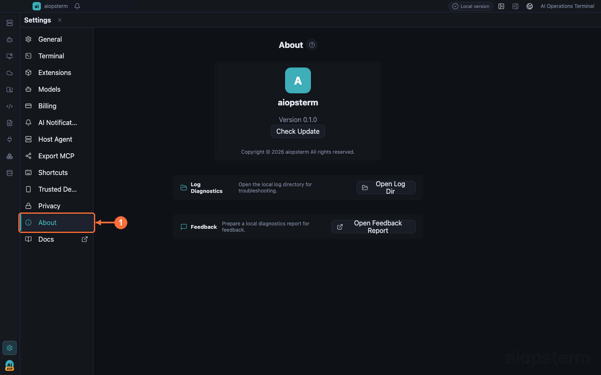

# Troubleshooting

This guide contains checks an installed-app user can complete. Confirm the entry point, configuration, and active scope before collecting logs.

## Where To Open It

Click **Settings -> About** to inspect the version, copy diagnostics, and open the log directory. External-session hooks are under **Settings -> AI Notifications**; Host Agent model and MCP settings are under **Settings -> Models** and **Settings -> Host Agent**; MCP exported to external Agents is under **Settings -> Export MCP**.

## The Installed App Will Not Open

- macOS reports an unidentified developer or damaged app: verify that the DMG is the signed and notarized release, drag the app to Applications, and launch it there instead of running from the mounted DMG.
- Windows SmartScreen blocks launch: verify the release source and checksum, then inspect the signature in the system prompt.
- Linux launch fails: use a package matching the machine architecture and try the system application menu once.

Manual changes inside an application bundle invalidate its signature. Reinstall the original release package.

## Terminal Input, Color, Or Layout Is Wrong

1. Click the target terminal tab and make sure focus is in the terminal, not search or a sidebar.
2. Right-click the terminal and inspect read-only mode, broadcast input, layout, and terminal actions.
3. Under **Settings -> Terminal**, inspect font, size, line height, letter spacing, shell, and colors. Restore defaults and create a new local terminal for comparison.
4. Reconnect when only one remote session is affected. When every terminal is affected, restart the app and open logs from **Settings -> About**.

## SSH, Proxy, Or Jump Host Fails

Open the asset editor under **Assets -> Hosts** and run the connection test:

- Direct host: check address, port, username, and password/private key.
- Standard SSH jump: verify the jump host itself and access from it to the target.
- relay-shell: complete OTP or second-hop prompts inside the terminal stream.
- JumpServer: verify the service endpoint, account/token, and asset-sync permissions.

A timeout usually points to networking, proxy, or firewall rules. Authentication failure points to username, key, password, or OTP. When a relay/jump path cannot provide SFTP, Files reports it as unsupported; use `scp` or `rsync` in the terminal.

## Host Agent Cannot Send Or Use Tools

1. Configure a Provider under **Settings -> Models**, then click **Check** and **Save**.
2. Embedded Codex requires **OpenAI Compatible** with API Format set to **Responses**.
3. Confirm mode, model, and tool switches under **Settings -> Host Agent**.
4. Rebind the target terminal in Host Agent and send again.

Classic AI supports additional compatible formats. Embedded Codex and Classic AI do not share sessions or substitute configuration. See [Host Agent](03-host-agent.md).

## External AI Sessions, File Changes, Or Notifications Are Missing

This applies only to external Codex, Claude Code, OpenCode, and similar sessions:

1. Install the matching Hook under **Settings -> AI Notifications**; reinstall after changing its configuration.
2. Enable and trust the plugin/Hook in Codex so aiopsterm receives real-time events.
3. Start the Agent from an aiopsterm-managed local terminal. History import can recover sessions but does not replace real-time events.
4. Check OS notification permission, aiopsterm notification/sound switches, and Do Not Disturb.
5. Use an AI-session row menu to confirm that the complete transcript and project files open.

Host Agent and Agents product sessions do not depend on the external-session Hook. See [AI Session Management](05-ai-sessions.md).

## MCP Was Configured In The Wrong Direction

- To let external Codex/Claude call aiopsterm, use **Settings -> Export MCP** and install the terminal, knowledge, or database service.
- To let Classic AI call a third-party MCP Server, add and enable it under **Settings -> Host Agent -> MCP**.

The directions are opposite. See [Export MCP](08-export-mcp.md) and [Third-Party MCP Servers](09-third-party-mcp.md).

## DB AI Cannot Run

Check and save a model, connect the database, and select a valid connection, database, and schema in the SQL tab. A context change creates a new DB AI session; restoring an old session requires its original database scope. Generated SQL can run directly only while that scope still matches and the SQL is read-only.

## Kubernetes AI Or Commands Fail

Verify kubeconfig, context, namespace, and RBAC first. The top Agent command bar is a constrained `kubectl` command surface, not an LLM. For AI analysis, configure a model and click **Send Output to AI** from resource details, logs, or terminal output.

## Before Filing A Report

Include:

- reproduction steps and time;
- version and diagnostics from **Settings -> About**;
- the matching time range from `aiopsterm-runtime.log`;
- screenshots with passwords, keys, and tokens removed.

Previous: [Themes And Terminal Appearance](16-themes.md) · [Back to index](../index.md)
