# 产品总览与快速上手

aiopsterm 把本地终端、SSH 资产、AI 运维、外部 AI 会话观察、文件、知识库、Kubernetes 和数据库放进同一个桌面工作台。本文先告诉你每项能力从哪里打开、适合解决什么问题，再链接到完整操作指南。

## 安装后先认识主界面

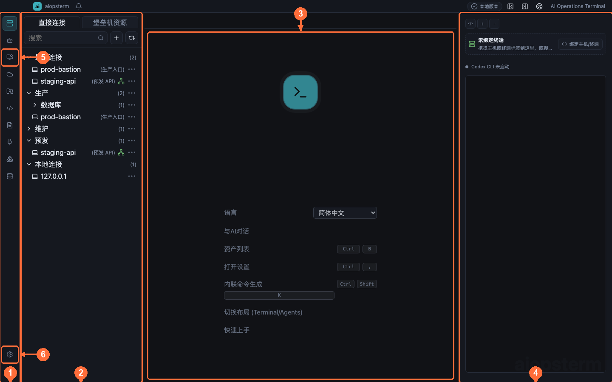

| 编号 | 区域 | 用途 |
| --- | --- | --- |
| ① | 模块栏 | 切换工作区、资产、文件、快捷命令、知识库、插件、K8s 和数据库 |
| ② | 左侧来源面板 | 显示当前模块的主机、会话、文件或文档列表 |
| ③ | 主工作区 | 所有终端、知识文档、AI 会话内容和项目文件共享的中央标签区 |
| ④ | AI 面板 | 内嵌 Codex 或 Classic 对话，可绑定当前终端 |
| ⑤ | Agents | 管理 aiopsterm 自己创建的 Codex、Classic 和 DB AI 产品会话 |
| ⑥ | 设置 | 配置模型、终端、通知、MCP、快捷键、主题和安全策略 |

欢迎页可直接选择语言。“快速上手”按钮会先打开中英文使用指南总目录，再由使用者选择对应语言的文章。左侧来源和中央工作区通常独立；从资产双击主机是例外，会立即把两侧都切到工作区并开始 SSH。

## 1. 终端与 SSH

**入口：** 点击模块栏最上方的 **工作区**，双击左侧 `127.0.0.1` 打开本地 Shell，或双击已保存主机打开 SSH。终端内右键可以调出输入命令、AI 命令、分屏、搜索、文件管理和全局执行。

终端支持标签、左右/上下分屏、拖拽合并、标准代理、密钥认证、SSH Agent、标准跳板和 relay-shell。`aio` 与 `aiossh` 可从 aiopsterm 本地终端控制和连接会话。详见[终端与主工作区](02-terminal-workspace.md)。

## 2. 主机 Agent

**入口：** 先打开一个本地或 SSH 终端，再点击右侧 AI 面板顶部的模式按钮，选择 **Codex CLI** 或 **Classic**；首次使用先到 **设置 -> 模型** 配置 Provider 和模型。

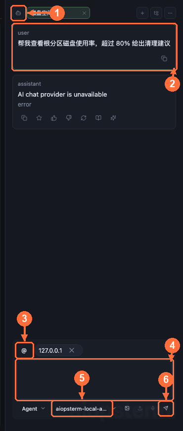

内嵌 Codex 通过绑定终端的远程工具执行命令和读取文件；Classic 提供 Chat、Command、Agent 三种权限层级。Agent 运行在本机，远程主机不需要安装 Agent，经过代理或跳板的主机也可管理。详见[主机 Agent](03-host-agent.md)。

## 3. Agents 产品会话

**入口：** 点击模块栏顶部的 **Agents** 图标；通过左侧 `+` 创建 Classic、Codex 或 DB AI 会话，单击历史会话恢复并续聊。

Agents 保存 aiopsterm 自己创建的 AI 对话及其终端、项目或数据库绑定。详见[Agents 产品会话](04-agents-product-sessions.md)。

## 4. AI 会话管理

**入口：** 点击模块栏的 **AI 会话** 图标查看外部 Codex、Claude Code、OpenCode 等会话；点击 **设置 -> AI 通知** 安装 Hook、配置桌面通知和声音。

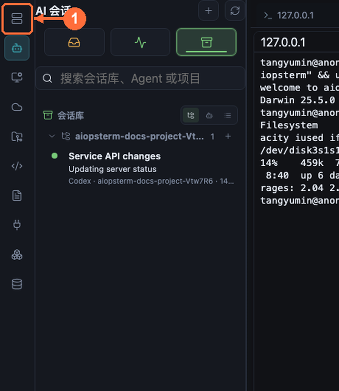

这里集中显示待处理、运行中和历史会话。右键会话选择 **打开会话内容**，可查看完整对话、切换源码/渲染并修订 transcript；工具栏的 **项目文件** 可查看最近修改和真实项目树。实时状态和通知需要先安装并信任对应 Agent Hook。详见[AI 会话管理](05-ai-sessions.md)。

## 5. 快捷命令与宏

**入口：** 点击模块栏的 **快捷命令**；新建按钮位于列表工具栏。终端右键的“输入命令”和“全局执行”可把命令送到当前或多个终端。

保存巡检命令、录制键盘宏、广播到多个终端，或在 AI 输入框通过 `/` 引用。详见[快捷命令与宏](06-quick-commands.md)。

## 6. 快捷键

**入口：** 点击左下角 **设置 -> 快捷键**，点击动作右侧按键框开始录制。

应用级快捷键避开普通 `Ctrl+字母`，保证 readline、vim 和 tmux 控制键继续透传。详见[快捷键](07-shortcuts.md)。

## 7. 导出 MCP

**入口：** 点击 **设置 -> 导出 MCP**，在三个能力卡片中分别安装到 Codex 或 Claude Code。

`aiopsterm_hosts`、`aiopsterm_ai_sessions`、`aiopsterm_databases` 分别把主机 SSH、托管 AI 会话和数据库只读能力提供给外部 Agent。详见[导出 MCP](08-export-mcp.md)。

## 8. 第三方 MCP Server

**入口：** 点击 **设置 -> 主机Agent -> MCP**，使用 **Add Server** 添加 stdio 或 HTTP Server，再检查连接状态和工具审批。

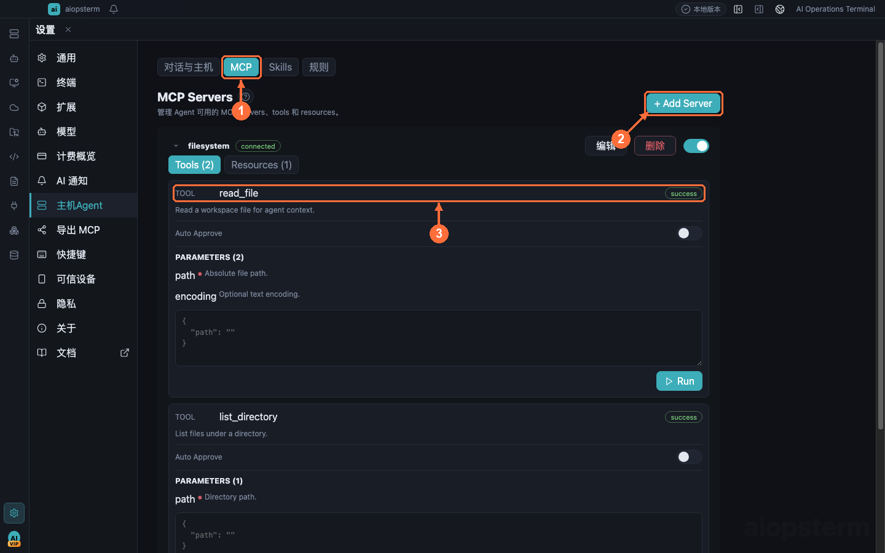

这是把第三方工具接入内嵌 Classic 的入口，与“导出 MCP”方向相反。详见[第三方 MCP Server](09-third-party-mcp.md)。

## 9. 文件管理

**入口：** 点击模块栏的 **文件**，或在 SSH 终端内右键点击 **文件管理**。

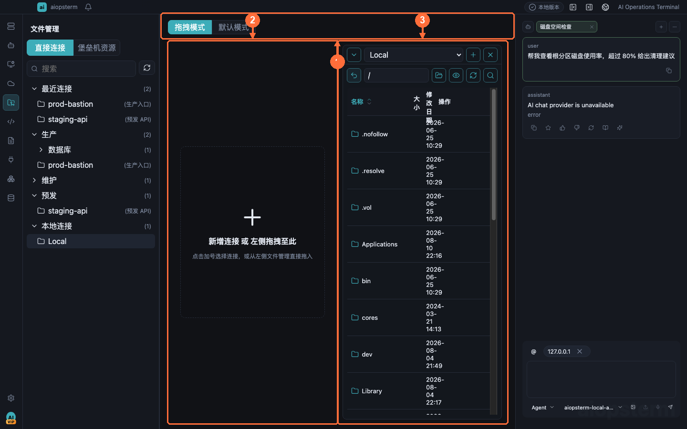

双栏浏览本地和远程 SFTP，支持拖放传输、任务进度、编辑、重命名和权限。详见[文件管理](10-files.md)。

## 10. 资产管理

**入口：** 点击模块栏的 **资产**；页面顶部切换主机、堡垒机、密钥和代理管理。

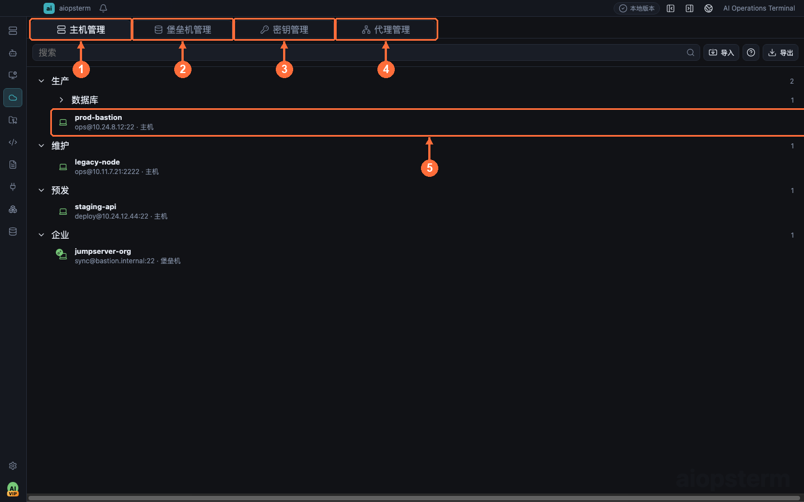

集中保存连接参数、凭据引用、代理、普通 SSH 跳板机和 JumpServer 数据源；双击主机立即回到工作区连接。详见[资产管理](11-assets.md)。

## 11. 知识库

**入口：** 点击模块栏的 **知识库**；搜索框和新建按钮位于左侧面板顶部，点击文件后在中央打开源码/渲染编辑器。

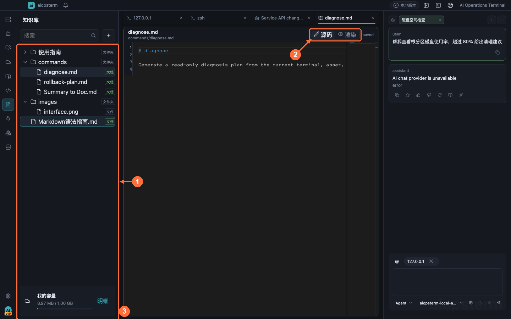

支持 Markdown、图片、搜索、Mermaid、内部链接和添加到 AI 上下文。详见[知识库](12-knowledge-base.md)。

## 12. 插件与扩展

**入口：** 点击模块栏的 **插件**，点击插件卡片进入详情，再执行安装、启用或停用。

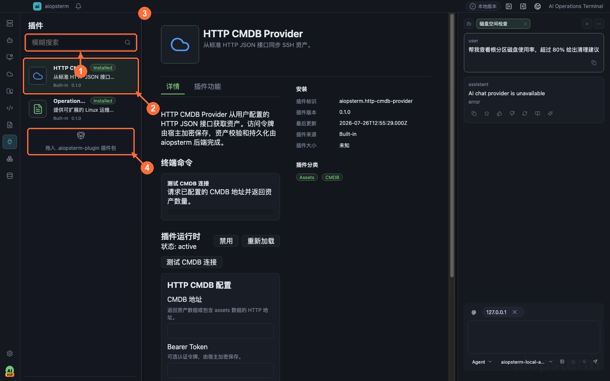

插件可以提供页面、工具和 Alias；外部包在启用前必须通过清单校验和用户信任。详见[插件与扩展](13-extensions.md)。

## 13. Kubernetes

**入口：** 点击模块栏的 **Kubernetes**；从集群区域点击添加按钮导入 kubeconfig，再点击连接。

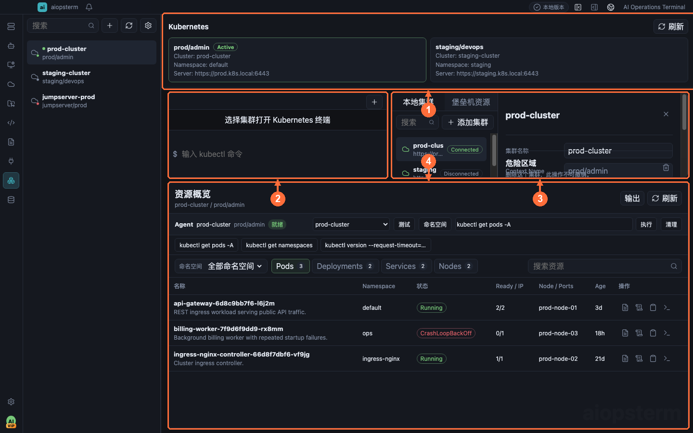

查看资源、日志和 Describe，打开隔离 kubectl 终端，使用集群 Agent 命令栏，并把命令或资源输出发送到 AI 分析。详见[Kubernetes](14-kubernetes.md)。

## 14. 数据库与 DB AI

**入口：** 点击模块栏的 **数据库**，在左侧连接区点击添加按钮，选择数据库类型并测试连接。

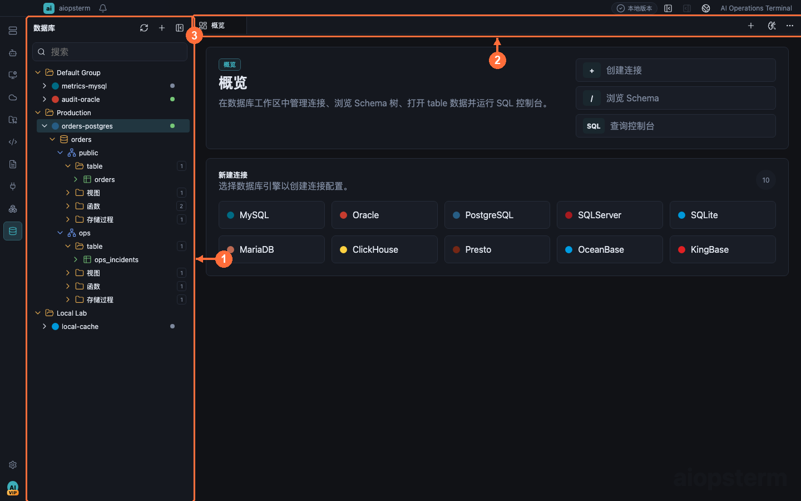

浏览目录、执行 SQL、查看和编辑结果，并让 DB AI 生成、解释、优化、转换和诊断 SQL。详见[数据库与 DB AI](15-database.md)。

## 15. 主题与终端外观

**入口：** 点击 **设置 -> 通用** 选择主题和背景；点击 **设置 -> 终端** 调整字体、行距、光标和终端选项。

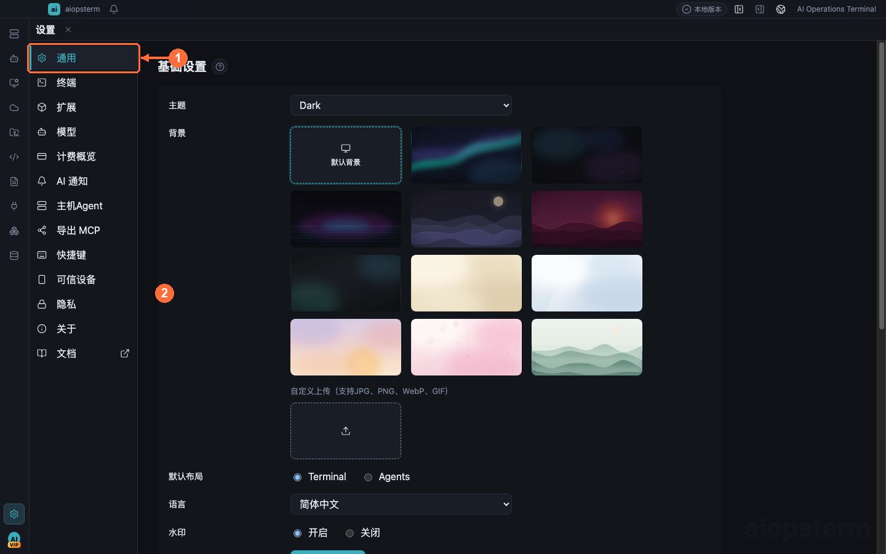

支持跟随系统、明暗主题、官方背景、自定义背景和跨平台终端排版。详见[主题与终端外观](16-themes.md)。

## 建议的第一次使用顺序

1. 在 **设置 -> 模型** 配置 AI Provider；不使用 AI 时可跳过。
2. 在 **资产 -> 主机管理** 保存一台测试主机并运行连接测试。
3. 回到 **工作区** 双击主机，尝试搜索、分屏和文件管理。
4. 打开右侧 AI 面板绑定该终端，先提出只读诊断任务。
5. 使用外部编码 Agent 时，再到 **设置 -> AI 通知** 安装 Hook。

下一篇：[终端与主工作区](02-terminal-workspace.md) · [返回目录](../index.md)
