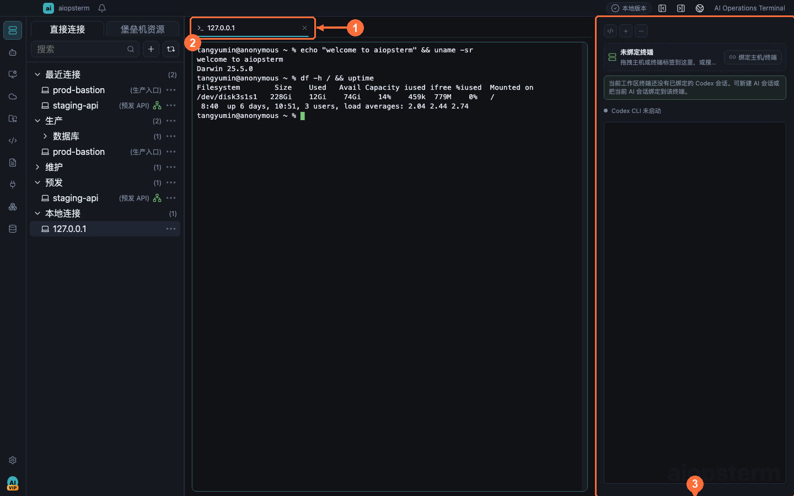
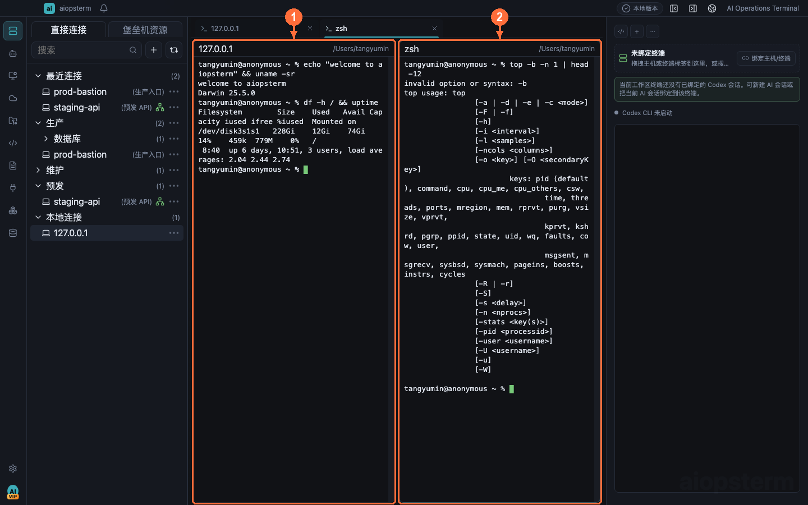
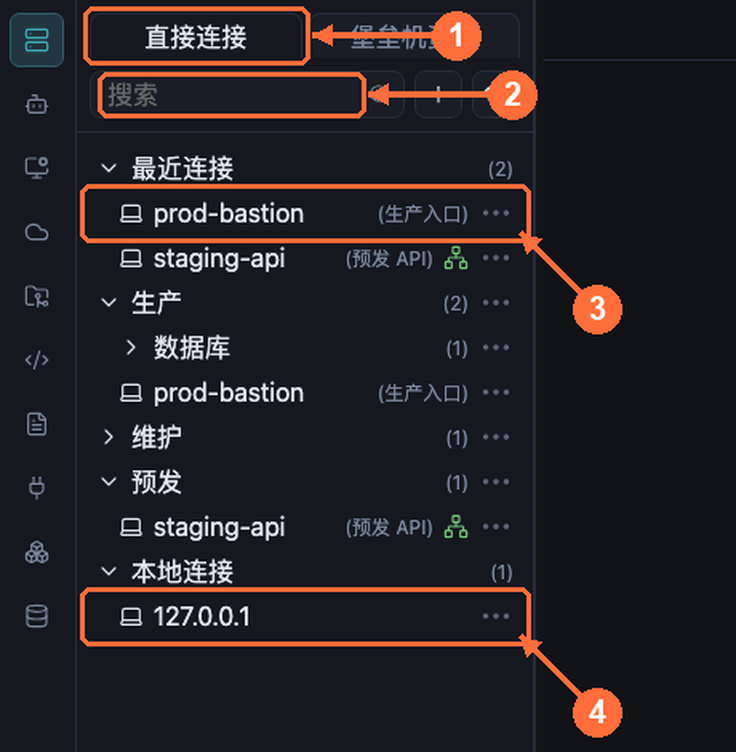

# 终端工作区最佳实践

终端是 aiopsterm 的核心。本文覆盖会话标签、右键菜单、拆分窗格与快捷键的推荐用法。

## 从哪里打开

点击模块栏顶部的 **工作区**。双击左侧 **本地连接 -> 127.0.0.1** 打开本地 Shell；双击直接连接或堡垒机资源中的主机打开 SSH。终端操作菜单不会常驻显示：请在终端内容区或标签上点击右键，再选择分屏、输入命令、AI 命令、文件管理、全局执行或搜索。

## 会话标签



- **① 会话标签**：单行紧凑显示，标题过长自动省略；悬停可查看类型、状态、主机、cwd、后端会话 ID 等完整信息。异常连接状态才会出现指示标记，正常的 `running/ready` 不占空间。
- **② 终端窗格**：当前选中的窗格是拆分、重连、搜索、字体缩放等操作的作用目标。
- **③ AI 侧栏**：可绑定当前终端，让 AI 生成的命令直接在该会话执行。

终端程序可以通过标准 xterm 标题协议（`OSC 0`/`OSC 2`）更新标签标题，也可以用 `OSC 9;4` 上报进度；手动重命名过的标签不会被覆盖。

> 提示：没有工具栏 `+` 按钮。新会话来自资源树双击、`Ctrl+Shift+T`（新建本地 Shell）或标签/窗格右键菜单。

## 右键菜单：终端操作的入口


在终端窗格或标签上右键：

| 编号 | 菜单项 | 用途 |
| --- | --- | --- |
| ① | AI 命令（`Ctrl+Shift+K`） | 对当前终端做内联 AI 命令生成 |
| ② | 输入命令 | 呼出浮动命令输入框；命令被拒绝或不可用时保持打开，写入成功后自动关闭 |
| ③ | 向右拆分 / 向下拆分 | 拆分**选中的窗格区域**，不是全局拆分 |
| ④ | 文件管理（`Ctrl+Shift+M`) | 打开该主机的 SFTP 文件管理 |

其余常用项：复制/粘贴（`Ctrl+Shift+C/V`）、搜索（`Ctrl+Alt+F`）、新建终端、关闭终端、清屏、全局执行（向多个终端广播命令）、字体放大/缩小。

## 拆分与合并窗格



- 右键选择 `向右拆分` / `向下拆分`，新窗格出现在**选中区域**的右侧或下方（图中 ① 原窗格、② 新窗格）。
- 右键 `取消拆分` 把窗格还原为独立标签，终端会自动重新适配尺寸。
- **拖拽合并**：把终端/知识标签拖到另一个标签或窗格上，作为其右侧拆分挂载。
- **拖拽恢复**：把拆分标签拖到标签栏空白处，恢复为独立标签。
- 把本地文件拖进终端会插入其被正确 shell 转义的路径，含空格的路径不会断开。

> 最佳实践：排查问题时"上下拆分"同一台主机——上面看日志（`tail -f`），下面执行命令；跨主机对比时用"向右拆分"+ 全局执行广播同一条诊断命令。

## 必记快捷键

终端聚焦时，普通 `Ctrl+字母` 全部透传给 Shell（`Ctrl+a/c/d/e/k/l` 等 readline/TUI 键保持原义），应用级操作一律用 `Ctrl+Shift+…`：

| 快捷键 | 动作 |
| --- | --- |
| `Ctrl+Shift+C` / `Ctrl+Shift+V` | 复制 / 粘贴 |
| `Ctrl+Alt+F` / `G` / `H` / `J` | 搜索 / 下一个 / 上一个 / 清除高亮 |
| `Ctrl+Shift+K` | AI 命令生成 |
| `Ctrl+Shift+T` / `W` | 新建终端 / 关闭当前面板 |
| `Ctrl+Shift+Y` | Fork 当前 SSH 通道（含跳板机会话） |
| `Ctrl+Shift+L` | 清屏 |
| `Ctrl+=` / `Ctrl+-` / `Ctrl+0` | 字体放大 / 缩小 / 复位（仅作用于选中窗格） |
| `Alt+1..9` / `Ctrl+PageUp/PageDown` | 切换标签 |
| `Shift+PageUp/PageDown` | 回滚滚动 |
| `F11` | 全屏 |

从已连接的本地终端 `Ctrl+Shift+T` 新建会话会继承当前 cwd；从 SSH 会话新建则不会隐式克隆远程连接。

### 主工作区导航

| 动作 | macOS | Windows / Linux |
| --- | --- | --- |
| 打开最近面板 | `Ctrl+Tab` | `Ctrl+Tab` |
| 按访问历史后退 / 前进 | `Cmd+[` / `Cmd+]` | `Ctrl+Left` / `Ctrl+Right` |
| 按标签栏顺序向左 / 向右切换 | `Ctrl+Shift+Left` / `Ctrl+Shift+Right` | `Ctrl+Shift+Left` / `Ctrl+Shift+Right` |

访问历史包含终端、知识文档、AI 会话内容和项目文件等主工作区面板。按标签栏顺序切换会在左右边界循环，不会重置访问历史。

## 跳板机与文件管理



SSH 连接参数不在终端打开后临时填写。创建第一台主机：

1. 点击模块栏 **资产 -> 主机管理**，在树空白处或目标目录上右键，选择 **新建主机**。
2. 填写显示名称、Host/IP、端口和用户名。
3. 选择密码、私钥或 SSH Agent；私钥先在 **密钥管理** 保存，再从主机表单引用。
4. 需要代理时先在 **代理管理** 保存 HTTP、SOCKS 或 raw TCP 代理，再回主机表单选择。
5. 需要普通 SSH 跳板时，先把跳板机保存为主机，再在目标主机中选择它；保存前运行连接测试。
6. 保存后从 **工作区 -> 直接连接/堡垒机资源** 或资产页双击主机。图中 **①** 切换资源分组，**②** 搜索，**③** 打开已保存 SSH，**④** 打开本地 Shell。

**普通跳板机**是目标主机连接链路中的一跳；**堡垒机管理**还可配置 JumpServer URL、Private Token 和组织同步，它们不是同一种配置。完整字段见[资产管理](11-assets.md)。标准跳板链路优先使用 TCP 转发；只有服务端拒绝转发时才回退 relay-shell。

- 直连与标准跳板机（TCP 转发）路径支持 SFTP 文件管理。
- 通过 relay-shell（受限跳板机）登录的主机暂不支持 SFTP，文件工作区会明确提示；请在终端内用 `scp`/`rsync`，或改用支持 TCP 转发的跳板机。
- 跳板机拒绝 TCP 转发时，aiopsterm 自动回退 relay-shell 模式：先本地 OpenSSH 登录跳板机，出现交互提示符后再写入嵌套 `ssh <目标>`，认证提示保留在终端流里。

## 命令行控制与 idle 清理

这些命令由 aiopsterm 创建的**本地终端**自动加入 PATH，Windows、macOS 和 Linux 使用相同命令名；SSH 远端 Shell 不会自动安装它们。

| 命令 | 用途 | 示例 |
| --- | --- | --- |
| `aio` | 查询和控制工作区、终端、会话、设置与通知 | `aio terminal list`、`aio terminal read-screen --lines 80` |
| `aiopen` | 在主工作区打开本地文本文件 | `aiopen ./README.md` |
| `aiossh` | 连接或复用已保存主机 | `aiossh prod-bastion` |
| `aioic` | 按设置中的 idle 策略清理可确认空闲的面板 | `aioic` |
| `aiobc` | 立即关闭后台面板，保留当前面板 | `aiobc` |

常用流程：

```sh
aio host list --names
aio host add prod-api --host 10.0.0.8 --user ops --port 22 --group production
aiossh prod-api
aio terminal list
aio terminal send --panel <panel-id> --text $'uptime\n'
```

`aiossh` 只负责连接已管理主机，创建资产使用 `aio host add`；临时配置某个工作区远端连接使用 `aio workspace remote configure user@host --connect`。自动化脚本应先查询面板或终端 ID，再显式指定写入、聚焦或关闭目标。运行 `aio help` 或 `aio recipes terminal` 可查看当前安装版能力。

清理 idle 终端时，aiopsterm 会先检查 PTY 前台进程组：只有确认回到初始 Shell 的终端才按空闲处理。正在运行 `ssh`、`top`、Codex 或其他前台程序的终端会标记为忙碌并跳过；无法确认前台状态的终端也会保守跳过，避免为了清理而误杀任务。

## 性能相关

- 线程化终端渲染默认开启（Worker + OffscreenCanvas）；环境不支持时自动回退普通 xterm。
- 隐藏标签与后台窗格持续接收输出但不持续绘制，切回可见时一次性同步，长日志任务放后台不拖累前台。
- 大量输出时前后端都会做批量合并（背压，不丢数据）；感觉卡顿时参见[故障排查](17-troubleshooting.md)。

上一篇：[产品总览](01-getting-started.md) · 下一篇：[主机 Agent](03-host-agent.md) · [返回目录](../index.md)
