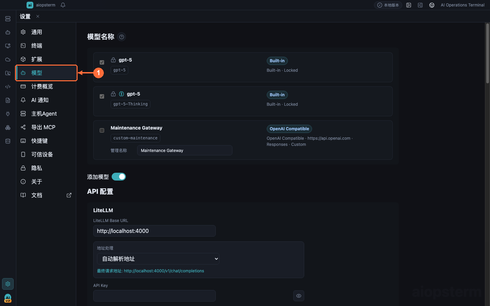
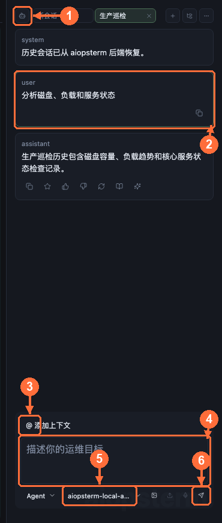

# 主机 Agent：用 AI 操作本地与远程主机

本章适合这样的任务：你已经在 aiopsterm 中保存并连接了一台主机，希望让 AI 帮你完成诊断、命令生成或多步运维，同时保留明确的目标主机和审批边界。

## 从哪里打开与必要配置

主机 Agent 必须先有可用模型，只有 SSH 连接没有模型配置不能发送对话。



1. 点击 **设置齿轮 -> 模型 -> 添加模型**。
2. 使用内嵌 Codex 时，选择 **OpenAI Compatible**，填写 Base URL、API Key 和 Model，并把 **API Format** 设为 **Responses**。Codex 不使用该 Provider 的 Chat Completions 格式。
3. 点击 **Check** 验证 Responses 端点，再点击 **Save**，并确认模型出现在模型列表。Ollama、启用 OpenAI Compatible Server 的 LM Studio，以及产品明确支持的 Bedrock OpenAI 模型走各自专用适配。
4. Classic 可以使用其支持的 Chat Completions、Responses、Anthropic 等 Provider；同样应先 Check/Save。
5. 点击 **工作区**，双击本地或 SSH 主机，等待终端可用。
6. 在右侧 AI 面板顶部选择 **Codex CLI** 或 **Classic**。面板关闭时，从顶栏布局控制重新显示。
7. Codex 在目标绑定区域选择当前终端；Classic 从输入框上方的 `@` 入口添加主机。

远程主机无需安装 Codex 或 Classic。Agent 在本机运行，远程操作通过已连接终端及其代理/跳板路径完成。



通过 **①** 选择 Codex CLI 或 Classic，**②** 检查 AI 返回内容，**③** 显式添加主机上下文，在 **④** 输入任务并于 **⑤** 确认模型，最后从 **⑥** 发送或停止任务。

## 场景一：用内嵌 Codex 排查远程主机

假设你在 `prod-api-01` 终端中发现服务响应变慢，可以在右侧 AI 面板切换到 Codex CLI，绑定当前终端，然后输入：

```text
检查这台主机的负载、内存、根分区和最近的 nginx 错误，只做诊断，不修改配置。
```

内嵌 Codex 不在本机项目目录中执行 shell。它先通过 `aiopsterm_remote` 获取绑定终端的目标信息，再使用远程命令、文件读取和搜索工具。没有绑定可用终端时，它只做分析，不会伪造执行结果。

推荐流程：

1. 先在工作区连接目标主机。
2. 在 Codex 页签中选择或绑定该终端。
3. 确认标题下方显示的是预期主机和工作目录。
4. 让 Codex 先运行只读诊断。
5. 涉及重启、写文件或安装软件时，逐条检查审批内容。

Codex 页签可以与主工作区联动。开启联动后，切换终端会选择已经绑定的 Codex 会话；没有既有绑定时，aiopsterm 只显示绑定提示，不会静默创建新会话。

## 场景二：用 Classic Agent 完成多步排查

Classic 提供三种不同权限的工作方式：

| 模式 | 适合的任务 | 是否执行命令 |
| --- | --- | --- |
| Chat | 解释概念、整理方案 | 不执行 |
| Command | 生成一条可编辑命令 | 仅在用户点击执行后 |
| Agent | 多步诊断和受控操作 | 通过工具和审批执行 |

例如，在 Classic Agent 中通过 `@ 添加上下文` 选择 `prod-api-01`，然后输入：

```text
找出磁盘增长最快的目录，判断是否由日志引起，并给出安全的清理步骤。
```

主机上下文默认是空的。模型只能在当前对话明确选择的主机中工作，不能根据一段文字自行指定新的 IP、账号或凭据。每张命令卡都会保留目标身份，执行时也必须找到它绑定的后端终端。

## 命令审批与自动执行

在 `设置 -> 主机Agent -> 对话与主机` 中可以配置：

- 自动执行只读命令：允许模型声明为低风险的查询命令自动继续。
- 自动批准：只影响允许自动通过的低风险动作。
- Shell Integration Timeout：控制 Agent 等待终端命令输出的时间。
- 安全配置：维护命令黑名单、白名单和审批规则。

模型给出的 `requiresApproval: false` 不是最终授权。主进程仍会应用终端安全策略，并且可以将命令升级为需要审批或直接拒绝。待审批的 Agent 命令不可编辑，防止批准内容和实际执行内容不一致。

## 选择 Codex 还是 Classic

- 需要完整终端式编码代理体验、远程文件读取和持续会话时，使用内嵌 Codex。
- 需要结构化命令卡、清晰的 Chat/Command/Agent 分级和多主机上下文时，使用 Classic。
- 只想快速得到一条命令时，使用 Classic Command 或终端右键菜单中的 AI 命令。
- 需要长期管理会话时，从[Agents 产品会话](04-agents-product-sessions.md)恢复对应 Codex 或 Classic。

## 为 Classic 增加第三方工具

需要 CMDB、监控或内部平台工具时，打开 **设置 -> 主机Agent -> MCP** 添加第三方 MCP Server。这个入口把外部工具提供给内嵌 Classic，不是把 aiopsterm 导出给外部 Codex；完整步骤见[第三方 MCP Server](09-third-party-mcp.md)。

## 常见失败

- 看不到主机工具：检查 AI 会话是否绑定了仍然存在的终端。
- 命令卡无法执行：原终端可能已关闭，aiopsterm 不会退回当前活跃终端。
- 只读命令仍要求确认：主进程安全策略覆盖了模型的低风险声明。
- Codex 只给出建议：目标可能未绑定、已断开或正在恢复。
- 长命令超时：调整 Shell Integration Timeout，或让 Agent 使用适合长任务的执行方式。

上一篇：[终端与主工作区](02-terminal-workspace.md) · 下一篇：[Agents 产品会话](04-agents-product-sessions.md) · [返回目录](../index.md)
