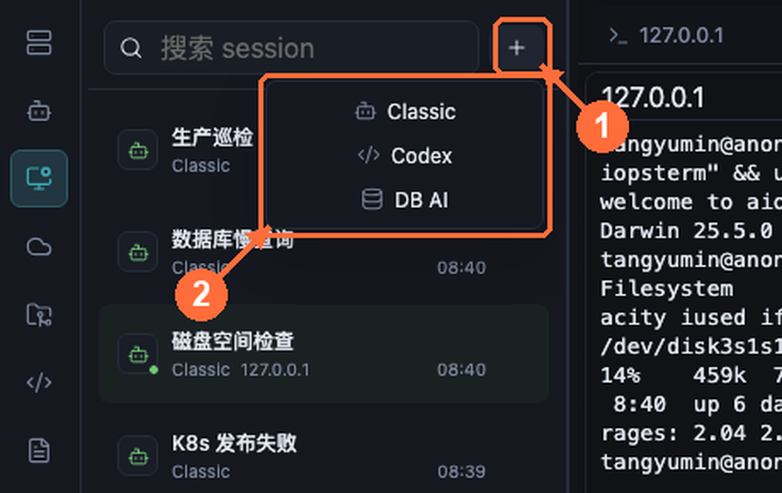
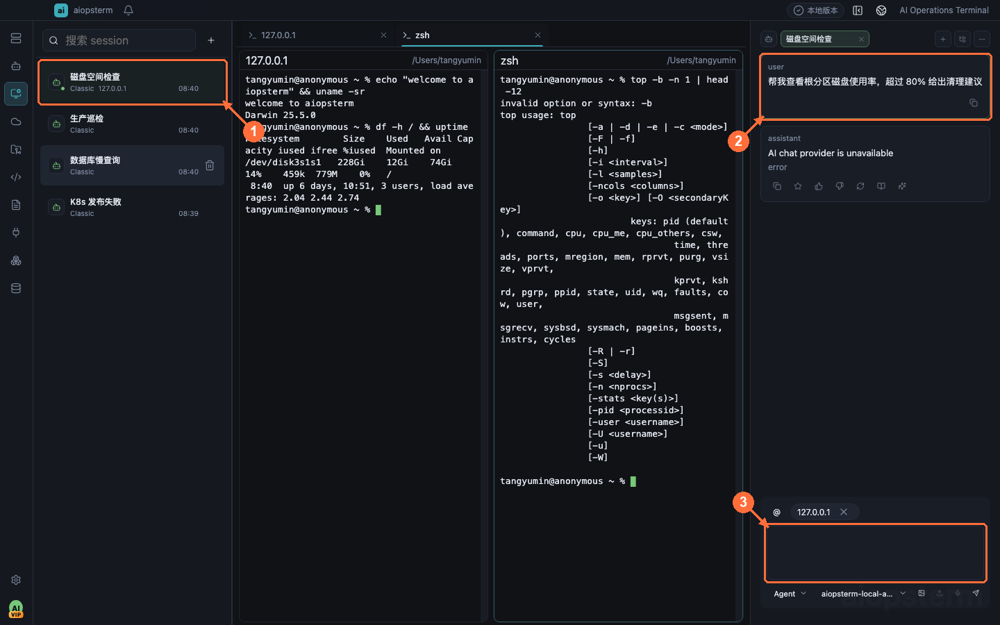

# Agents 产品会话：创建、恢复与续聊

Agents 是 aiopsterm 自己创建并保存的 AI 产品会话目录。它管理右侧 Classic、内嵌 Codex 和数据库工作区的 DB AI，不是外部 Codex、Claude Code、OpenCode 的通知收件箱。

## 从哪里打开

点击模块栏顶部的 **Agents** 图标。左侧会显示搜索框、会话列表和 `+` 新建按钮；单击会话会恢复到右侧 AI 面板或数据库工作区。首次创建前，先在 **设置 -> 模型** 配置并检查对应 Provider；具体配置见[主机 Agent](03-host-agent.md)。

图中 **①** 是 Agents 入口，**②** 搜索标题、载体、绑定和项目，**③** 选择已有会话，**④** 是恢复后的对话区域。

## 新建三类产品会话

点击 **① `+`** 打开 **② 新建菜单**：

- **Classic**：创建 Chat、Command 或 Agent 主机运维对话。主机上下文默认为空，需要在对话中通过 `@` 选择。
- **Codex**：创建内嵌 Codex 会话，可绑定终端和项目 cwd。Codex 使用 Responses Provider，且不会因为切换终端自动创建新会话。
- **DB AI**：切换到数据库工作区创建数据库范围会话；发送前必须有有效连接、database 和 schema。

建议按长期任务命名，例如“生产巡检”“支付库慢 SQL”“K8s 发布检查”，不要把所有工作堆进一个会话。

## 恢复、分页和续聊

点击 **① 会话行** 后，历史消息在 **②** 恢复，输入框 **③** 可以直接续聊。恢复后默认定位到最新消息；向上滚动才按页加载更早记录，旧页面消息不会被重复加入下一轮模型上下文。

- Codex 会话恢复原终端绑定；终端不存在时按保存信息重连或提示重新绑定。
- Classic 恢复主机上下文和对话模式，但执行命令时仍要求原目标存在。
- DB AI 返回原数据库范围；连接或 schema 缺失时只读打开，不会悄悄换到另一个库。

## Close、Delete 与应用重启

- **Close**：关闭当前 UI 和运行时，保留会话记录，可从 Agents 再次恢复。
- **Delete**：永久删除产品会话，不能通过 Agents 恢复。
- 应用启动时不会自动恢复所有会话，避免后台同时启动大量模型和终端；需要时从目录逐个打开。

## 与 AI 会话模块的区别

| Agents 产品会话 | AI 会话模块 |
| --- | --- |
| 由 aiopsterm 主动创建 | 由外部编码 Agent Hook 或本地历史发现 |
| Codex、Classic、DB AI | Codex、Claude Code、OpenCode 等外部进程 |
| 用于恢复并继续对话 | 用于通知、定位、查看/修订 transcript 和项目文件 |
| 不需要通知 Hook | 实时状态和通知需要安装对应 Hook |

上一篇：[主机 Agent](03-host-agent.md) · 下一篇：[AI 会话管理](05-ai-sessions.md) · [返回目录](../index.md)
