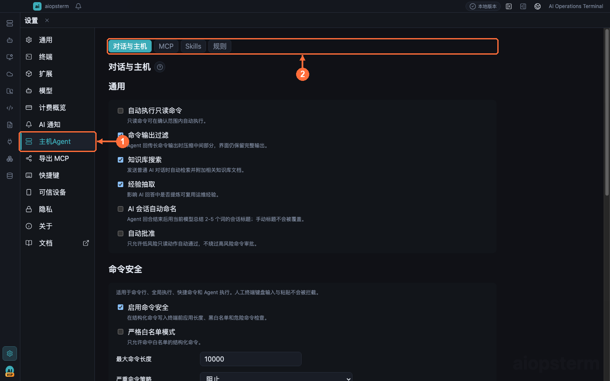
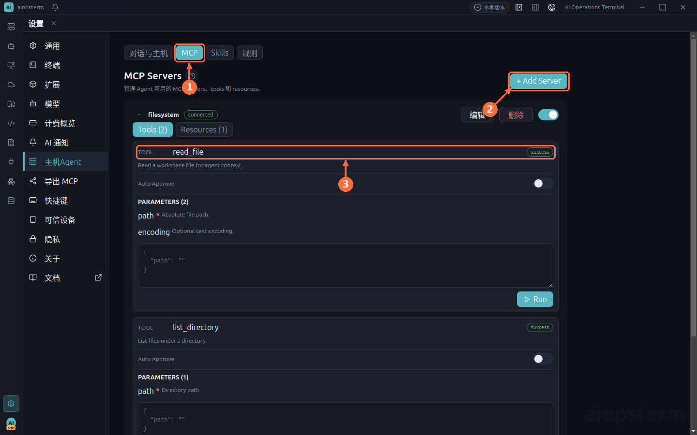
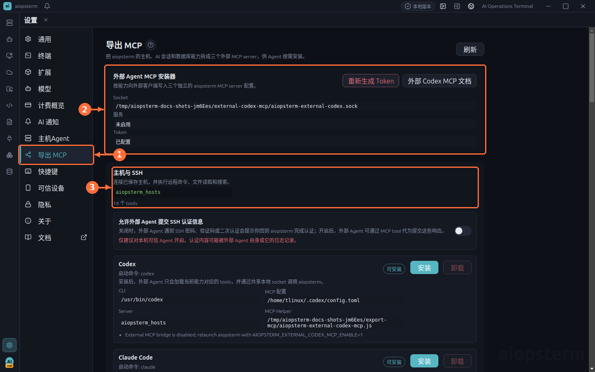

# MCP 集成最佳实践

aiopsterm 的 MCP 相关能力有两个方向：**接入第三方 MCP Server** 给内部 Agent 使用，以及把 aiopsterm 自身能力**导出**给外部编码代理。

## 配置第三方 MCP Server



打开 **① 设置 -> 主机Agent**，页内 **② 子页签** 依次是 `对话与主机`、`MCP`、`Skills`、`规则`。



切到 **① MCP 子页签**：

- **② Add Server** 打开 JSON 编辑器，直接编辑用户数据目录下的 `setting/mcp_settings.json`。
- **③ 服务器与工具列表**：主进程完成发现（`initialize` → `tools/list` → `resources/list`）后，这里展示每个 Server 的 Tools/Resources，工具行可展开查看参数并单独控制 Auto Approve。

`stdio` 与 `streamableHttp` 配置示例：

```json
{
  "mcpServers": {
    "local-tools": {
      "type": "stdio",
      "command": "node",
      "args": ["/absolute/path/to/server.js"],
      "timeout": 10
    },
    "remote-tools": {
      "type": "streamableHttp",
      "url": "https://mcp.example.com/mcp",
      "headers": { "Authorization": "Bearer ${TOKEN}" }
    }
  }
}
```

实用规则：

- 省略 `type` 时：有 `url` 无 `command` 按 `streamableHttp` 处理；`http`、`streamable_http`、`streamable-http` 别名保存时归一化；`command` 与 `url` 同时存在且无显式类型时按更安全的 stdio 解释。
- 后端没有返回有效 `connected` 状态的 Server 一律显示 `disconnected`，其 Run/Read 操作被禁用——不要以为写进 JSON 就等于连上了。
- 旧版 `sse` 服务器继续用 `"type": "sse"` 同样的字段。
- 种子示例 `ops-inventory` 只是开发/测试用名字；若本地配置里有它且命令不存在，会报 ENOENT，可直接删掉。

> 安全边界：Agent 只能读取已启用 Server 上明确列出的资源 URI，且每次读取都要在资源审批卡上显式点击；MCP 的传输命令、环境变量、请求头与凭据从不暴露给模型。

## 导出 MCP 给外部代理



**设置 -> 导出 MCP** 把能力拆成主机与 SSH、托管 AI 会话、数据库只读访问三个独立 MCP Server，供外部 Codex、Claude Code 等代理按需安装：

- 页面提供外部 Agent MCP 安装器与 Token 管理（`重新生成 Token` 后旧 Token 失效）。
- 三个能力卡片分别安装和卸载，未安装的服务不会向 Agent 提供 tool schema。
- 帮助脚本通过 aiopsterm 自带运行时执行（`ELECTRON_RUN_AS_NODE=1 <aiopsterm可执行文件> <helper.js>`），**不需要**系统安装 Node.js。
- 数据库工具走独立的 Export MCP 网关，用进程级随机句柄解析到已保存连接——外部代理拿不到第二份 DSN 或密码。

> 最佳实践：给每个外部代理单独生成 Token，泄露疑虑时立即重新生成；导出的能力保持只读定位，写操作仍应回到 aiopsterm 内部的审批流。
