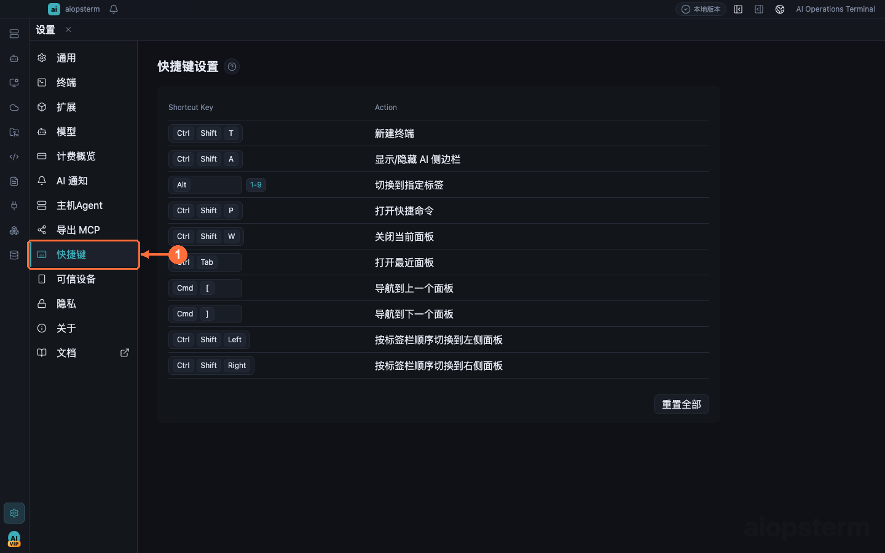

# 快捷键：高效操作终端与工作区

本文帮助你在不破坏 Shell 控制键的前提下，用键盘完成终端、标签、搜索、AI 和布局操作。

## 从哪里打开

点击窗口左下角的 **设置齿轮**，在设置左侧导航中点击 **快捷键**。要修改某一项，点击该动作右侧的按键框，再按下新组合键；发生冲突时页面会立即提示。点击单项重置按钮恢复一个动作，点击页面顶部的恢复默认按钮重置全部快捷键。

## 终端为什么使用组合键

终端聚焦时，`Ctrl+A/C/D/E/K/L` 等组合必须交给 readline、vim、tmux 和远程 TUI。aiopsterm 因此把复制、粘贴、新建终端等应用操作放在 `Ctrl+Shift` 或 `Ctrl+Alt` 组合中。macOS 的界面提示会根据实际快捷键显示；不要把系统级的按住按键重复输入与应用快捷键混为一谈。

## 推荐记住的操作

| 类别 | 默认操作 |
| --- | --- |
| 会话 | 新建本地终端、关闭当前面板、最近面板、前后标签 |
| 终端 | 复制、粘贴、清屏、Fork SSH、字体缩放 |
| 搜索 | 打开搜索、上一项、下一项、清除高亮 |
| AI | 内联 AI 命令、打开或关闭 AI 面板 |
| 文件 | 打开当前 SSH 主机的文件管理 |
| 应用 | 设置、资产列表、全屏和布局切换 |

完整按键以设置页当前值为准，因为用户可以重映射，Windows、Linux 与 macOS 的系统保留组合也不同。

## 自定义步骤

1. 在 **设置 -> 快捷键** 搜索动作名称。
2. 点击动作右侧的按键框，确认进入录制状态。
3. 按完整组合键，不要逐个点击键帽。
4. 若显示冲突，先决定保留哪个动作，再为另一个动作换键。
5. 回到实际终端验证：普通 Shell 控制键应继续透传，应用动作应只触发一次。

## 最佳实践与排错

- 高频应用操作使用 `Ctrl+Shift`，保留普通 `Ctrl+字母` 给终端程序。
- 不要绑定 macOS Mission Control、Windows 输入法或 Linux 桌面环境已经占用的组合。
- 某个快捷键无响应时，先点击目标终端或面板确认焦点，再检查设置页是否冲突。
- 远程 vim/tmux 收不到按键时，恢复该动作默认值并确认没有把终端控制键改成应用快捷键。

上一篇：[快捷命令与宏](06-quick-commands.md) · 下一篇：[导出 MCP](08-export-mcp.md) · [返回目录](../index.md)
