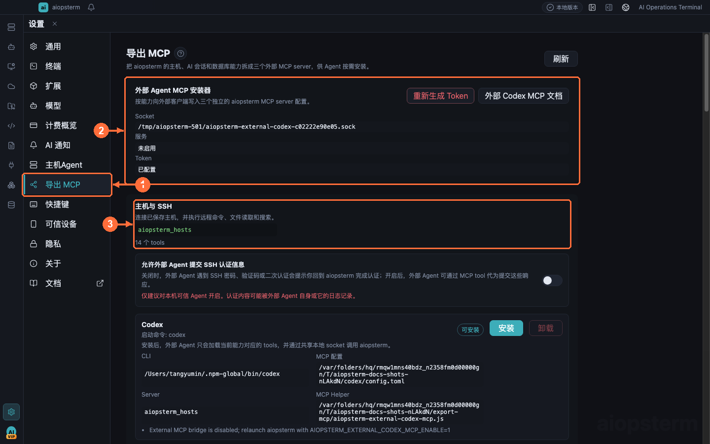

# 导出 MCP 给外部 Agent

本文重点介绍把 aiopsterm 自身能力导出给外部编码代理。内部 Agent 接入第三方 MCP 是另一条链路，不要混用两个设置入口。

## 从哪里打开

点击左下角 **设置齿轮 -> 导出 MCP**。页面顶部管理网关和 Token，下方三个能力卡分别对应 Hosts、AI Sessions 和 Databases；必须在目标卡片内点击 Codex 或 Claude Code 安装按钮，没有批量安装按钮。内部 Agent 的第三方 MCP 配置位于 **设置 -> 主机Agent -> MCP**。

## 三个独立的导出能力

从左侧 **① 导出 MCP** 进入页面，**②** 管理本地网关和 Token，**③** 是第一个独立能力卡片；其余两个 Server 卡片在同页下方。

**设置 -> 导出 MCP** 把能力拆成主机与 SSH、托管 AI 会话、数据库只读访问三个独立 MCP Server，供外部 Codex、Claude Code 等代理按需安装：

| Server | 典型场景 | 能力边界 |
| --- | --- | --- |
| `aiopsterm_hosts` | 外部 Agent 复用已保存主机，建立无界面 SSH 连接并排查远程文件 | 列出主机、连接/断开、认证请求、运行有界命令、读取文件、glob 和 grep；不返回密码、私钥或令牌 |
| `aiopsterm_ai_sessions` | 外部 Agent 查看另一个编码代理卡在哪里，并把你带回对应终端 | 列出会话、审批/问题/计划、事件和通知，无轮询等待会话完成，定位、标记、清理；Claude 阻塞 Hook 可回复，原生 Codex 提示只能定位后在其终端处理 |
| `aiopsterm_databases` | 让可信外部 Agent 浏览保存连接的结构并读取有界数据样本 | 连接投影、目录搜索、表结构/DDL、结构化筛选和分页；不接受任意 SQL，数据库读取权限默认关闭 |

安装步骤：

1. 在页面顶部确认本地网关已启用，再为目标 Agent 生成 Token。
2. 只安装任务需要的能力卡片。未安装的 Server 不会向 Agent 提供 tool schema。
3. 数据库场景还要显式开启 **允许外部 Agent 读取数据库**；非 SQLite 连接通常需要先在数据库工作区打开。
4. 回到外部 Agent 重新加载 MCP 列表，用一次只读查询验证连接。

监控另一个 Agent 完成任务时，不要让外部 Agent 每几秒调用一次 `list_ai_sessions`。先取得目标 `source` 和 `sessionId`，再调用一次 `wait_ai_session_completion`；它会在后续 `stop`、`session_end` 或生命周期结束事件到达时立即返回，默认最多等待 120 秒。只有返回 `timedOut: true` 时，才使用响应中的 `nextSeq` 作为下一次 `afterSeq` 继续等待。返回完成事件后，再由外部 Agent 检查工作目录、代码差异和测试结果。

页面提供外部 Agent MCP 安装器与 Token 管理。三个 Server 共用本地 socket、应用自带运行时和当前 Token，但工具列表完全隔离：

- `重新生成 Token` 会立即使旧 Token 失效，已运行的外部 Agent 需重新加载配置。
- 帮助脚本通过 aiopsterm 自带运行时执行（`ELECTRON_RUN_AS_NODE=1 <aiopsterm可执行文件> <helper.js>`），**不需要**系统安装 Node.js。
- 数据库工具走独立的 Export MCP 网关，用进程级随机句柄解析到已保存连接——外部代理拿不到第二份 DSN 或密码。
- 应用重启后数据库随机句柄会变化；外部 Agent 应重新调用连接列表，不能持久化旧句柄。

> 最佳实践：只把 Token 发给可信本地 Agent，疑似泄露时立即重新生成。主机命令仍受连接和认证边界约束；数据库保持只读；AI 会话工具不会关闭对应终端或杀死代理进程。

第三方 MCP Server 的方向和入口完全不同，请使用[第三方 MCP Server](09-third-party-mcp.md)，不要把它的 JSON 配置写进导出页面。

上一篇：[快捷键](07-shortcuts.md) · 下一篇：[第三方 MCP Server](09-third-party-mcp.md) · [返回目录](../index.md)
