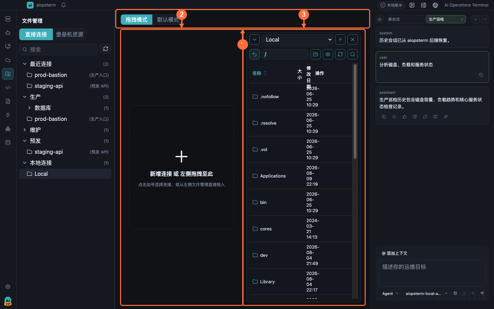

# 文件管理：本地与远程 SFTP

文件工作区适合在本地目录和 SSH 主机之间浏览、编辑和传输文件，并持续显示传输进度。

## 从哪里打开

有三种入口：点击左侧模块栏的 **文件** 图标打开完整文件工作区；在终端窗格中右键并点击 **文件管理**，直接带入当前 SSH 主机；在文件工作区的空白连接栏点击 **添加连接**，再从资产或已有会话中选择主机。

## 建立左右两侧

1. 在任一空侧点击 **添加连接**。
2. 选择本地目录、已保存资产或仍在线的 SSH 会话。
3. 远程连接成功后，顶部显示主机和当前路径；失败时保留选择界面并显示具体错误。
4. 两侧可任意组合为本地到远程、远程到本地或两台远程主机。

## 浏览与编辑

- 点击目录名进入目录，使用 `..` 返回上级；表头可按名称、大小和修改时间排序。
- 工具栏的隐藏文件开关控制点文件；符号链接显示目标并尝试按目录打开。
- 单击选中，双击普通文件打开浮动编辑器；保存冲突时先比较磁盘版本再决定重新加载或覆盖。
- 文件右键菜单提供重命名、复制路径、移动、复制、权限和删除；危险操作需要确认。

## 传输文件

把文件或目录拖到另一侧的真实目录行即可传输；放到空白区域时使用当前目录。也可点击上传文件、上传目录或下载按钮。右下角传输入口打开任务面板，显示已登记、进行中、完成和失败状态，并支持取消仍在运行的任务。

## 跳板与 relay 限制

直连 SSH 和支持 TCP 转发的标准跳板机可以建立 SFTP。relay-shell 只提供交互终端流，没有结构化 SSH 通道，因此文件工作区会明确拒绝；请改用允许 TCP 转发的跳板机，或在终端内运行 `scp`/`rsync`。

## 最佳实践与排错

- 大目录先按名称筛选，再传输需要的子目录，避免无意复制日志或依赖缓存。
- 修改权限前记录原始模式；生产配置文件先下载备份。
- 连接失败先回资产管理运行连接测试，再确认当前路径是否存在和账号是否有 SFTP 权限。
- 传输失败查看任务详情中的操作前缀、源路径、目标路径和后端错误，不要只重试同一目标。

上一篇：[第三方 MCP Server](09-third-party-mcp.md) · 下一篇：[资产管理](11-assets.md) · [返回目录](../index.md)
