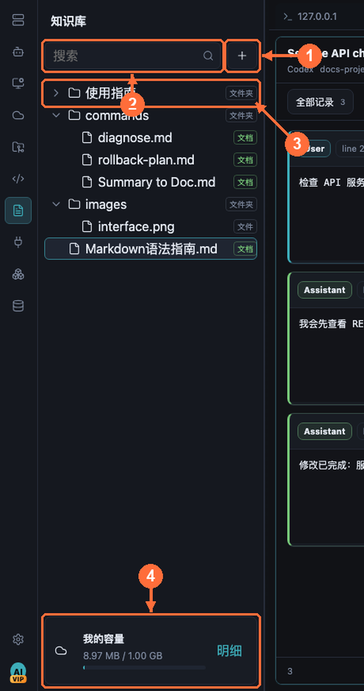

# 知识库最佳实践

知识库把运维文档、预案、命令手册放进 aiopsterm 本体：既能像普通标签一样与终端并排拆分，也能作为 AI 对话的上下文证据。

## 从哪里打开

点击模块栏的 **知识库**。搜索框和 `+` 新建按钮位于左侧顶部；点击 `+` 后才会出现新建文档、文件夹、上传文件和上传目录。单击 Markdown 文件在中央打开，编辑器右上角 **源码/渲染** 切换视图。文档右键菜单提供重命名、移动、删除和添加到聊天。

## 树面板

- **① 新建按钮**：`新建文档` 创建 Markdown 文档，立即在主工作区打开并进入行内重命名；也可新建文件夹或上传文件/目录。
- **② 搜索框**：按名称过滤树节点。
- **③ 树节点**：行尾紧凑标注类型（`文件夹` / `文档` / `文件`）。
- **④ 容量条**：当前知识库占用一目了然。

整理技巧：

- 拖拽文件/文件夹到目标文件夹即移动；拖到空白处移回根目录。移入自身或子孙目录会被前置拦截。
- 文件夹右键菜单支持定向上传，导入内容直接落到该文件夹。

## 文档编辑

- 在 **① 树** 中双击文档，于主工作区打开 **③ 编辑器**。
- **② `源码` / `渲染`** 切换 Markdown 源码与预览；渲染管线支持表格、代码高亮、Mermaid 图、知识库内图片与净化后的 HTML。你的模式选择会被记住，之后打开其他 Markdown 文档沿用上次的查看模式（从搜索结果跳转到指定行时仍会进入源码模式）。
- 在渲染模式点击相对 Markdown 链接，会在同一主工作区打开对应知识文档；带 `#标题` 的链接会继续滚动到标题。外部 `http/https` 链接交给系统浏览器，越过知识库根目录的相对路径会被拒绝。
- 内容经知识后端**自动保存**，没有常驻保存按钮；后端失败时编辑器保持脏状态并显示错误。

> 最佳实践：预案文档直接内嵌 Mermaid 流程图 + 带语言标注的代码块；排障时把文档标签与终端窗格拆分并排（拖拽文档标签到终端窗格上即可），左看预案右执行。

## 与终端、AI 协同

- 知识标签是一等工作区标签：右键拆分、拖拽合并、拖回标签栏恢复，行为与终端标签一致。
- 在 AI 输入框用 `@` 选择知识文档作为上下文；自动知识检索只发送匹配到的有限行段，而不是整篇文档。
- Agent 模式下的 `search_knowledge_base` 工具最多返回十条有界片段——文档写得结构化（小标题 + 短段落），AI 检索效果最好。
- 知识库图片可以作为 Classic 对话的图片输入（计入每条消息最多 5 张的限制）。

上一篇：[资产管理](11-assets.md) · 下一篇：[插件与扩展](13-extensions.md) · [返回目录](../index.md)
