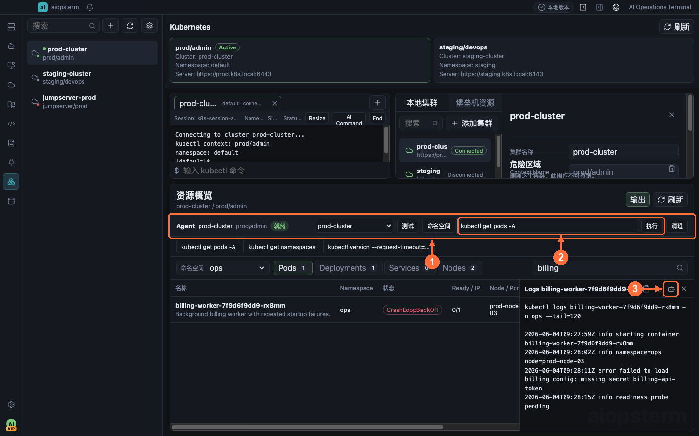

# Kubernetes 日常操作

本章从一个常见任务开始：导入现有 kubeconfig，查看目标 namespace 的工作负载，读取 Pod 日志，并在需要时打开真实 kubectl 终端。

## 从哪里打开

点击模块栏的 **Kubernetes**。没有集群时点击集群区域的添加按钮，选择导入 kubeconfig 或手工配置，保存前先点击连接测试。连接后可从资源行打开 Describe/Logs，从集群操作打开终端，从资源工作区的 **Agent** 命令栏执行集群范围命令；资源输出区的 **发送输出到 AI** 会把真实输出交给右侧 AI 对话分析，使用前需在 **设置 -> 模型** 配置可用模型。

**①** 切换 context，**②** 是 kubectl 终端，**③** 管理集群配置，**④** 浏览和操作资源。

## 场景一：导入 kubeconfig

在 Kubernetes 工作区选择 `导入 Kubeconfig`：

1. 选择 kubectl 或 client-go 格式的 kubeconfig 文件。
2. 从解析出的 contexts 中选择目标。
3. 检查自动填充的集群名称、server、context 和默认 namespace。
4. 运行 Test Connection。
5. 保存并连接。

也可以使用手动配置粘贴 kubeconfig 内容。空配置和旧的占位地址会被拒绝。证书轮换后可以更新已保存集群的路径或内容，连接状态会重置，下一次 Connect 使用新凭据探测。

## 场景二：查看资源和日志

连接后，从资源视图选择 namespace 和资源类型。典型排查顺序：

1. 查看 Deployment、StatefulSet 和 Pod 状态。
2. 对异常资源执行 Describe。
3. 读取 Pod Logs。
4. 需要持续观察时打开 Kubernetes Terminal，运行 `kubectl logs -f`。

资源动作由后端根据当前集群、context 和 namespace 生成真实 kubectl 调用。连接失败不会被界面标记为成功。

## 场景三：打开隔离的 kubectl 终端

每个 Kubernetes 终端使用会话级 kubeconfig 副本，并将 current-context 固定到选择的集群。终端内运行 `kubectl config use-context` 不会修改用户原始 kubeconfig。

流式日志和 `kubectl exec` 可以工作。该终端是普通 PTY 文本视图，不适合依赖完整屏幕控制的 TUI。kubectl 单次输出上限为 10 MiB，终端状态只保留最新 1 MiB；长期日志应依赖可见终端 scrollback 或外部日志系统。

## 场景四：集群 Agent 命令工作流

资源工作区顶部的 Agent 栏始终绑定一个明确的 cluster/context：

1. 在 **① 集群选择器**确认目标集群和 context。
2. 点击 **连接测试**，再用 **命名空间**快捷动作读取可用 namespace。
3. 在 **② 命令栏**输入 `kubectl get deployments -A` 等命令并执行；命令、目标和结果进入当前 Agent 历史。
4. **③ 历史/输出**用于复查最近执行；切换集群会更新作用域，不会把旧结果当成新集群结果。
5. 点击 **清理**结束该 Agent 状态；它不会删除集群或 kubeconfig。

这里的 Agent 是带集群作用域和历史的 kubectl 命令执行面，不会自行调用大模型，也不会越过当前 cluster/context。集群配置中的 **Agent 代理**指 kubectl 网络代理，不是 AI Agent 开关。

## 场景五：把 Kubernetes 证据交给 AI

有两种入口：

- 在资源表执行 Describe 或 Logs，展开输出面板后点击 **发送输出到 AI**。aiopsterm 会把集群、namespace、资源和真实输出组成一条用户消息，送到右侧 Classic/Codex 对话。
- 在 Kubernetes 终端执行命令后，点击 **采集命令输出到 AI**；只有当前存在可采集命令时才会开始，避免把整段历史误发。

推荐顺序是“先取证，再分析”：先 Describe、Events、Logs，再让 AI 总结根因和下一条只读命令。发送到 AI 只增加上下文，不会自动执行模型建议；需要执行时回到 K8s 终端或 Agent 命令栏审查后运行。

## JumpServer 来源集群

JumpServer 组织资产可以同步到 Kubernetes 目录，但当前没有 JumpServer 命令流。此类集群的 Connect、资源刷新、终端创建和资源动作会失败关闭。需要执行真实 kubectl 时，请导入可以直接访问集群的 kubeconfig。

## 安全与排错

- kubeconfig 内容和会话副本以仅当前用户可读写的权限保存。
- 连接测试和 Connect 需要本机可用的 kubectl，或配置 `AIOPSTERM_KUBECTL_PATH`。
- Test Connection 默认在 15 秒后超时，普通资源刷新默认 30 秒。
- 连接后看不到资源时，检查 context、namespace 和 Kubernetes RBAC。
- 证书、Token 或 server 变化后，更新配置并重新 Connect。
- 输出被截断时缩小 label selector、namespace 或资源范围。

上一篇：[插件与扩展](13-extensions.md) · 下一篇：[数据库与 DB AI](15-database.md) · [返回目录](../index.md)
