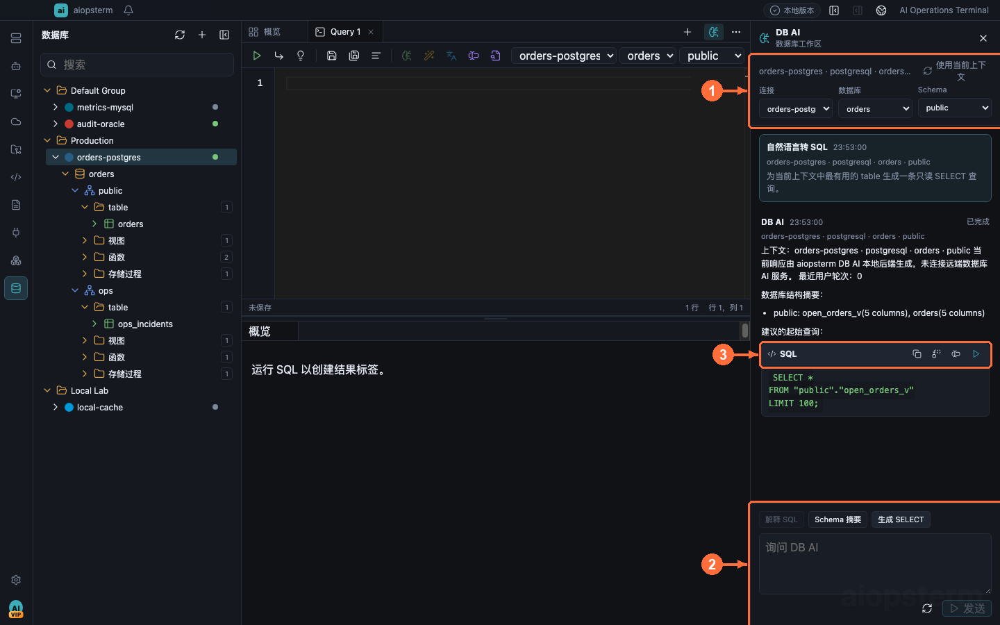

# 数据库、SQL 与 DB AI

本章适合需要在同一个工作区中保存数据库连接、查看对象、执行 SQL，并让 AI 在固定数据库范围内协助分析的用户。

## 从哪里打开

点击模块栏的 **数据库**。点击左侧连接栏添加按钮，选择数据库类型，填写连接并先点击测试；保存后双击连接或使用行菜单连接。从目录树表的右键菜单新建查询/打开数据，或点击主区域 `+` 新建 SQL 标签。DB AI 通过数据库工作区右侧 **切换 DB AI 面板** 打开并绑定当前连接。使用 DB AI 前先到 **设置 -> 模型** 配置、Check 并 Save 一个可用 Provider。


**①** 是连接和对象树，**②** 管理 SQL、数据和结果页签，**③** 是当前数据库工作区内容。

## 场景一：连接数据库并查看表

在数据库工作区新建连接，选择引擎并填写连接参数。建议先执行连接测试，再保存并连接。连接成功后，从左侧目录依次展开 database、schema、table；SQLite 的单一 `main` catalog 会被界面折叠，直接显示 tables。

双击表可以打开分页数据视图。需要比较多个结果时，可将重要结果页签固定；未固定且已经完成的结果页签会被后续执行复用，防止结果栏无限增长。

## 场景二：执行一组 SQL

打开 New SQL 页签并输入：

```sql
select status, count(*) as total
from orders
group by status
order by total desc;
```

Run all 会识别常见 SQL 语句边界并逐条执行。字符串、注释、带引号标识符和 PostgreSQL dollar-quoted body 中的分号不会被错误拆分。某条语句失败不会阻止后续语句产生各自的结果页签。

破坏性操作应通过界面确认流程执行。生成 SQL 的 Run 动作仅接受只读语句，并要求当前 SQL 页签仍然匹配生成时的连接、database 和 schema。

## 场景三：用自然语言生成 SQL



1. 打开连接并选定 database/schema，再点击 **切换 DB AI 面板**。
2. 在 **① 上下文**确认连接、database 和 schema；没有上下文时不能发送。
3. 点击 **生成 SELECT** 或在 **② 输入框**描述查询，例如“统计过去 24 小时每种订单状态的数量”。
4. DB AI 返回目标方言 SQL。使用 **③ 操作按钮**复制、替换当前选区/语句、插入编辑器，或在满足安全条件时直接运行只读 SQL。

生成结果不会绕过编辑器作用域：当前 SQL 标签必须仍匹配生成时的连接、database 和 schema，Run 才可用。建议先插入或替换，检查过滤条件和行数，再执行。

## 场景四：解释、优化、转换与诊断

选中 SQL 后使用 Explain 或 Optimize，或者打开 DB AI 输入：

```text
这条查询为什么没有使用索引？请先检查表结构和索引，再给出改写建议。
```

DB AI 支持的核心动作包括：

- **Explain**：结合表结构、索引和可用执行计划解释查询。
- **Optimize**：给出保持语义的改写与索引建议。
- **Complete**：补全当前不完整 SQL。
- **Convert**：转换到选择的目标 SQL 方言，并在结果卡标明方言。
- **Diagnose**：基于 SQL、错误或执行信息诊断问题。
- **Schema Summary**：总结当前 schema 的主要对象和关系。

模型可使用目录发现、表描述、DDL、有限样本、计数、索引检查和 explain 工具，但不能通过工具切换连接，也不能执行任意 SQL 或写操作。Drop、Truncate 等破坏性意图只会得到说明或受控方案，不会由只读 DB AI 工具执行。

## 场景五：恢复 DB AI 产品会话

数据库上下文变化后，aiopsterm 会轮换到新的 DB AI 会话，避免旧对话在另一个数据库上继续执行。可以从 [Agents 产品会话](04-agents-product-sessions.md)恢复原 DB AI；如果连接或 schema 不可用，会以只读状态打开并要求修复原绑定，不会替换成另一个数据库。

## 场景六：让外部 Agent 只读数据库

安装 `aiopsterm_databases` 并在 `设置 -> 导出 MCP` 开启 `允许外部 Agent 读取数据库`。外部 Agent 先发现进程级随机连接 handle，再调用目录、描述和结构化查询工具。

安全边界：

- 默认关闭数据库读取权限。
- 不返回保存的连接 ID、地址、用户名、URL、文件路径、代理或密码。
- 不提供任意 SQL 和写操作。
- `query_database_table` 只查询 base table，投影和过滤必须经过 catalog 校验，单页最多 100 行。
- ClickHouse 和 Presto 的 MCP 数据查询会失败关闭，但 catalog、describe 和脱敏 DDL 仍可使用。

## 常见问题

- 连接测试成功但目录为空：检查账号的 catalog/schema 元数据权限。
- DB AI 无法发送：确认当前 Product Session 的原连接和 schema 仍然有效。
- 生成 SQL 无法 Run：当前页签范围与生成时范围不一致，或 SQL 不是只读。
- 外部 Agent 返回读取关闭：在导出 MCP 设置中显式授权数据库读取。
- 结果被截断：缩小查询范围，使用分页表视图或导出流程，不要依赖一次返回完整大表。

上一篇：[Kubernetes](14-kubernetes.md) · 下一篇：[主题与终端外观](16-themes.md) · [返回目录](../index.md)
