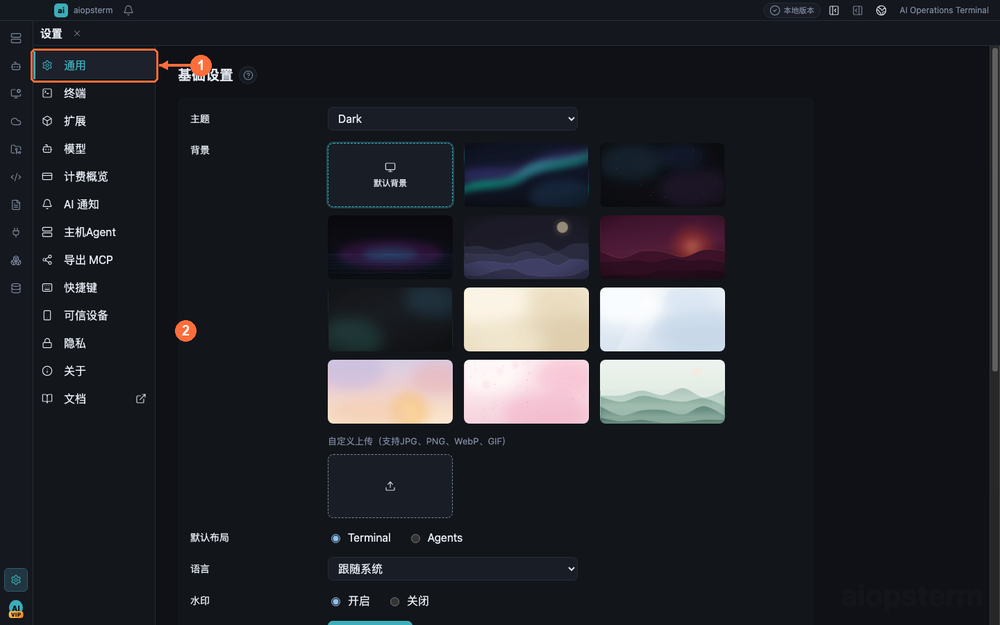

# 主题、背景与终端外观

外观设置不仅影响观感，也直接影响长时间运维时的可读性。建议先确定主题，再调整背景、字体和终端配色。

## 从哪里打开

点击左下角 **设置齿轮**，选择 **通用** 调整应用主题和背景；选择 **终端** 调整字体、字号、行距、光标和终端相关选项。背景预设必须先点击对应缩略图才会生效，自定义背景通过背景区域中的上传按钮导入。

## 主题与背景

- 跟随系统会响应系统明暗模式；固定浅色或深色适合需要稳定截图和颜色判断的环境。
- 官方背景预设以居中、`cover` 方式显示；选择后立即预览，保存失败会回滚到原配置。
- 自定义背景会复制到应用数据目录，移动原始图片不会使配置失效；删除前先切换到其他背景。
- 背景过亮或细节过多时降低透明度或改用纯色，确保终端 ANSI 色和正文对比度。

## 终端排版

进入 **设置 -> 终端** 后选择字体，并分别调整字号、行距、字重和光标。macOS、Windows、Linux 的字体度量不同，同一数值不保证字符宽度完全一致；修改后应打开本地终端，用包含中英文、表格和 ANSI 色的命令验证。

## 推荐检查

1. `ls` 或彩色日志中的蓝、绿、红是否清楚。
2. 中英文混排是否对齐，长路径是否出现重叠。
3. 分屏后每个终端是否仍有足够列宽。
4. 浅色和深色模式下选区、光标、链接和搜索高亮是否可见。

## 常见问题

- 背景缩略图空白：检查包内图片是否存在、预览样式是否包含 `background-image`。
- 终端无配色：确认 Shell 启动环境、`TERM` 和命令本身是否输出颜色。
- 字符拥挤：恢复默认行距和字重，再逐项调整，避免同时修改多个变量。
- 设置未生效：确认保存提示和当前终端是否需要重建渲染实例。

上一篇：[数据库与 DB AI](15-database.md) · 下一篇：[故障排查](17-troubleshooting.md) · [返回目录](../index.md)
